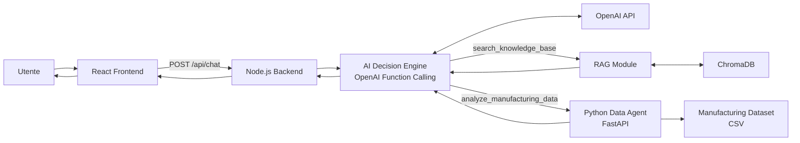
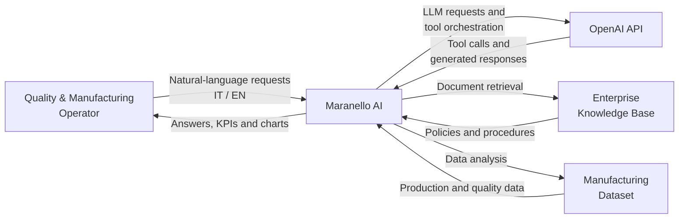
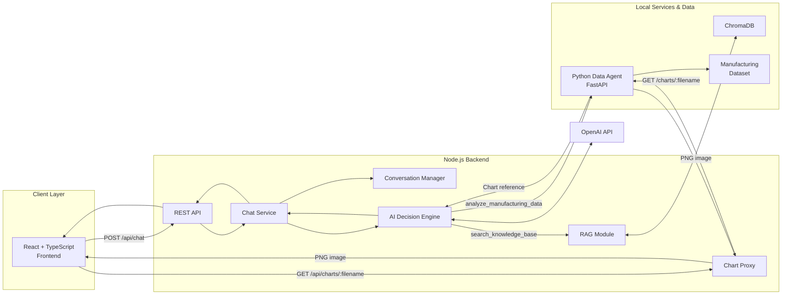
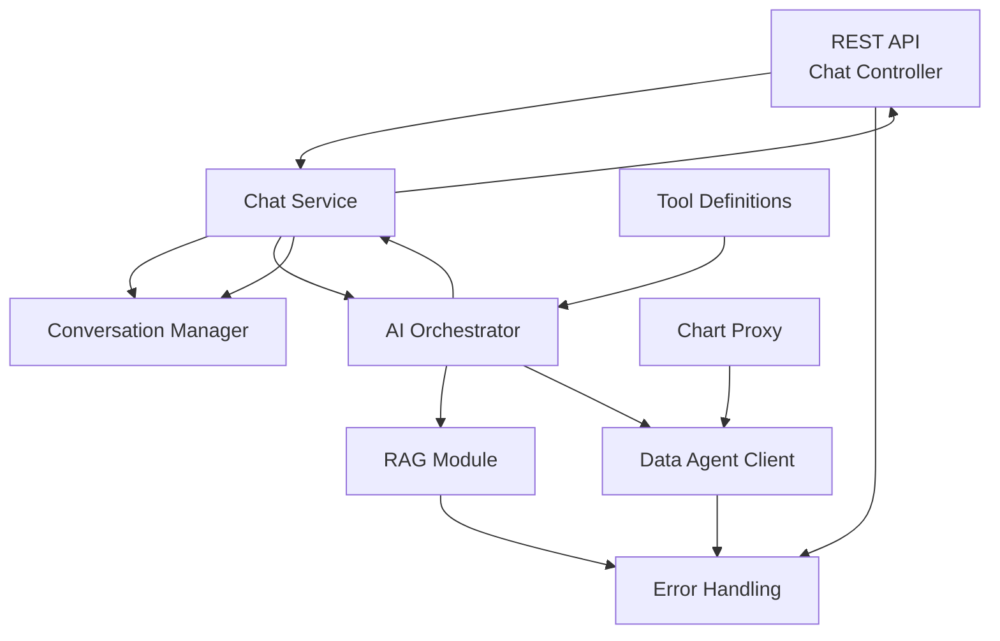
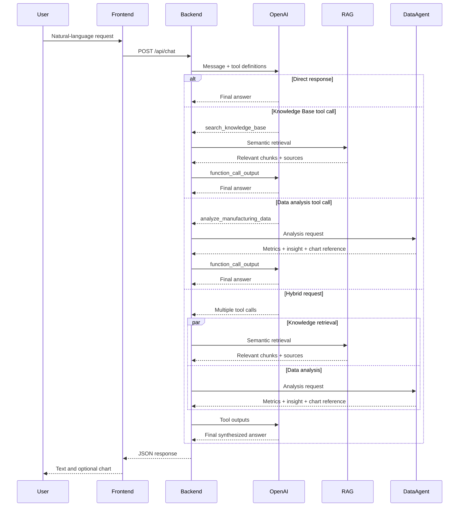
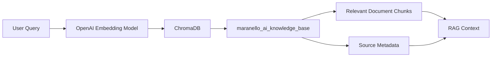
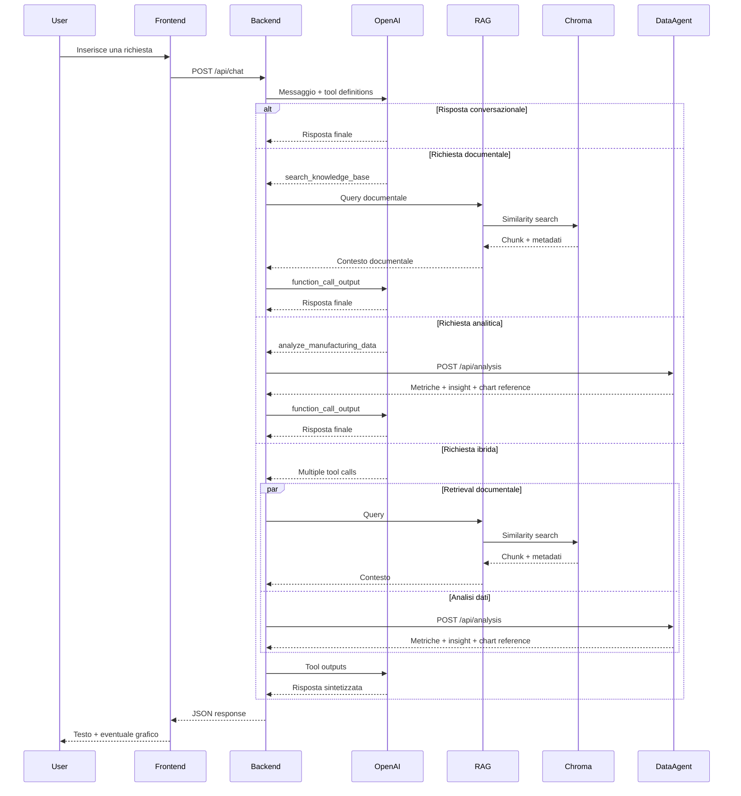
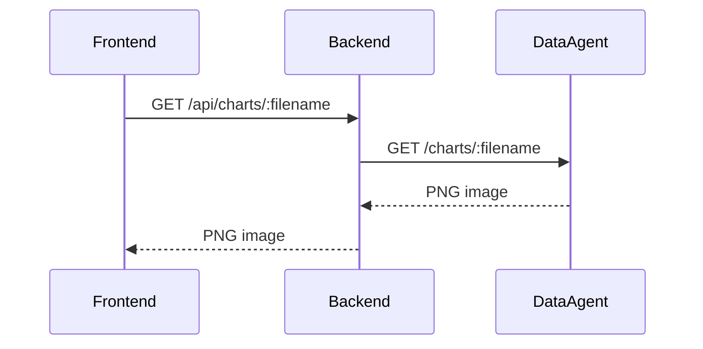

# System Architecture

> **Progetto:** Maranello AI  
> **Versione:** 2.0  
> **Tipo documento:** System Architecture Document (SAD)  
> **Stato:** Final  
> **Autore:** Marco Saccani  
> **Ultimo aggiornamento:** Settembre 2026

---

# Indice

1. Introduzione
2. Obiettivi architetturali
3. Principi architetturali
4. Architettura generale
5. System Context
6. Container Architecture
7. Backend Architecture
8. AI Decision Engine
9. Retrieval-Augmented Generation
10. Python Data Agent
11. Communication Flow
12. Technology Stack
13. Architectural Decisions
14. Scalabilità
15. Sicurezza
16. Estendibilità
17. Conclusioni

---

# 1. Introduzione

## 1.1 Scopo

Il presente documento descrive l'architettura software finale del progetto **Maranello AI**.

L'obiettivo è illustrare la struttura dell'applicazione, i componenti principali, le responsabilità di ciascun modulo, le modalità di comunicazione tra i servizi e le principali decisioni architetturali adottate durante l'implementazione.

Il documento rappresenta l'architettura **as-built** del sistema, ovvero la configurazione effettivamente implementata e validata al termine dello sviluppo.

Costituisce inoltre il collegamento tra i requisiti software definiti nella Software Requirements Specification e il codice sorgente finale dell'applicazione.

---

## 1.2 Obiettivi

L'architettura è stata progettata e implementata con i seguenti obiettivi:

- separazione delle responsabilità;
- elevata modularità;
- facilità di manutenzione;
- scalabilità;
- estendibilità;
- supporto a nuovi strumenti AI;
- facilità di testing;
- riutilizzabilità dei componenti;
- isolamento dei servizi specializzati;
- affidabilità nella comunicazione tra i componenti;
- tracciabilità delle decisioni dell'agente attraverso l'utilizzo esplicito dei tool.

---

## 1.3 Visione architetturale

Maranello AI è un sistema distribuito organizzato secondo un'architettura a servizi, progettato per supportare il reparto **Quality & Manufacturing Operations** di un produttore automotive premium fittizio.

Il sistema integra due tipologie complementari di conoscenza aziendale:

- documentazione testuale relativa a policy e procedure operative;
- dati strutturati relativi ai processi produttivi e alla qualità.

Ogni componente svolge una responsabilità specifica e comunica con gli altri tramite interfacce chiaramente definite.

L'elemento centrale dell'architettura è il backend Node.js, che ospita l'**AI Decision Engine** e coordina l'interazione tra il modello linguistico, il sistema Retrieval-Augmented Generation e il Python Data Agent.

Attraverso il meccanismo di function calling, il modello linguistico decide autonomamente se una richiesta richiede:

- il recupero di informazioni dalla Knowledge Base;
- un'analisi numerica del Manufacturing Dataset;
- l'utilizzo combinato di entrambi gli strumenti;
- una risposta conversazionale che non richiede strumenti esterni.

L'utente interagisce esclusivamente tramite un'unica interfaccia conversazionale React, mentre la selezione degli strumenti, l'esecuzione delle analisi e l'aggregazione dei risultati vengono gestite dal backend.

---

# 2. Obiettivi architetturali

L'architettura finale del sistema soddisfa i seguenti obiettivi.

| ID | Obiettivo |
|----|-----------|
| AG-001 | Separare frontend, orchestrazione backend e analisi dati. |
| AG-002 | Isolare la logica di orchestrazione AI dalla logica dell'interfaccia utente. |
| AG-003 | Incapsulare il retrieval documentale come strumento specializzato del backend. |
| AG-004 | Rendere indipendente il Python Data Agent tramite un microservizio dedicato. |
| AG-005 | Consentire l'aggiunta di nuovi strumenti AI senza modificare il frontend. |
| AG-006 | Ridurre l'accoppiamento tra i componenti attraverso interfacce definite. |
| AG-007 | Favorire manutenzione, testing e debugging dei singoli componenti. |
| AG-008 | Consentire l'evoluzione futura dell'architettura. |
| AG-009 | Consentire all'LLM di selezionare autonomamente uno o più strumenti tramite function calling. |
| AG-010 | Mantenere il contesto conversazionale tra richieste appartenenti alla stessa sessione. |
| AG-011 | Supportare richieste e risposte in italiano e inglese. |
| AG-012 | Gestire in modo controllato l'indisponibilità temporanea dei servizi dipendenti. |

---

# 3. Principi architetturali

L'architettura finale di Maranello AI segue principi di software engineering orientati alla modularità, alla testabilità e alla separazione delle responsabilità.

## 3.1 Single Responsibility Principle

Ogni componente possiede una responsabilità chiaramente identificabile.

In particolare:

- il frontend gestisce l'interazione con l'utente e lo stato dell'interfaccia;
- il backend gestisce API, sessione conversazionale e orchestrazione;
- l'AI Decision Engine coordina il processo di tool selection e tool execution;
- il componente RAG esegue il retrieval semantico della documentazione aziendale;
- ChromaDB mantiene la rappresentazione vettoriale della Knowledge Base;
- il Python Data Agent esegue data cleaning, analisi numeriche e generazione di grafici;
- il Manufacturing Dataset rappresenta la sorgente strutturata utilizzata per le analisi quantitative.

---

## 3.2 Separation of Concerns

Le responsabilità dell'applicazione sono distribuite tra componenti distinti.

La logica dell'interfaccia utente non contiene logica di retrieval o analisi dati. Allo stesso modo, il Python Data Agent non gestisce la conversazione né decide autonomamente quando essere utilizzato.

La decisione relativa agli strumenti da invocare viene centralizzata nel backend attraverso il modello linguistico e il meccanismo di function calling.

Questa separazione consente di modificare o sostituire un componente limitando l'impatto sugli altri livelli dell'applicazione.

---

## 3.3 Modularità

I componenti principali sono organizzati come moduli indipendenti e comunicano attraverso interfacce definite.

Il frontend comunica esclusivamente con il backend Node.js.

Il backend comunica con:

- OpenAI API per l'orchestrazione tramite LLM;
- ChromaDB per il retrieval semantico;
- Python Data Agent tramite API REST.

Il Python Data Agent accede autonomamente al Manufacturing Dataset e restituisce al backend risultati strutturati, insight narrativi ed eventuali riferimenti ai grafici generati.

Questa organizzazione riduce le dipendenze dirette tra i componenti.

---

## 3.4 Scalabilità

La separazione tra frontend, backend, database vettoriale e Data Agent consente di evolvere ciascun componente indipendentemente.

L'architettura permette, ad esempio, di:

- aggiungere nuovi tool al processo di orchestrazione;
- integrare nuove sorgenti documentali;
- supportare ulteriori dataset;
- sostituire o aggiornare il modello linguistico;
- distribuire i servizi in ambienti separati;
- introdurre meccanismi di persistenza o autenticazione senza riprogettare l'intera applicazione.

---

## 3.5 Estendibilità

Il sistema è progettato affinché nuovi strumenti, modelli AI e sorgenti dati possano essere integrati senza modificare l'interfaccia conversazionale.

Il meccanismo di function calling permette di estendere il set di capacità disponibili all'agente introducendo nuove definizioni di tool e relativi executor.

Questa caratteristica consente di evolvere Maranello AI da assistente specializzato in **Quality & Manufacturing Operations** verso una piattaforma capace di integrare ulteriori funzioni aziendali mantenendo invariato il modello generale di interazione.

---

# 4. Architettura generale

Maranello AI è organizzato secondo un'architettura a servizi con orchestrazione centralizzata nel backend Node.js.

I componenti principali sono:

- React Frontend;
- Node.js Backend;
- AI Decision Engine;
- OpenAI API;
- RAG Module;
- ChromaDB;
- Python Data Agent;
- Manufacturing Dataset.

L'utente comunica esclusivamente con il frontend React.

Ogni richiesta viene inviata al backend Node.js tramite API REST. Il backend mantiene il contesto della sessione e delega all'AI Decision Engine la gestione della richiesta.

L'AI Decision Engine utilizza il modello linguistico e il meccanismo di function calling per determinare autonomamente se invocare:

- `search_knowledge_base`, per recuperare informazioni documentali;
- `analyze_manufacturing_data`, per effettuare analisi quantitative;
- entrambi gli strumenti, quando la richiesta combina dati e procedure;
- nessuno strumento, quando la richiesta può essere gestita direttamente a livello conversazionale.

I risultati dei tool vengono restituiti al modello linguistico, che produce la risposta finale mantenendo la lingua e il contesto della conversazione.

---

## 4.1 Architettura ad alto livello



Il diagramma evidenzia il ruolo centrale del Decision Engine.

La selezione tra RAG e Data Agent non viene effettuata dal frontend né tramite regole statiche nel controller HTTP. La decisione viene delegata al modello linguistico attraverso le definizioni dei tool disponibili.

Questo permette al sistema di gestire anche richieste ibride, nelle quali entrambi gli strumenti vengono invocati prima della generazione della risposta finale.

---

## 4.2 Descrizione dei componenti

| Componente | Responsabilità |
|------------|----------------|
| React Frontend | Gestisce l'interfaccia conversazionale, lo stato dei messaggi, il caricamento e la visualizzazione dei grafici. |
| Node.js Backend | Espone le API, gestisce le sessioni e coordina l'intera elaborazione. |
| AI Decision Engine | Utilizza l'LLM e il function calling per selezionare ed eseguire gli strumenti necessari. |
| OpenAI API | Fornisce il modello linguistico utilizzato per comprensione, tool selection e sintesi finale. |
| RAG Module | Esegue il retrieval semantico della documentazione aziendale. |
| ChromaDB | Memorizza e ricerca le rappresentazioni vettoriali della Knowledge Base. |
| Python Data Agent | Pulisce e analizza il dataset, calcola KPI e genera grafici. |
| Manufacturing Dataset | Contiene i dati sintetici di produzione e qualità utilizzati nelle analisi quantitative. |

---

# 5. System Context

## 5.1 Contesto del sistema

Maranello AI è una piattaforma software progettata per supportare il reparto **Quality & Manufacturing Operations** di un produttore automotive premium fittizio.

Il sistema affronta due esigenze informative complementari:

1. recuperare rapidamente informazioni contenute in policy e procedure aziendali;
2. ottenere KPI, trend e insight dai dati strutturati relativi ai processi produttivi.

L'applicazione fornisce un unico punto di accesso conversazionale verso:

- documentazione aziendale;
- Manufacturing Dataset;
- capacità analitiche Python;
- modello linguistico;
- retrieval semantico.

L'utente non deve conoscere quale sorgente o servizio sia necessario per rispondere alla propria richiesta.

La selezione degli strumenti viene gestita autonomamente dall'AI Decision Engine.

Il sistema supporta inoltre richieste in italiano e inglese e mantiene il contesto tra messaggi appartenenti alla stessa sessione conversazionale.

---

## 5.2 Attori e sistemi esterni

| Attore / Sistema | Descrizione |
|------------------|-------------|
| Operatore Quality & Manufacturing | Interagisce con Maranello AI tramite l'interfaccia conversazionale. |
| OpenAI API | Fornisce il modello linguistico utilizzato per orchestrazione, function calling e generazione della risposta. |
| Knowledge Base | Contiene le policy e procedure aziendali fittizie utilizzate dal sistema RAG. |
| Manufacturing Dataset | Contiene i dati strutturati utilizzati dal Python Data Agent. |

ChromaDB e il Python Data Agent non vengono considerati attori esterni dal punto di vista del System Context, poiché fanno parte dell'architettura interna di Maranello AI.

---

## 5.3 System Context Diagram



---

# 6. Container Architecture

## 6.1 Panoramica

Maranello AI è composto da più componenti con responsabilità separate.

Dal punto di vista del deployment locale, i principali processi applicativi sono:

1. React Frontend;
2. Node.js Backend;
3. Python Data Agent;
4. ChromaDB.

Il backend Node.js costituisce il punto centrale di orchestrazione e integra internamente sia l'AI Decision Engine sia il modulo RAG.

Il modello linguistico viene fornito attraverso OpenAI API, mentre il Manufacturing Dataset viene letto localmente dal Python Data Agent.

Questa organizzazione permette di mantenere separata l'interfaccia utente, l'orchestrazione AI, il retrieval vettoriale e l'elaborazione analitica.

---

## 6.2 Container principali

| Container / Componente | Tecnologia | Responsabilità |
|------------------------|------------|----------------|
| Frontend | React + TypeScript + Vite | Interfaccia conversazionale e rendering delle risposte. |
| Backend | Node.js + Express + TypeScript | API REST, session management, orchestrazione AI e integrazione dei servizi. |
| AI Decision Engine | OpenAI SDK + Responses API + Function Calling | Tool selection, tool execution loop e sintesi della risposta. |
| RAG Module | TypeScript + ChromaDB client + OpenAI embeddings | Retrieval semantico della Knowledge Base. |
| Vector Database | ChromaDB | Persistenza e ricerca degli embedding documentali. |
| Python Data Agent | FastAPI + Pandas | Data cleaning, analisi quantitative, KPI e generazione dei grafici. |
| Manufacturing Dataset | CSV | Sorgente strutturata dei dati di produzione e qualità. |

L'AI Decision Engine e il RAG Module sono componenti logici interni al backend Node.js e non costituiscono processi applicativi indipendenti.

---

## 6.3 Container Diagram



---

## 6.4 Responsabilità dei container e componenti

### React Frontend

Responsabilità:

- visualizzazione della chat;
- gestione dello stato dei messaggi;
- gestione del `sessionId`;
- invio asincrono delle richieste;
- visualizzazione dello stato di caricamento;
- rendering delle risposte testuali;
- rendering dei grafici restituiti dal backend;
- gestione degli errori presentabili all'utente.

Il frontend comunica esclusivamente con il backend Node.js e non accede direttamente al Python Data Agent o a ChromaDB.

---

### Node.js Backend

Responsabilità:

- esposizione delle API REST;
- validazione delle richieste;
- gestione della sessione conversazionale;
- coordinamento del modello linguistico;
- esecuzione del function calling;
- integrazione con il modulo RAG;
- comunicazione con il Python Data Agent;
- aggregazione e restituzione delle risposte;
- gestione controllata degli errori dei servizi dipendenti;
- proxy dei grafici generati dal Data Agent.

Il backend rappresenta l'unico punto di ingresso applicativo utilizzato dal frontend.

---

### AI Decision Engine

Responsabilità:

- invio della richiesta al modello linguistico;
- esposizione delle definizioni dei tool disponibili;
- interpretazione delle function call generate dal modello;
- esecuzione di uno o più tool;
- gestione delle richieste ibride;
- restituzione degli output dei tool al modello;
- iterazione fino alla generazione della risposta finale;
- mantenimento della continuità conversazionale tramite gli identificativi delle risposte del modello.

La selezione dei tool non viene effettuata mediante una classificazione rigida definita nel codice, ma attraverso il meccanismo di function calling del modello linguistico.

---

### RAG Module

Responsabilità:

- generazione dell'embedding della query;
- ricerca semantica in ChromaDB;
- recupero dei chunk più rilevanti;
- recupero dei metadati e delle fonti;
- preparazione del contesto documentale da restituire all'AI Decision Engine.

Il modulo RAG è implementato all'interno del backend Node.js.

---

### ChromaDB

Responsabilità:

- memorizzazione degli embedding della Knowledge Base;
- persistenza locale della collection;
- similarity search;
- restituzione dei chunk documentali rilevanti e dei relativi metadati.

ChromaDB viene eseguito come servizio locale indipendente.

---

### Python Data Agent

Responsabilità:

- caricamento del Manufacturing Dataset;
- data cleaning;
- interpretazione controllata delle richieste analitiche;
- calcolo dei KPI;
- aggregazioni e analisi temporali;
- generazione dei grafici;
- salvataggio delle immagini generate;
- produzione di risultati strutturati e insight narrativi.

Il Data Agent è esposto come microservizio FastAPI e comunica con il backend tramite HTTP REST.

---

### Manufacturing Dataset

Il Manufacturing Dataset costituisce la sorgente dati strutturata del sistema.

Contiene dati sintetici relativi a produzione e qualità, inclusi:

- volumi produttivi;
- unità difettose;
- categorie di difetto;
- rework e scrap;
- downtime;
- cycle time;
- quality score;
- fornitori;
- componenti;
- linee produttive;
- turni;
- date di produzione.

Il dataset include intenzionalmente anomalie e dati sporchi utilizzati per validare le capacità di data cleaning del Python Data Agent.

---

# 7. Backend Architecture

## 7.1 Panoramica

Il backend Node.js rappresenta il centro di orchestrazione di Maranello AI.

Le sue responsabilità principali sono:

- esporre le API utilizzate dal frontend;
- validare le richieste in ingresso;
- mantenere il contesto della conversazione;
- coordinare il modello linguistico;
- eseguire i tool richiesti dall'LLM;
- comunicare con ChromaDB;
- comunicare con il Python Data Agent;
- restituire risposte testuali e riferimenti ai grafici;
- gestire in modo controllato eventuali errori dei servizi dipendenti.

Il backend non esegue direttamente l'analisi numerica del Manufacturing Dataset.

Tale responsabilità viene delegata al Python Data Agent.

Allo stesso modo, il frontend non contiene logica di orchestrazione AI e comunica esclusivamente con il backend tramite API REST.

---

## 7.2 Architettura interna

L'implementazione finale del backend è organizzata in moduli con responsabilità distinte.

| Modulo | Responsabilità |
|--------|----------------|
| REST API Layer | Espone gli endpoint HTTP e valida le richieste. |
| Chat Service | Coordina il ciclo completo di elaborazione di un messaggio. |
| Conversation Manager | Gestisce sessioni, cronologia applicativa e identificativi delle risposte OpenAI. |
| AI Orchestrator | Interagisce con il modello linguistico, gestisce il function calling ed esegue il tool loop. |
| Tool Definitions | Descrivono al modello gli strumenti disponibili e i relativi parametri. |
| Tool Executors | Eseguono concretamente le richieste verso RAG e Data Agent. |
| RAG Module | Esegue retrieval semantico tramite ChromaDB. |
| Data Agent Client | Comunica con il microservizio Python tramite HTTP REST. |
| Chart Client / Proxy | Recupera i grafici dal Data Agent e li espone al frontend tramite il backend. |
| Error Handling Layer | Converte gli errori applicativi e di dipendenza in risposte HTTP controllate. |

Questa organizzazione separa la gestione HTTP, la conversazione, l'orchestrazione AI e l'integrazione con i servizi esterni.

---

## 7.3 Backend Component Diagram



---

## 7.4 Flusso di elaborazione

Ogni richiesta conversazionale segue il seguente processo:

1. Il frontend invia un messaggio tramite `POST /api/chat`.
2. Il backend valida il contenuto della richiesta.
3. Il Chat Service identifica o crea la sessione conversazionale.
4. Il Conversation Manager recupera l'eventuale identificativo della precedente risposta OpenAI.
5. Il Chat Service inoltra la richiesta all'AI Orchestrator.
6. L'AI Orchestrator invia il messaggio al modello linguistico insieme alle definizioni dei tool disponibili.
7. Il modello può:
   - produrre direttamente una risposta;
   - invocare `search_knowledge_base`;
   - invocare `analyze_manufacturing_data`;
   - invocare più tool nello stesso ciclo.
8. Il backend esegue i tool richiesti.
9. Gli output dei tool vengono restituiti al modello.
10. Il ciclo continua fino a quando il modello produce una risposta finale.
11. Il Chat Service aggiorna la sessione conversazionale.
12. La risposta viene restituita al frontend.

---

## 7.5 REST API Layer

Il backend espone gli endpoint necessari all'interazione con il frontend e al recupero dei grafici.

Tra le responsabilità principali:

- ricezione delle richieste HTTP;
- validazione degli input;
- estrazione del `sessionId`;
- invocazione del Chat Service;
- trasformazione degli errori in risposte HTTP;
- restituzione dei risultati in formato JSON;
- proxy delle immagini generate dal Data Agent.

L'endpoint principale della conversazione è:

```text
POST /api/chat
```

Il backend espone inoltre il recupero dei grafici attraverso:

```text
GET /api/charts/:filename
```

---

## 7.6 Chat Service

Il Chat Service costituisce il coordinatore applicativo della singola richiesta.

Le sue responsabilità comprendono:

- creazione o recupero della sessione;
- recupero del contesto conversazionale;
- invocazione dell'AI Orchestrator;
- persistenza dei messaggi della conversazione;
- memorizzazione dell'identificativo della risposta OpenAI;
- conversione dei riferimenti ai grafici in URL esposti dal backend;
- costruzione del risultato restituito al controller.

La persistenza della conversazione viene effettuata solamente dopo il completamento corretto dell'elaborazione.

Questo comportamento evita di registrare nello stato della sessione interazioni incomplete dovute a errori dei servizi dipendenti.

---

## 7.7 Conversation Manager

Il Conversation Manager mantiene lo stato conversazionale in memoria per ciascuna sessione.

Ogni sessione contiene:

- identificativo univoco;
- cronologia dei messaggi applicativi;
- identificativo dell'ultima risposta OpenAI;
- informazioni necessarie alla continuazione del contesto.

Le sessioni vengono identificate attraverso UUID generati dal backend.

La continuità conversazionale viene gestita su due livelli:

1. cronologia applicativa mantenuta dal backend;
2. continuazione del contesto OpenAI tramite l'identificativo della precedente risposta.

Questo permette al sistema di comprendere richieste contestuali come:

> "E se invece il suo tasso aumentasse al 4,2%?"

anche quando il referente, ad esempio un fornitore, è stato menzionato in un messaggio precedente.

---

## 7.8 Data Agent Client

Il Data Agent Client gestisce la comunicazione tra il backend Node.js e il Python Data Agent.

La comunicazione avviene tramite HTTP REST.

Il client:

- invia la domanda analitica al Data Agent;
- riceve risultati numerici;
- riceve insight narrativi;
- riceve eventuali riferimenti ai grafici generati;
- valida le risposte ricevute;
- applica un timeout esplicito alle richieste HTTP;
- gestisce errori di connessione e risposte non valide;
- ritenta automaticamente le richieste in presenza di errori transitori.

Le chiamate HTTP verso il Data Agent utilizzano un meccanismo condiviso di resilienza basato su `AbortController`.

Se una richiesta supera il timeout configurato, viene interrotta invece di rimanere indefinitamente in attesa.

Il meccanismo di retry distingue inoltre tra errori transitori e non transitori:

- errori di rete possono essere ritentati;
- risposte HTTP `5xx` possono essere ritentate;
- risposte HTTP `4xx` non vengono ritentate automaticamente;
- tra i tentativi viene applicato un backoff controllato.

Questa strategia evita sia attese indefinite sia retry inutili su richieste che il servizio ha già identificato come non valide.

Il medesimo meccanismo HTTP resiliente viene riutilizzato dal Chart Client, mantenendo coerente la gestione delle comunicazioni backend-to-service.

L'indisponibilità persistente del Data Agent, dopo l'applicazione della strategia di resilienza prevista, viene gestita dal backend come errore di dipendenza e restituita al frontend mediante una risposta HTTP controllata.

---

## 7.9 Chart Proxy

I grafici vengono generati e salvati dal Python Data Agent.

Il frontend non comunica direttamente con il servizio Python.

Quando deve visualizzare un'immagine, utilizza il backend Node.js:

    Frontend
       |
       | GET /api/charts/:filename
       v
    Node.js Backend
       |
       | GET /charts/:filename
       v
    Python Data Agent

Il backend recupera il file dal Data Agent e lo inoltra al frontend.

Questa scelta mantiene un unico punto di accesso applicativo e impedisce al frontend di dipendere direttamente dalla topologia interna dei servizi.

Il nome del file richiesto viene validato prima dell'inoltro per impedire richieste di path non consentiti.

Anche la comunicazione utilizzata dal Chart Client adotta il meccanismo HTTP resiliente condiviso dal backend.

Il recupero del grafico dispone quindi di:

- timeout esplicito tramite `AbortController`;
- retry per errori di rete transitori;
- retry per risposte HTTP `5xx`;
- assenza di retry automatico per risposte HTTP `4xx`;
- backoff controllato tra i tentativi.

In questo modo un problema temporaneo del Data Agent non provoca immediatamente il fallimento del recupero dell'immagine, mentre un'indisponibilità persistente viene comunque propagata attraverso il normale error handling del backend.

---

## 7.10 Error Handling

Il backend distingue tra errori di validazione, errori delle dipendenze e errori imprevisti.

Tra i casi gestiti esplicitamente:

- messaggio vuoto o non valido;
- indisponibilità del Python Data Agent;
- indisponibilità di ChromaDB;
- errori nella generazione o nel recupero dei grafici.

Quando una dipendenza necessaria non è disponibile, il backend restituisce una risposta HTTP `503 Service Unavailable` con un messaggio comprensibile per il frontend.

Gli errori non riconosciuti vengono delegati al middleware centralizzato di Express.

---

# 8. AI Decision Engine

## 8.1 Panoramica

L'AI Decision Engine rappresenta il componente centrale dell'orchestrazione di Maranello AI.

Nell'implementazione finale non viene utilizzato un classificatore separato basato su categorie rigide.

La scelta degli strumenti viene invece delegata direttamente al Large Language Model attraverso il meccanismo di **function calling**.

Il Decision Engine utilizza l'OpenAI SDK e la Responses API per:

- comprendere la richiesta dell'utente;
- mantenere il contesto conversazionale;
- selezionare uno o più tool;
- ricevere gli output dei tool;
- continuare il processo di ragionamento;
- generare la risposta finale.

Questo approccio permette di realizzare il comportamento agentico richiesto dal progetto senza introdurre un routing deterministico basato esclusivamente su keyword o regole statiche.

---

## 8.2 Tool disponibili

Il modello dispone di due strumenti principali.

### `search_knowledge_base`

Utilizzato per recuperare informazioni dalla documentazione aziendale.

Lo strumento viene invocato quando la richiesta riguarda, ad esempio:

- policy;
- procedure;
- soglie operative;
- escalation;
- supplier quality;
- non conformità;
- rework e scrap.

---

### `analyze_manufacturing_data`

Utilizzato per effettuare analisi quantitative sul Manufacturing Dataset.

Lo strumento viene invocato quando la richiesta richiede, ad esempio:

- KPI;
- defect rate;
- confronti tra linee produttive;
- analisi per turno;
- analisi per fornitore;
- analisi per componente;
- trend temporali;
- generazione di grafici.

---

## 8.3 Tool Selection

La selezione dei tool viene effettuata autonomamente dal modello linguistico.

Le possibili strategie sono:

| Tipo di richiesta | Comportamento |
|-------------------|---------------|
| Documentale | Invocazione di `search_knowledge_base`. |
| Analitica | Invocazione di `analyze_manufacturing_data`. |
| Ibrida | Invocazione di entrambi i tool. |
| Conversazionale | Nessun tool obbligatorio. |

Queste categorie descrivono il comportamento osservabile del sistema, ma non vengono implementate attraverso un classificatore separato nel codice.

La decisione emerge direttamente dal processo di function calling.

---

## 8.4 Tool Definitions

Ogni tool viene descritto al modello tramite:

- nome;
- descrizione;
- parametri accettati;
- JSON Schema;
- vincoli di validazione.

Le definizioni sono progettate per guidare il modello verso l'utilizzo corretto degli strumenti.

Particolare attenzione viene posta alla conservazione dello scope originale della richiesta.

Il modello viene istruito a non introdurre autonomamente:

- periodi temporali non richiesti;
- dimensioni di raggruppamento aggiuntive;
- filtri non presenti nella domanda dell'utente.

Questo riduce il rischio che una richiesta valida venga trasformata in un'analisi non supportata dal Data Agent.

---

## 8.5 Agentic Tool Loop

L'orchestrazione segue un ciclo iterativo controllato.

    User Message
         |
         v
    OpenAI Responses API
         |
         v
      Tool call?
       /      \
     No        Yes
     |          |
     v          v
    Final     Check tool-round limit
    Answer       |
                 v
          Execute requested tool(s)
                 |
                 v
          function_call_output
                 |
                 +--------> OpenAI Responses API

Quando il modello richiede uno o più tool, l'AI Orchestrator esegue gli strumenti richiesti, restituisce i relativi `function_call_output` alla Responses API e consente al modello di proseguire il processo.

Il ciclo termina quando:

- il modello produce una risposta finale senza ulteriori function call;
- l'esecuzione di un tool produce un errore che interrompe il flusso;
- viene raggiunto il limite massimo di tool round consentiti.

L'implementazione definisce:

    MAX_TOOL_ROUNDS = 5

Un tool round rappresenta un ciclo nel quale il modello richiede l'esecuzione di uno o più strumenti.

Il limite viene verificato prima di eseguire un nuovo round di tool. Di conseguenza, al massimo cinque round possono eseguire strumenti; un'ulteriore richiesta di tool viene interrotta con un errore controllato.

Questa protezione impedisce che una sequenza anomala o non terminante di function call possa generare un ciclo indefinito o un consumo incontrollato di risorse e chiamate al provider AI.

---

## 8.6 Esecuzione dei tool

Quando il modello restituisce una function call, l'AI Orchestrator:

1. identifica il tool richiesto;
2. valida gli argomenti;
3. invoca l'executor associato;
4. raccoglie l'output;
5. restituisce il risultato al modello come `function_call_output`.

Se vengono richiesti più tool nello stesso ciclo, gli executor possono essere avviati in parallelo.

Questo comportamento è particolarmente utile nelle richieste ibride, nelle quali documentazione e analisi numerica sono indipendenti e possono essere recuperate simultaneamente.

---

## 8.7 Richieste ibride

Una richiesta ibrida combina informazioni quantitative e documentali.

Esempio:

> "Quale fornitore ha il tasso di difettosità più alto e, secondo la Supplier Quality Procedure, quale azione deve essere intrapresa?"

In questo caso il modello può invocare:

```text
analyze_manufacturing_data
search_knowledge_base
```

Il Data Agent determina il fornitore con il defect rate più elevato, mentre il RAG recupera la procedura aziendale applicabile.

I due risultati vengono successivamente restituiti al modello, che costruisce una risposta unica.

---

## 8.8 Conversation Continuation

Per mantenere la continuità della conversazione, il backend conserva l'identificativo dell'ultima risposta del modello.

Le richieste successive possono essere inviate utilizzando tale riferimento, permettendo alla Responses API di proseguire la stessa conversazione.

Questo meccanismo consente di mantenere riferimenti semantici tra turni consecutivi.

Ad esempio:

```text
Utente:
Which supplier has the highest defect rate?

Utente:
What would happen if that supplier's defect rate increased to 3.2%?
```

Il sistema è in grado di comprendere che `that supplier` si riferisce al fornitore identificato nel turno precedente.

La continuità viene mantenuta anche quando la lingua cambia nel corso della stessa sessione.

---

## 8.9 Supporto multilingua

Il Decision Engine è progettato per gestire richieste in italiano e inglese.

Il modello viene istruito a rispondere nella stessa lingua utilizzata dall'utente.

Il supporto multilingua riguarda:

- comprensione della richiesta;
- selezione dei tool;
- retrieval della Knowledge Base;
- sintesi degli output;
- mantenimento del contesto conversazionale.

La Knowledge Base è scritta in inglese, ma il sistema supporta query in italiano grazie all'utilizzo di embedding semantici adatti al retrieval cross-language.

---

## 8.10 Controllo del ciclo agentico

Per evitare esecuzioni indefinite, l'AI Orchestrator applica un limite esplicito al numero di cicli di tool execution.

Il valore implementato è:

    MAX_TOOL_ROUNDS = 5

Il contatore viene incrementato per ogni round nel quale vengono effettivamente eseguiti uno o più tool.

Prima dell'esecuzione di un nuovo round, l'orchestratore verifica che il limite non sia già stato raggiunto.

Il processo può quindi terminare in uno dei seguenti modi:

- risposta finale prodotta dal modello;
- errore di uno dei tool;
- raggiungimento del limite massimo di cinque tool round.

Se il modello richiede ulteriori strumenti dopo i cinque round consentiti, l'orchestratore interrompe il ciclo e genera un errore controllato invece di continuare indefinitamente.

Il limite rappresenta contemporaneamente:

- una protezione contro loop agentici non terminanti;
- un controllo sul consumo di risorse;
- un limite al numero di chiamate potenzialmente generate dal processo agentico;
- un comportamento deterministico e verificabile attraverso test automatici.

La protezione non modifica il routing autonomo del modello: l'LLM continua a decidere quali tool utilizzare e in quale sequenza, ma tale autonomia opera entro un confine applicativo esplicito.

---

## 8.11 Workflow del Decision Engine



---

## 8.12 Principi di orchestrazione

L'AI Decision Engine segue alcuni principi fondamentali.

### Tool-grounded responses

Quando una richiesta riguarda dati aziendali o procedure interne, il modello deve utilizzare i tool disponibili invece di inventare informazioni.

### Scope preservation

Le richieste inviate ai tool devono mantenere lo scope definito dall'utente.

### Source-aware generation

Le risposte documentali devono utilizzare le informazioni recuperate dalla Knowledge Base e riportare, quando disponibile, il documento o la sezione di riferimento.

### Deterministic analytics

Il modello decide **quando** utilizzare il Data Agent, ma non esegue direttamente codice Python arbitrario.

L'analisi viene demandata al microservizio Python, che applica operazioni analitiche controllate e testabili.

### Language consistency

La risposta finale deve mantenere la lingua della richiesta dell'utente.

### Failure isolation

Un errore di un servizio specializzato viene gestito senza compromettere l'intero processo backend.

---

# 9. Retrieval-Augmented Generation (RAG)

## 9.1 Panoramica

Il modulo Retrieval-Augmented Generation (RAG) è responsabile del recupero delle informazioni contenute nella Knowledge Base aziendale.

Il suo obiettivo è fornire all'AI Decision Engine contesto documentale affidabile e pertinente, in modo che le risposte relative a policy, procedure e regole operative siano basate sui documenti disponibili anziché sulla sola conoscenza generale del modello linguistico.

Il RAG è implementato all'interno del backend Node.js e utilizza ChromaDB come database vettoriale locale.

---

## 9.2 Responsabilità

Il modulo RAG è responsabile di:

- ricevere una query documentale;
- generare l'embedding semantico della query;
- interrogare la collection ChromaDB;
- recuperare i chunk più rilevanti;
- recuperare i relativi metadati;
- preservare le informazioni sulle fonti;
- restituire il contesto documentale all'AI Decision Engine.

---

## 9.3 Architettura del RAG



---

## 9.4 Pipeline di elaborazione

Il modulo RAG segue il seguente flusso:

1. ricezione della query dal tool `search_knowledge_base`;
2. generazione dell'embedding della query;
3. invio della ricerca a ChromaDB;
4. similarity search sulla collection della Knowledge Base;
5. recupero dei candidati semanticamente più vicini;
6. valutazione della distanza restituita dal Vector Database;
7. esclusione dei risultati che superano la soglia massima di distanza;
8. recupero dei metadati associati ai risultati accettati;
9. costruzione del contesto documentale;
10. restituzione del risultato all'AI Decision Engine;
11. utilizzo del contesto da parte del modello linguistico per generare la risposta finale.

Il retriever non considera quindi automaticamente rilevanti tutti i risultati restituiti dalla ricerca Top-K.

L'implementazione applica:

    maxDistance = 0.70

I candidati con distanza superiore a `0.70` vengono esclusi dal contesto RAG.

Anche risultati privi di una distanza valida vengono scartati, poiché non possono essere verificati rispetto al criterio di rilevanza configurato.

Se nessun candidato soddisfa il requisito, il retriever può restituire un insieme vuoto invece di fornire al modello contenuto documentale semanticamente debole.

Questo comportamento riduce il rischio che una query fuori dominio venga associata forzatamente ai chunk più vicini della Knowledge Base soltanto perché ChromaDB restituisce comunque una lista di nearest neighbors.

---

## 9.5 Embedding Model

Il sistema utilizza:

```text
text-embedding-3-small
```

come modello di embedding.

Questa scelta è stata adottata dopo una fase di validazione del retrieval.

Una soluzione iniziale basata su embedding locali non garantiva una qualità sufficientemente stabile per le query in italiano rivolte a documentazione scritta in inglese.

L'utilizzo degli embedding OpenAI ha migliorato il retrieval cross-language, permettendo al sistema di recuperare correttamente sezioni rilevanti della Knowledge Base anche quando la lingua della query differisce da quella dei documenti.

---

## 9.6 ChromaDB

ChromaDB viene utilizzato come Vector Database locale.

La collection principale del progetto è:

```text
maranello_ai_knowledge_base
```

La collection contiene i chunk prodotti durante l'indicizzazione dei documenti della Knowledge Base.

Il database vettoriale permette di effettuare ricerca semantica basata sulla similarità tra embedding, superando i limiti di una ricerca puramente lessicale.

ChromaDB viene eseguito come servizio locale indipendente e viene interrogato dal backend Node.js.

---

## 9.7 Knowledge Base

La Knowledge Base è composta da documentazione aziendale fittizia relativa al reparto **Quality & Manufacturing Operations**.

I documenti implementati sono:

- `manufacturing_quality_policy.md`
- `non_conformity_procedure.md`
- `supplier_quality_procedure.md`
- `rework_and_scrap_procedure.md`
- `production_escalation_policy.md`

I contenuti sono stati progettati specificamente per il progetto e non rappresentano documentazione ufficiale di aziende reali.

La Knowledge Base copre, tra gli altri, i seguenti ambiti:

- soglie di defect rate;
- livelli di warning e critical;
- gestione delle non conformità;
- supplier quality;
- rework e scrap;
- escalation produttiva;
- responsabilità operative;
- criteri di monitoraggio e intervento.

---

## 9.8 Indicizzazione

I documenti vengono suddivisi in chunk prima dell'inserimento nel Vector Database.

La configurazione attuale produce complessivamente:

```text
5 documents
149 chunks
```

Ogni chunk viene associato a metadati che permettono di preservare il riferimento alla sorgente originale.

Questo consente all'AI Decision Engine di includere nella risposta riferimenti al documento o alla sezione utilizzata.

---

## 9.9 Retrieval multilingua

La Knowledge Base è scritta in inglese.

L'interfaccia conversazionale supporta tuttavia richieste sia in inglese sia in italiano.

Il retrieval cross-language permette quindi scenari come:

```text
Qual è la soglia critica del defect rate?
```

anche quando la sezione rilevante della Knowledge Base è disponibile esclusivamente in inglese.

Il sistema restituisce il contesto documentale recuperato al modello linguistico, che produce la risposta finale nella lingua della richiesta dell'utente.

---

## 9.10 Output del RAG

Il risultato del tool RAG contiene esclusivamente i chunk che hanno superato il controllo di rilevanza configurato.

Quando sono disponibili risultati pertinenti, l'output contiene informazioni utili alla generazione della risposta, tra cui:

- contenuto dei chunk rilevanti;
- identificazione della sorgente;
- sezione documentale, quando disponibile;
- metadati associati;
- contesto testuale aggregato.

Queste informazioni permettono al modello di generare risposte grounded nella Knowledge Base.

Il numero massimo di candidati recuperati non rappresenta tuttavia una garanzia che lo stesso numero di chunk venga restituito al modello.

Dopo la similarity search, il filtro basato sulla distanza può ridurre il numero dei risultati fino a zero.

Un risultato vuoto è quindi considerato un esito valido del retrieval quando la Knowledge Base non contiene contenuto sufficientemente rilevante rispetto alla query.

---

## 9.11 Vincoli del RAG

Il modulo RAG non deve essere utilizzato come fonte per calcolare KPI o statistiche del Manufacturing Dataset.

Allo stesso modo, il modello non deve inventare policy aziendali quando la documentazione disponibile non supporta una determinata affermazione.

Il retriever applica inoltre una soglia massima di distanza pari a `0.70`.

La soglia è stata calibrata sul corpus del progetto attraverso verifiche con query pertinenti e query chiaramente fuori dominio, includendo richieste formulate sia in inglese sia in italiano.

Le verifiche hanno mostrato che le query documentali pertinenti utilizzate nel progetto rimangono entro il limite configurato, mentre query estranee al dominio possono essere escluse completamente dal retrieval.

La soglia rappresenta un parametro applicativo calibrato per l'attuale Knowledge Base e non una costante universale: un'evoluzione significativa del corpus, del modello di embedding o della strategia di indicizzazione richiederebbe una nuova validazione.

La separazione tra retrieval documentale e analisi quantitativa costituisce uno dei principi fondamentali dell'architettura ibrida.

---

# 10. Python Data Agent

## 10.1 Panoramica

Il Python Data Agent è il microservizio responsabile dell'analisi quantitativa del Manufacturing Dataset.

È implementato tramite FastAPI e utilizza Pandas per il caricamento, la pulizia e l'elaborazione dei dati.

Il Data Agent non decide autonomamente quando essere utilizzato.

La decisione viene presa dall'AI Decision Engine del backend Node.js, che invoca il tool `analyze_manufacturing_data` quando una richiesta richiede analisi numeriche.

---

## 10.2 Responsabilità

Il Python Data Agent è responsabile di:

- caricamento del dataset CSV;
- normalizzazione dei dati;
- gestione dei valori mancanti;
- rimozione dei duplicati;
- identificazione e gestione di valori non validi;
- calcolo di KPI;
- aggregazioni per dimensione;
- analisi temporali;
- generazione di grafici;
- salvataggio delle immagini;
- restituzione di risultati strutturati;
- produzione di insight narrativi.

---

## 10.3 Architettura del Data Agent

Il Data Agent separa interpretazione della richiesta, preparazione del dataset, analisi, generazione dei grafici e produzione degli insight.

    Analysis Request
           |
           v
    Question Interpreter
           |
           v
    DataAnalysisService
           |
           v
    DatasetRepository
       |         |
       | cache   | first load / explicit reload
       v         v
    Prepared   Dataset Loader
    DataFrame       |
       ^            v
       |        Data Cleaner
       |____________|
           |
           v
    Analytics Engine
       |         |
       v         v
    Chart      Narrative
    Generator   Insight
       |         |
       +----+----+
            |
            v
    Structured Response

`DatasetRepository` costituisce il boundary tra la logica analitica e il lifecycle del dataset preparato.

Il repository incapsula `DataLoader` e `DataCleaner` e mantiene in memoria il DataFrame già caricato e normalizzato.

Questa separazione evita che ogni richiesta analitica debba conoscere o ripetere il processo di caricamento e pulizia.

---

## 10.4 API del Data Agent

Il Data Agent espone un'API REST tramite FastAPI.

Gli endpoint principali sono:

```text
GET /
GET /health
POST /api/analysis
GET /charts/:filename
```

`POST /api/analysis` rappresenta l'endpoint principale utilizzato dal backend Node.js.

La richiesta contiene la domanda analitica da interpretare.

La risposta può contenere:

- metriche;
- risultati aggregati;
- insight narrativi;
- riferimenti al grafico generato.

---

## 10.5 Data Loading

Il dataset viene elaborato tramite Pandas, ma non viene riletto e ripulito a ogni richiesta `POST /api/analysis`.

La gestione del lifecycle del dataset è affidata a `DatasetRepository`.

Il repository utilizza una strategia di **lazy loading con cache per processo**:

1. alla prima analisi viene richiesto il dataset preparato;
2. `DatasetRepository` carica il CSV attraverso `DataLoader`;
3. il dataset viene normalizzato attraverso `DataCleaner`;
4. il DataFrame preparato viene conservato nella cache in memoria;
5. le analisi successive riutilizzano il dataset già preparato senza ripetere lettura e cleaning.

Questo elimina il costo di `pd.read_csv` e della successiva pulizia da ogni singola richiesta analitica.

Il caricamento rimane lazy: il processo FastAPI può avviarsi senza leggere immediatamente il dataset e la preparazione avviene al primo utilizzo effettivo.

Il repository espone inoltre un'operazione esplicita di `reload()` che consente di ricostruire la cache quando il dataset deve essere ricaricato.

Il reload viene gestito in modo transazionale rispetto alla cache esistente: se il nuovo caricamento o cleaning fallisce, il dataset precedentemente preparato rimane disponibile invece di essere sostituito da uno stato incompleto.

Il DataFrame memorizzato dal repository viene inoltre protetto rispetto a modifiche accidentali da parte dei consumer, preservando il dataset preparato tra analisi successive.

Ogni riga del Manufacturing Dataset rappresenta un batch produttivo e contiene informazioni relative a:

- data di produzione;
- plant;
- production line;
- vehicle model;
- shift;
- unità prodotte;
- unità difettose;
- rework;
- scrap;
- downtime;
- cycle time;
- quality score;
- supplier;
- component category;
- inspection status;
- operator team.

Per il dataset attuale, composto da circa 2.000 record, questa strategia mantiene la semplicità di Pandas eliminando contemporaneamente il principale overhead derivante dalla rilettura del CSV per ogni richiesta.

La strategia di persistenza e query per dataset di dimensioni significativamente superiori viene trattata separatamente nel capitolo dedicato alla scalabilità.

---

## 10.6 Data Cleaning

Il Manufacturing Dataset contiene intenzionalmente anomalie utilizzate per validare il processo di pulizia.

Tra le anomalie presenti:

- righe duplicate;
- valori mancanti;
- formati data incoerenti;
- etichette testuali non normalizzate;
- quality score fuori range;
- relazioni numeriche non valide;
- outlier di downtime;
- outlier di cycle time.

Il Data Agent applica operazioni controllate di cleaning prima dell'esecuzione delle analisi.

Tra le operazioni principali:

- rimozione dei duplicati;
- normalizzazione dei valori categorici;
- parsing delle date;
- gestione dei valori numerici non validi;
- preservazione dei valori mancanti quando la loro imputazione non è giustificata;
- esclusione o segnalazione dei record incompatibili con specifiche analisi.

---

## 10.7 Question Interpreter

L'interpretazione delle richieste analitiche viene effettuata da un componente deterministico.

Il Question Interpreter riconosce lo scope della richiesta e la associa a una delle analisi supportate.

Le principali categorie implementate sono:

- KPI globali;
- defect rate per production line;
- defect rate per shift;
- defect rate per supplier;
- defect rate per component category;
- defect rate per vehicle model;
- defect rate per plant;
- defect rate per operator team;
- monthly defect rate trend.

L'interprete supporta richieste in italiano e inglese.

---

## 10.8 Scelta di un approccio deterministico

Il Data Agent non esegue codice Python arbitrario generato dal modello linguistico.

Il backend utilizza l'LLM per decidere **quando** delegare una richiesta al Data Agent, mentre il microservizio Python determina **come** eseguire l'analisi utilizzando operazioni predefinite e testate.

Questa decisione architetturale è stata adottata per ottenere:

- comportamento prevedibile;
- maggiore sicurezza;
- maggiore testabilità;
- riduzione del rischio di esecuzione di codice non controllato;
- risultati riproducibili;
- migliore gestione degli errori.

L'approccio mantiene la natura agentica dell'orchestrazione evitando di affidare al modello l'esecuzione arbitraria di codice sul sistema host.

---

## 10.9 Analytics Engine

L'Analytics Engine utilizza Pandas per calcolare metriche e aggregazioni.

Le analisi implementate includono:

### KPI globali

- total production;
- total defective units;
- defect rate;
- rework rate;
- scrap rate;
- average quality score;
- average downtime;
- average cycle time.

### Analisi per dimensione

Il defect rate può essere confrontato per:

- production line;
- shift;
- supplier;
- component category;
- vehicle model;
- plant;
- operator team.

### Analisi temporale

Il sistema supporta il calcolo del monthly defect rate trend.

---

## 10.10 Generazione dei grafici

Il Data Agent utilizza Matplotlib in modalità non interattiva per generare immagini lato server.

Quando una richiesta richiede una visualizzazione, il sistema:

1. calcola i dati necessari;
2. genera il grafico;
3. salva l'immagine su disco;
4. assegna un nome file univoco;
5. restituisce il riferimento al backend.

Le immagini generate vengono archiviate nella directory dedicata ai chart runtime.

I file generati non fanno parte del codice sorgente e vengono esclusi dal version control.

### Lifecycle e retention dei grafici

Per evitare un accumulo indefinito di immagini runtime, il Data Agent implementa una strategia automatica di retention tramite `ChartCleanupService`.

La configurazione predefinita utilizza:

    chart_retention_hours = 24.0
    chart_cleanup_interval_minutes = 60.0

Di conseguenza, i grafici generati più vecchi di 24 ore diventano eleggibili per la rimozione e il controllo viene eseguito periodicamente ogni 60 minuti.

Il lifecycle FastAPI avvia la gestione della retention insieme al servizio:

1. la directory dei grafici viene resa disponibile all'avvio;
2. viene eseguito immediatamente un primo cleanup;
3. viene avviato un task asincrono periodico;
4. il task attende l'intervallo configurato;
5. il cleanup viene rieseguito in background;
6. allo shutdown del servizio il task viene cancellato in modo controllato.

Le operazioni di scansione e rimozione vengono eseguite senza bloccare direttamente l'event loop principale dell'applicazione.

Il cleanup è intenzionalmente limitato ai file runtime che rispettano il pattern dei grafici generati dall'applicazione:

    monthly_defect_rate_*.png

In questo modo il servizio non effettua una cancellazione indiscriminata di altri file eventualmente presenti nella directory.

La gestione considera inoltre condizioni operative come:

- directory non ancora esistente;
- file già rimosso tra scansione e cancellazione;
- configurazioni di retention o intervallo non valide.

I parametri di retention sono configurabili tramite le impostazioni del Data Agent e devono assumere valori positivi.

Questa strategia mantiene i grafici sufficientemente a lungo per il normale utilizzo conversazionale, evitando contemporaneamente che gli artefatti runtime crescano senza limite nel filesystem.

---

## 10.11 Distribuzione dei grafici

Il Data Agent espone i grafici tramite:

```text
GET /charts/:filename
```

Tuttavia il frontend non utilizza direttamente questo endpoint.

Il backend Node.js intercetta il riferimento restituito dal Data Agent e lo converte in un endpoint applicativo:

```text
GET /api/charts/:filename
```

Il backend agisce quindi come proxy tra frontend e Data Agent.

Questa soluzione mantiene il frontend disaccoppiato dal servizio Python.

---

## 10.12 Insight Generation

Il Data Agent produce una sintesi testuale dell'analisi eseguita.

L'output contiene le informazioni necessarie affinché il modello linguistico possa trasformare i risultati numerici in una risposta comprensibile per l'utente.

La generazione della risposta finale rimane responsabilità dell'AI Decision Engine.

Questo permette di separare:

```text
Python Data Agent
    -> computes facts and metrics

AI Decision Engine
    -> communicates those facts to the user
```

---

## 10.13 Gestione dello scope analitico

Il Data Agent accetta solamente combinazioni analitiche supportate.

Ad esempio, richieste che combinano simultaneamente più dimensioni di grouping non previste vengono rifiutate in modo controllato.

Lo stesso principio viene applicato alle combinazioni tra analisi temporali e raggruppamenti non supportati.

Parallelamente, il prompt dell'AI Decision Engine istruisce il modello a preservare lo scope originale della domanda e a non aggiungere filtri o dimensioni non richieste.

Questa doppia protezione riduce il rischio di interpretazioni analitiche errate.

---

## 10.14 Vantaggi dell'architettura

L'utilizzo di un microservizio Python separato offre diversi vantaggi:

- accesso diretto all'ecosistema Pandas e Matplotlib;
- isolamento della logica analitica;
- indipendenza dal backend Node.js;
- maggiore testabilità;
- risultati riproducibili;
- possibilità di evolvere il motore analitico separatamente;
- riduzione del rischio associato all'esecuzione di codice dinamico;
- possibilità futura di introdurre nuove analisi senza modificare il frontend.

La separazione consente inoltre al backend di concentrarsi sull'orchestrazione, lasciando al Data Agent la responsabilità esclusiva del calcolo numerico.

---

# 11. Communication Flow

## 11.1 Panoramica

La comunicazione tra i componenti di Maranello AI segue un modello client-server con orchestrazione centralizzata nel backend Node.js.

Il frontend non comunica direttamente con ChromaDB né con il Python Data Agent.

Il backend rappresenta l'unico punto di ingresso applicativo e coordina:

- gestione della conversazione;
- interazione con OpenAI;
- retrieval documentale;
- analisi quantitativa;
- distribuzione dei grafici;
- gestione degli errori.

Questa scelta riduce l'accoppiamento tra i componenti e nasconde al frontend la topologia interna del sistema.

---

## 11.2 Flusso generale della conversazione



---

## 11.3 Flusso di recupero dei grafici

I grafici vengono generati dal Python Data Agent e distribuiti al frontend attraverso il backend Node.js.



Il frontend non conosce direttamente l'indirizzo del microservizio Python.

Questo mantiene un unico punto di accesso applicativo e riduce l'accoppiamento tra client e servizi interni.

---

## 11.4 Comunicazioni tra i componenti

| Origine | Destinazione | Protocollo / Meccanismo |
|---------|--------------|-------------------------|
| Frontend | Backend | HTTP REST |
| Backend | OpenAI API | HTTPS |
| Backend | Python Data Agent | HTTP REST |
| Backend RAG Module | ChromaDB | ChromaDB client / HTTP |
| Python Data Agent | Manufacturing Dataset | Accesso locale al file CSV |
| Frontend | Backend Chart Proxy | HTTP GET |
| Backend Chart Proxy | Python Data Agent | HTTP GET |

---

## 11.5 Gestione della sessione

Ogni conversazione viene identificata mediante un `sessionId`.

Il frontend conserva l'identificativo durante la sessione corrente e lo invia nelle richieste successive.

Il backend utilizza il `sessionId` per:

- recuperare la cronologia applicativa;
- associare messaggi consecutivi;
- recuperare l'identificativo dell'ultima risposta OpenAI;
- mantenere continuità semantica tra i turni.

La persistenza attuale è in-memory e viene considerata adeguata allo scope dimostrativo del progetto.

Una futura evoluzione potrebbe introdurre persistenza su database o cache distribuita.

---

# 12. Technology Stack

## 12.1 Tecnologie principali

| Livello | Tecnologia |
|---------|------------|
| Frontend | React |
| Linguaggio Frontend | TypeScript |
| Build Tool Frontend | Vite |
| Backend Runtime | Node.js |
| Backend Framework | Express |
| Linguaggio Backend | TypeScript |
| AI SDK | OpenAI SDK |
| AI API | OpenAI Responses API |
| Orchestrazione | Native Function Calling |
| LLM | Modello OpenAI configurabile tramite variabile d'ambiente |
| Embeddings | OpenAI `text-embedding-3-small` |
| Vector Database | ChromaDB |
| Python API | FastAPI |
| Data Analysis | Pandas |
| Visualization | Matplotlib |
| Dataset | CSV |
| Knowledge Base | Markdown documents |
| Testing Backend | Vitest |
| Python Linting | Ruff |

---

## 12.2 Motivazioni delle scelte tecnologiche

| Tecnologia | Motivazione |
|------------|-------------|
| React | Consente di realizzare un'interfaccia conversazionale moderna e component-based. |
| TypeScript | Migliora la sicurezza dei tipi e la manutenibilità di frontend e backend. |
| Vite | Offre un ambiente di sviluppo rapido e una build frontend semplice. |
| Node.js | È adatto a un backend orientato a I/O, API e orchestrazione di servizi. |
| Express | Fornisce un framework HTTP leggero e modulare. |
| OpenAI SDK | Permette l'integrazione diretta con Responses API e function calling senza introdurre un livello di astrazione non necessario. |
| OpenAI Responses API | Supporta conversazioni, tool calling e continuazione tramite response identifier. |
| ChromaDB | Offre un Vector Database locale semplice da utilizzare per il retrieval semantico. |
| OpenAI Embeddings | Migliorano il retrieval cross-language tra query italiane e documentazione inglese. |
| FastAPI | Consente di esporre il Data Agent come microservizio Python tipizzato e facilmente testabile. |
| Pandas | Fornisce strumenti maturi per cleaning, aggregazione e analisi di dati tabellari. |
| Matplotlib | Permette la generazione server-side di grafici salvabili come immagini. |
| Vitest | Consente testing rapido dei moduli TypeScript del backend. |
| Ruff | Garantisce controllo statico e qualità del codice Python. |

---

# 13. Architectural Decisions

Durante la progettazione e l'implementazione sono state adottate decisioni architetturali rilevanti per affidabilità, manutenibilità e sicurezza.

| ID | Decisione | Motivazione |
|----|-----------|-------------|
| ADR-001 | Separazione tra frontend e backend | Isolare la UI dalla logica applicativa e dall'orchestrazione AI. |
| ADR-002 | Backend Node.js come orchestratore centrale | Fornire un unico punto di coordinamento tra frontend, LLM, RAG e Data Agent. |
| ADR-003 | Python Data Agent come microservizio FastAPI | Sfruttare l'ecosistema Python mantenendo indipendente la logica analitica. |
| ADR-004 | ChromaDB come Vector Database locale | Supportare retrieval semantico riproducibile senza dipendere da un vector store esterno. |
| ADR-005 | OpenAI SDK nativo invece di LangChain | Ridurre complessità e dipendenze utilizzando direttamente le capacità richieste dal progetto. |
| ADR-006 | Responses API con function calling | Consentire al modello di selezionare autonomamente uno o più tool. |
| ADR-007 | Tool routing LLM-driven | Evitare classificatori rigidi e mantenere il comportamento realmente agentico. |
| ADR-008 | Data Agent deterministico | Evitare esecuzione arbitraria di codice Python e garantire analisi riproducibili e testabili. |
| ADR-009 | OpenAI embeddings per il RAG | Migliorare il retrieval cross-language rispetto alla soluzione locale inizialmente valutata. |
| ADR-010 | Chart proxy tramite backend Node.js | Impedire al frontend di dipendere direttamente dal servizio Python. |
| ADR-011 | Session state in-memory | Fornire memoria conversazionale sufficiente per lo scope del progetto riducendo la complessità infrastrutturale. |
| ADR-012 | Continuazione tramite OpenAI response identifier | Mantenere il contesto semantico tra turni senza ricostruire manualmente l'intera conversazione nel prompt. |
| ADR-013 | Parallel execution dei tool indipendenti | Ridurre la latenza delle richieste ibride quando RAG e Data Agent possono essere eseguiti simultaneamente. |
| ADR-014 | Dependency-aware error handling | Distinguere errori applicativi da indisponibilità di ChromaDB o Data Agent e restituire `503 Service Unavailable`. |
| ADR-015 | Runtime chart files esclusi dal version control | Evitare la presenza nel repository di artefatti generati dinamicamente. |
| ADR-016 | Environment-based configuration | Impedire l'hardcoding di API key, URL dei servizi e configurazioni sensibili. |
| ADR-017 | Prepared dataset cache per processo | Evitare lettura e cleaning del CSV a ogni analisi mantenendo il dataset preparato in memoria con reload esplicito. |
| ADR-018 | Bounded agentic tool loop | Limitare l'esecuzione autonoma a un massimo di cinque tool round, prevenendo loop indefiniti e consumo incontrollato di risorse. |
| ADR-019 | Resilient inter-service HTTP | Applicare timeout, retry selettivi e backoff alle comunicazioni con il Data Agent tramite un meccanismo condiviso. |
| ADR-020 | RAG relevance threshold | Filtrare i nearest neighbors con `maxDistance = 0.70` e consentire retrieval vuoti per query non sufficientemente pertinenti. |
| ADR-021 | Runtime chart retention | Eliminare periodicamente i grafici runtime scaduti tramite una policy configurabile di retention e cleanup. |
| ADR-022 | Chat API hardening and observability | Applicare fail-fast configuration, rate limiting e osservabilità strutturata con request ID, latenza, tool utilizzati e token usage. |

---

## 13.1 Decisione sul Data Agent deterministico

La consegna del progetto richiede un agente Python capace di analizzare dati strutturati e produrre insight.

Durante l'implementazione è stato scelto di non consentire al modello linguistico di generare ed eseguire codice Python arbitrario.

L'LLM mantiene la responsabilità agentica di decidere **quando** utilizzare lo strumento analitico.

Il microservizio Python mantiene invece la responsabilità di decidere **come** eseguire l'analisi attraverso operazioni controllate.

Questa separazione migliora:

- sicurezza;
- prevedibilità;
- riproducibilità;
- testabilità;
- gestione degli errori.

---

## 13.2 Decisione sull'utilizzo dell'SDK OpenAI nativo

L'architettura iniziale considerava l'utilizzo di framework di orchestrazione come LangChain.

Durante l'implementazione è stato verificato che i requisiti del progetto potevano essere soddisfatti direttamente tramite:

- OpenAI SDK;
- Responses API;
- function calling;
- custom tool executors.

È stato quindi preferito l'SDK nativo per ridurre il numero di astrazioni e mantenere maggiore controllo sul ciclo agentico.

---

## 13.3 Decisione sugli embeddings

Durante la validazione del RAG, una soluzione iniziale basata su embedding locali ha mostrato prestazioni insufficientemente stabili nelle query cross-language.

Poiché uno dei requisiti funzionali del progetto è il supporto italiano/inglese, è stato adottato:

```text
text-embedding-3-small
```

La nuova configurazione ha migliorato il retrieval di documenti inglesi a partire da query formulate in italiano.

---

# 14. Scalabilità

L'architettura di Maranello AI è stata progettata per consentire un'evoluzione progressiva.

L'attuale implementazione è dimensionata per un ambiente locale, dimostrativo e riproducibile, mentre la separazione tra frontend, orchestrazione, retrieval e analisi consente di evolvere i singoli componenti senza modificare il modello di interazione dell'utente.

## 14.1 Scalabilità del Data Agent

Il Manufacturing Dataset utilizzato dal progetto contiene circa 2.000 record.

Per questa scala, Pandas rappresenta una soluzione appropriata perché:

- è coerente con i requisiti analitici del progetto;
- permette trasformazioni e aggregazioni semplici e leggibili;
- mantiene ridotta la complessità infrastrutturale;
- consente test deterministici e riproducibili;
- integra direttamente la logica di cleaning e analytics già implementata.

L'ottimizzazione introdotta tramite `DatasetRepository` elimina inoltre la rilettura e il cleaning del CSV per ogni richiesta.

Il dataset preparato viene caricato una volta per processo al primo utilizzo e successivamente riutilizzato dalla cache in memoria.

Per il volume attuale, questa strategia evita il principale overhead della precedente implementazione senza introdurre un database aggiuntivo non necessario.

## 14.2 Evoluzione per dataset di grandi dimensioni

La cache Pandas non viene considerata una soluzione universale per dataset arbitrariamente grandi.

Con dataset nell'ordine delle centinaia di migliaia o milioni di record, oppure quando la dimensione complessiva dei dati rende inefficiente mantenerli interamente in RAM, sarebbe opportuno spostare progressivamente filtering, aggregazioni e query verso un motore dedicato.

Le principali evoluzioni considerate sono:

- **DuckDB**, particolarmente adatto a workload analitici locali e query SQL su dati tabulari, CSV o formati colonnari;
- **SQLite**, utilizzabile quando sono richieste persistenza relazionale locale e query strutturate con un footprint infrastrutturale ridotto;
- **database o data platform esterna**, per scenari enterprise nei quali i dati provengano direttamente da sistemi produttivi, data warehouse, MES o altre sorgenti persistenti.

In tale evoluzione, il Data Agent manterrebbe lo stesso ruolo architetturale.

Cambierebbe principalmente il layer di accesso ai dati:

    Current
    DatasetRepository
         |
         v
    Pandas DataFrame cache

    Future large-scale scenario
    Data Repository
         |
         v
    DuckDB / SQLite / external datastore
         |
         v
    Query and aggregation pushdown

L'obiettivo sarebbe evitare il caricamento indiscriminato dell'intero dataset in memoria ed eseguire quanto più possibile filtri e aggregazioni vicino al layer di persistenza.

DuckDB rappresenta una naturale opzione futura per workload analitici tabulari, mentre la scelta definitiva dipenderebbe da volume, concorrenza, persistenza richiesta e infrastruttura di produzione.

Questa evoluzione è intenzionalmente documentata ma **non implementata nell'attuale versione**, poiché il dataset del progetto non presenta dimensioni tali da giustificare la complessità aggiuntiva.

## 14.3 Scalabilità degli altri componenti

Ulteriori evoluzioni architetturali possibili includono:

- containerizzazione dei servizi;
- deployment indipendente di frontend, backend, ChromaDB e Data Agent;
- bilanciamento del carico tra più istanze backend;
- persistenza delle sessioni su Redis o database;
- autenticazione e autorizzazione degli utenti;
- Role-Based Access Control;
- supporto a più dataset;
- supporto a più collection ChromaDB;
- integrazione con database relazionali;
- integrazione con sistemi ERP o MES;
- aggiunta di nuovi tool;
- sistemi centralizzati di osservabilità e metriche;
- code asincrone per analisi particolarmente onerose.

La separazione tra orchestrazione, retrieval e analisi permette di scalare i diversi componenti in modo indipendente.

---

# 15. Sicurezza

## 15.1 Gestione dei secret e fail-fast configuration

Le credenziali e le configurazioni sensibili non vengono hardcodate nel codice sorgente.

Le informazioni sensibili e le principali configurazioni runtime vengono caricate attraverso variabili d'ambiente, tra cui:

- OpenAI API key;
- modello LLM;
- embedding model;
- URL dei servizi;
- configurazioni applicative;
- configurazione del rate limiting.

Il file `.env` locale è escluso dal version control.

Il repository contiene solamente file `.env.example` privi di credenziali reali.

La variabile `OPENAI_API_KEY` è obbligatoria per il backend.

L'applicazione applica una strategia **fail-fast**: se la variabile è assente, vuota o composta solamente da whitespace, la configurazione viene rifiutata durante l'avvio invece di consentire al servizio di partire in uno stato parzialmente funzionante.

Questa scelta rende immediatamente visibile un errore di configurazione e impedisce che venga scoperto solamente alla prima richiesta che richiede il provider AI.

---

## 15.2 Git hygiene

Il repository esclude dal version control artefatti locali e runtime, tra cui:

- `.env`;
- `node_modules`;
- ambienti virtuali Python;
- `__pycache__`;
- directory di build;
- grafici generati dinamicamente;
- file temporanei del sistema operativo.

Questo riduce il rischio di esposizione accidentale di informazioni sensibili e mantiene il repository riproducibile.

---

## 15.3 Input validation

Gli input ricevuti dal frontend vengono validati prima dell'elaborazione.

Una richiesta di chat vuota o non valida viene rifiutata senza invocare l'AI Orchestrator.

Anche gli argomenti utilizzati dai tool vengono sottoposti a validazione attraverso gli schema definiti nel backend.

---

## 15.4 Sicurezza del Chart Proxy

Il backend valida il nome dei file richiesti attraverso l'endpoint dei grafici.

Questo impedisce di utilizzare il proxy per accedere arbitrariamente a percorsi del filesystem.

Il frontend può quindi recuperare solamente immagini generate e rese disponibili secondo il flusso previsto dall'applicazione.

---

## 15.5 Failure isolation

L'indisponibilità di un servizio dipendente viene gestita in modo controllato.

In particolare:

- indisponibilità del Python Data Agent;
- indisponibilità di ChromaDB.

vengono tradotte in risposte HTTP `503 Service Unavailable`.

Questo impedisce che un errore di dipendenza venga rappresentato come un errore applicativo generico.

---

## 15.6 Rate limiting della Chat API

L'endpoint `POST /api/chat` può generare chiamate verso servizi AI a consumo.

Per ridurre il rischio di richieste eccessive, il backend applica un rate limiter dedicato alla Chat API.

La configurazione predefinita è:

    CHAT_RATE_LIMIT_WINDOW_MINUTES = 15
    CHAT_RATE_LIMIT_MAX_REQUESTS = 30

Questo corrisponde a un massimo di 30 richieste per finestra di 15 minuti secondo la chiave di identificazione utilizzata dal middleware.

Quando il limite viene superato, la richiesta viene bloccata prima di raggiungere il Chat Service e il backend restituisce:

    HTTP 429 Too Many Requests

Il rate limiter utilizza gli header standard previsti dalla libreria e non abilita i legacy rate-limit headers.

I valori possono essere modificati tramite configurazione d'ambiente senza intervenire sul codice applicativo.

Il rate limiting rappresenta una protezione di base per l'attuale deployment dimostrativo; non sostituisce autenticazione, autorizzazione o quote per utente necessarie in un sistema enterprise multi-user.

---

## 15.7 Osservabilità strutturata della Chat API

Il backend registra informazioni strutturate relative all'elaborazione delle richieste di chat.

A ogni richiesta viene associato un request identifier che permette di correlare il ciclo applicativo.

Lo stesso identificativo viene restituito al client attraverso l'header:

    X-Request-Id

I dati di osservabilità includono almeno:

- request identifier;
- codice HTTP della risposta;
- latenza della richiesta;
- tool utilizzati dall'orchestratore;
- utilizzo dei token OpenAI.

L'AI Orchestrator raccoglie il token usage restituito dalla Responses API e lo aggrega attraverso tutti i round necessari a completare la richiesta.

Le metriche considerate sono:

- input tokens;
- output tokens;
- total tokens.

L'aggregazione comprende quindi anche eventuali round intermedi di function calling e non solamente la risposta finale.

Le informazioni di token usage vengono utilizzate internamente per l'osservabilità e **non vengono aggiunte al contratto pubblico della Chat API** restituito al frontend.

Anche richieste rifiutate durante la validazione o dal rate limiter mantengono il tracciamento del request identifier e delle informazioni applicabili al relativo ciclo HTTP.

La strategia mantiene separati:

    Public API response
        -> user-facing conversational result

    Internal observability
        -> request metadata, tools, latency and token usage

Questo consente di migliorare tracciabilità e diagnosi senza modificare il payload applicativo utilizzato dal frontend.

---

## 15.8 Limitazioni attuali

L'implementazione dimostrativa non include ancora:

- autenticazione;
- autorizzazione;
- quote persistenti per identità autenticata;
- crittografia applicativa aggiuntiva;
- persistenza distribuita delle sessioni;
- gestione centralizzata dei secret;
- piattaforma esterna centralizzata per log, metriche e tracing.

Il rate limiting e l'osservabilità strutturata costituiscono il baseline implementato nel backend attuale.

In un deployment enterprise, questi controlli dovrebbero essere integrati con identità degli utenti, autorizzazione, storage centralizzato dei log, metriche operative, alerting e distributed tracing.

---

# 16. Estendibilità

Uno degli obiettivi principali dell'architettura è consentire l'aggiunta di nuove funzionalità senza modificare il modello di interazione dell'utente.

Il meccanismo di tool calling consente di integrare nuovi strumenti aggiungendo:

1. una nuova definizione del tool;
2. il relativo schema dei parametri;
3. un executor;
4. l'eventuale integrazione con un nuovo servizio.

Possibili estensioni includono:

- nuovi Data Agent specializzati;
- database SQL;
- sistemi MES;
- sistemi ERP;
- API aziendali;
- strumenti di Business Intelligence;
- document repository aziendali;
- sistemi di ticketing;
- forecasting;
- anomaly detection;
- predictive maintenance;
- sistemi di alerting.

Il frontend potrebbe continuare a utilizzare la stessa interfaccia conversazionale anche dopo l'introduzione di nuovi tool.

---

# 17. Conclusioni

L'architettura finale di Maranello AI realizza un agente AI ibrido e multi-tool per il dominio **Quality & Manufacturing Operations**.

Il sistema integra:

- interfaccia conversazionale React;
- backend Node.js per orchestrazione e gestione delle sessioni;
- OpenAI Responses API con function calling;
- RAG basato su ChromaDB;
- Knowledge Base aziendale;
- Python Data Agent con FastAPI e Pandas;
- Manufacturing Dataset;
- generazione e rendering di grafici;
- supporto italiano/inglese;
- memoria conversazionale;
- gestione controllata delle dipendenze.

Il modello linguistico costituisce lo snodo decisionale del sistema e seleziona autonomamente gli strumenti necessari sulla base della richiesta dell'utente.

L'architettura supporta richieste:

- documentali;
- analitiche;
- ibride;
- conversazionali.

La separazione tra orchestrazione AI, retrieval documentale e analisi quantitativa rende il sistema modulare, testabile ed estendibile.

Le decisioni adottate durante l'implementazione hanno inoltre privilegiato affidabilità e controllo, introducendo un Data Agent deterministico, un accesso centralizzato attraverso il backend e una gestione esplicita delle dipendenze.

Maranello AI rappresenta quindi non soltanto un prototipo conversazionale, ma una dimostrazione completa di architettura AI orientata a un caso aziendale realistico.

---

## Stato del documento

| Informazione | Valore |
|--------------|--------|
| Documento | System Architecture |
| Versione | 2.0 |
| Stato | Final |
| Tipologia | As-Built Architecture |
| Lingua | Italiano |
| Ultimo aggiornamento | Settembre 2026 |

---