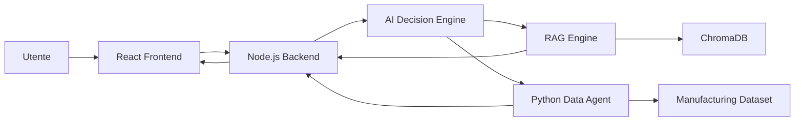
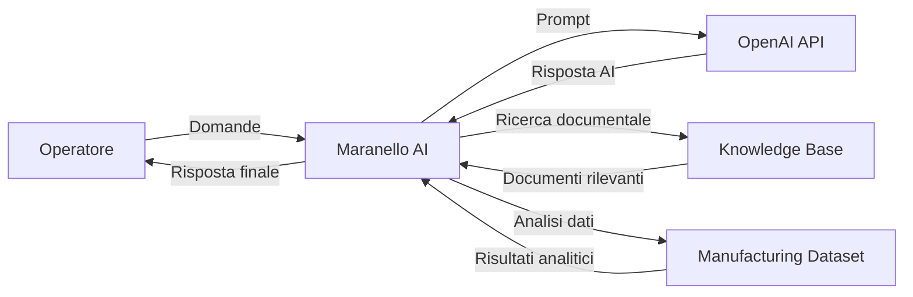
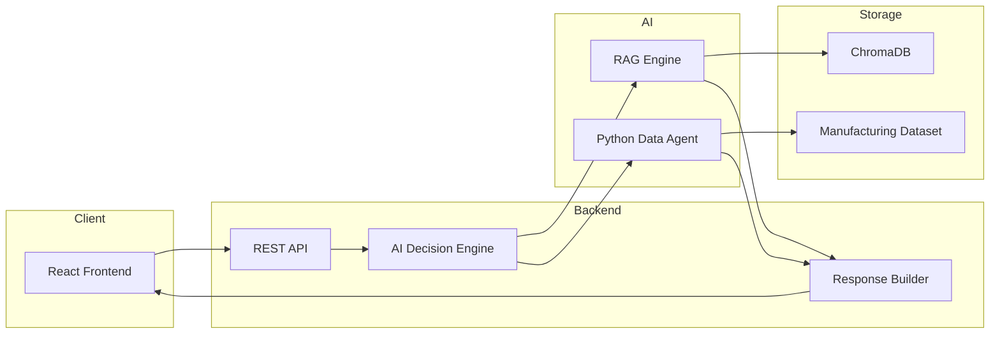
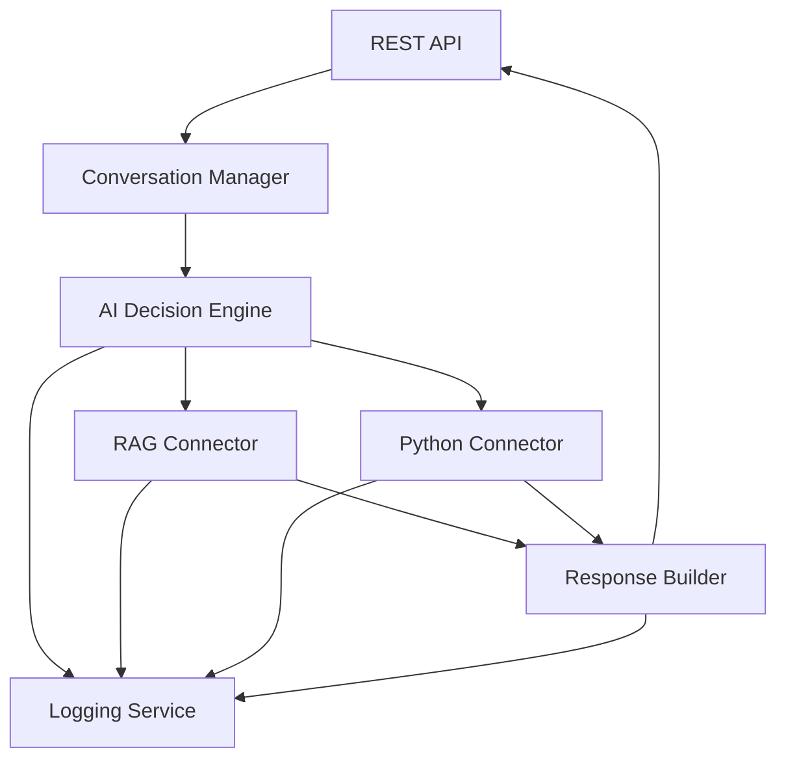
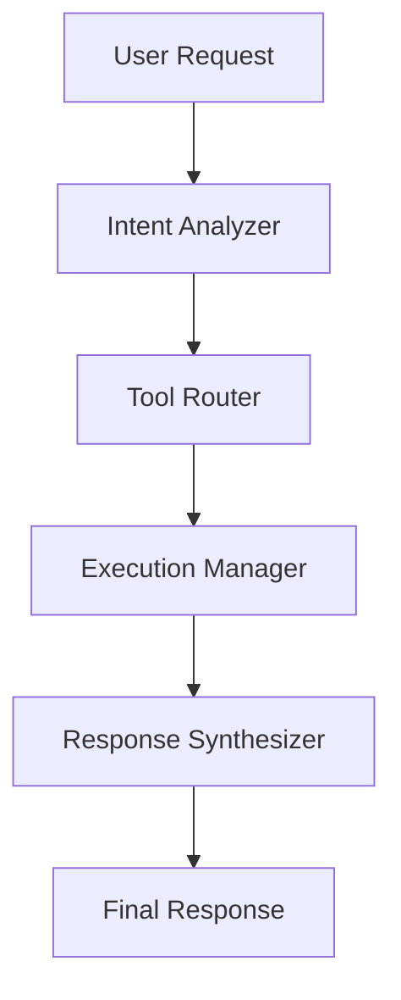
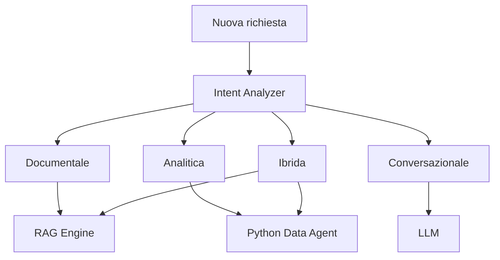
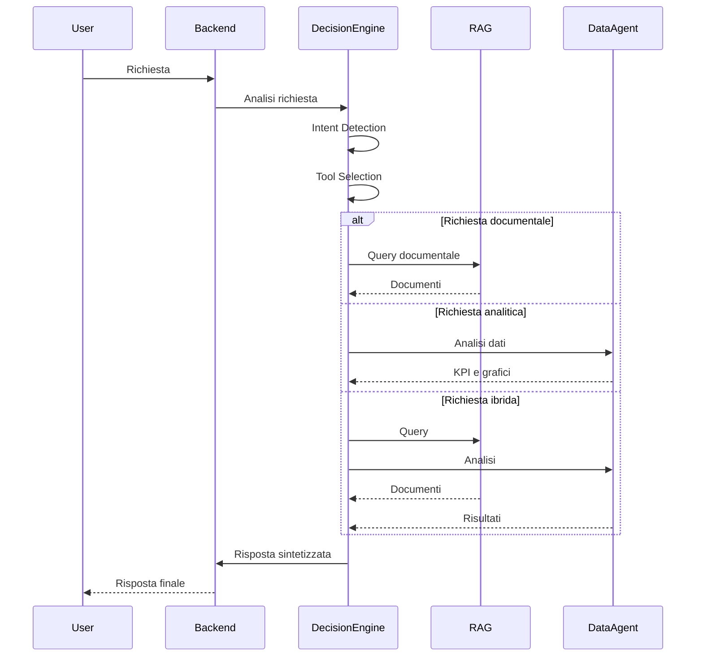
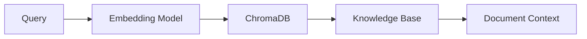
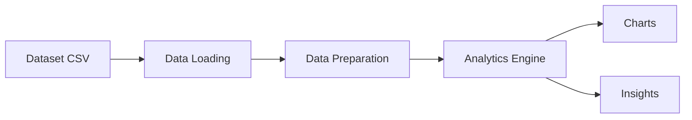
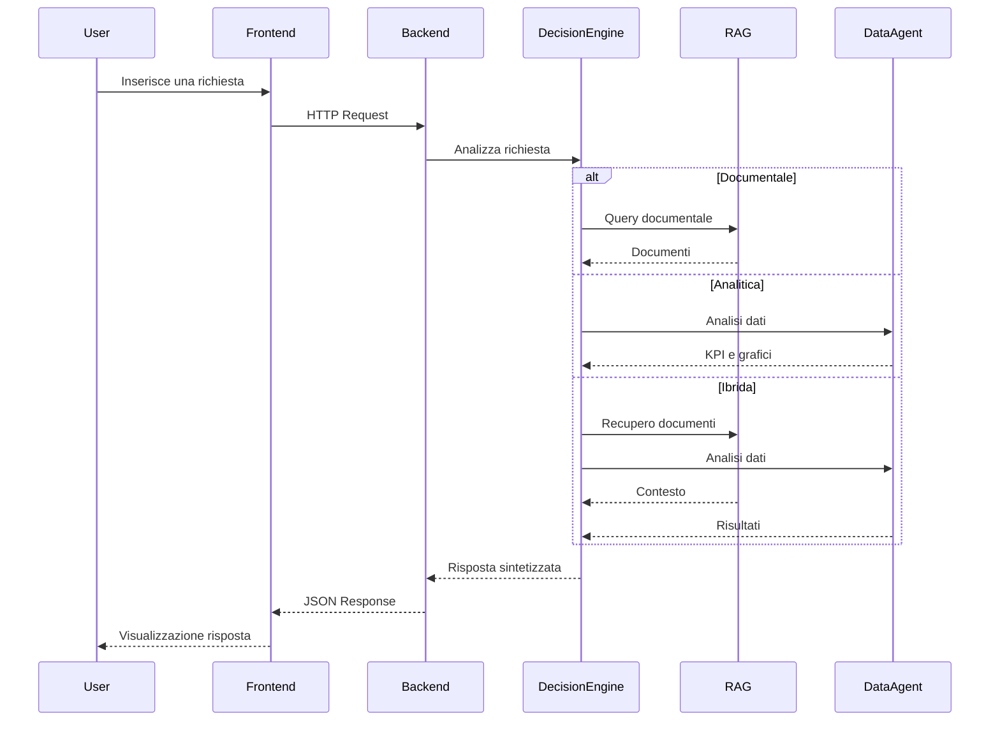

# System Architecture

> **Progetto:** Maranello AI  
> **Versione:** 1.0  
> **Tipo documento:** System Architecture Document (SAD)  
> **Stato:** Draft  
> **Autore:** Marco Saccani  
> **Ultimo aggiornamento:** Luglio 2026

---

# Indice

1. Introduzione
2. Obiettivi architetturali
3. Principi architetturali
4. Architettura generale
5. System Context
6. Container Architecture
7. Backend Architecture
8. AI Decision Engine
9. Retrieval-Augmented Generation
10. Python Data Agent
11. Communication Flow
12. Technology Stack
13. Architectural Decisions
14. Scalabilità
15. Sicurezza
16. Estendibilità
17. Conclusioni

---

# 1. Introduzione

## 1.1 Scopo

Il presente documento descrive l'architettura software del progetto **Maranello AI**.

L'obiettivo è illustrare la struttura dell'applicazione, i componenti principali, le responsabilità di ciascun modulo e le modalità di comunicazione tra i servizi.

Questo documento costituisce il riferimento principale per l'implementazione tecnica del sistema e rappresenta il collegamento tra i requisiti software definiti nella Software Requirements Specification e il codice sorgente.

---

## 1.2 Obiettivi

L'architettura è stata progettata con i seguenti obiettivi.

- Separazione delle responsabilità.
- Elevata modularità.
- Facilità di manutenzione.
- Scalabilità.
- Estendibilità.
- Supporto a nuovi strumenti AI.
- Facilità di testing.
- Riutilizzabilità dei componenti.

---

## 1.3 Visione architetturale

Maranello AI è stato progettato come un sistema distribuito composto da più servizi indipendenti.

Ogni componente svolge una responsabilità specifica e comunica con gli altri esclusivamente tramite interfacce ben definite.

L'elemento centrale dell'architettura è l'**AI Decision Engine**, incaricato di analizzare le richieste degli utenti, selezionare il flusso di elaborazione più appropriato e coordinare i servizi coinvolti nella generazione della risposta.

L'utente interagisce esclusivamente con una semplice interfaccia conversazionale, mentre tutta la complessità dell'elaborazione rimane nascosta all'interno del backend.

---

# 2. Obiettivi architetturali

L'architettura del sistema è stata progettata per soddisfare i seguenti obiettivi.

| ID | Obiettivo |
|----|-----------|
| AG-001 | Separare completamente frontend e backend. |
| AG-002 | Isolare la logica AI dalla logica applicativa. |
| AG-003 | Rendere indipendente il motore RAG. |
| AG-004 | Rendere indipendente il Data Agent Python. |
| AG-005 | Consentire l'aggiunta di nuovi strumenti AI senza modificare il frontend. |
| AG-006 | Ridurre l'accoppiamento tra i componenti. |
| AG-007 | Favorire la manutenzione del codice. |
| AG-008 | Consentire l'evoluzione futura dell'architettura. |

---

# 3. Principi architetturali

L'intera architettura è stata progettata seguendo alcuni principi fondamentali di software engineering.

## 3.1 Single Responsibility Principle

Ogni componente del sistema possiede una singola responsabilità.

Ad esempio:

- il frontend gestisce esclusivamente l'interfaccia utente;
- il backend coordina i servizi;
- il Decision Engine prende le decisioni;
- il RAG recupera la documentazione;
- il Data Agent analizza i dati.

---

## 3.2 Separation of Concerns

Ogni livello dell'applicazione è indipendente dagli altri.

La logica di business non dipende dalla tecnologia utilizzata per l'interfaccia grafica né dagli strumenti AI impiegati.

---

## 3.3 Modularità

Tutti i servizi sono progettati come moduli indipendenti.

Questo permette di sostituire un componente senza modificare il resto del sistema.

---

## 3.4 Scalabilità

L'architettura consente l'aggiunta di nuovi servizi AI mantenendo invariata la struttura generale dell'applicazione.

---

## 3.5 Estendibilità

Nuovi strumenti, modelli AI o sorgenti dati possono essere integrati tramite nuovi connettori senza modificare l'interfaccia utente.

---

# 4. Architettura generale

L'applicazione è organizzata secondo un'architettura a servizi.

I componenti principali sono:

- Frontend React
- Backend Node.js
- AI Decision Engine
- Retrieval-Augmented Generation Engine
- Python Data Agent
- ChromaDB
- Dataset CSV

L'utente comunica esclusivamente con il frontend.

Ogni richiesta viene inoltrata al backend, che delega il processo decisionale all'AI Decision Engine.

Quest'ultimo determina il flusso di elaborazione più appropriato e coordina l'utilizzo del motore RAG, del Python Data Agent oppure di entrambi.

La risposta finale viene costruita dal backend e restituita all'interfaccia conversazionale.

---

## 4.1 Architettura ad alto livello

---

## 4.2 Descrizione dei componenti

| Componente | Responsabilità |
|------------|----------------|
| Frontend | Interfaccia conversazionale dell'utente |
| Backend | Coordinamento dell'intera applicazione |
| AI Decision Engine | Analisi dell'intento e selezione del flusso di elaborazione |
| RAG Engine | Recupero della documentazione aziendale |
| ChromaDB | Ricerca semantica nella Knowledge Base |
| Python Data Agent | Analisi del dataset e generazione di grafici |
| Dataset | Archivio dei dati di produzione utilizzato dal Data Agent |

---

# 5. System Context

## 5.1 Contesto del sistema

Maranello AI è una piattaforma software progettata per supportare gli operatori del reparto **Quality & Manufacturing Operations** nell'accesso rapido a informazioni aziendali e nell'analisi dei dati di produzione.

L'applicazione rappresenta un unico punto di accesso verso differenti sorgenti informative:

- documentazione aziendale;
- dataset di produzione;
- modelli di intelligenza artificiale.

L'utente interagisce esclusivamente tramite una chat web, senza conoscere la complessità dell'architettura sottostante.

L'intero processo decisionale viene gestito automaticamente dal sistema.

---

## 5.2 Attori esterni

| Attore | Descrizione |
|---------|-------------|
| Operatore | Utilizza il sistema per consultare documentazione e analizzare dati. |
| OpenAI API | Fornisce il Large Language Model utilizzato dal Decision Engine. |
| Knowledge Base | Contiene la documentazione aziendale indicizzata. |
| Manufacturing Dataset | Contiene i dati di produzione utilizzati dal Data Agent. |

---

## 5.3 System Context Diagram

---

# 6. Container Architecture

## 6.1 Panoramica

L'applicazione è organizzata secondo un'architettura a servizi indipendenti.

Ogni container svolge una responsabilità specifica e comunica con gli altri mediante API.

Questa organizzazione riduce l'accoppiamento tra i componenti e rende il sistema facilmente estendibile.

---

## 6.2 Container principali

| Container | Tecnologia | Responsabilità |
|------------|------------|----------------|
| Frontend | React | Interfaccia utente |
| Backend | Node.js + Express | Coordinamento dei servizi |
| AI Decision Engine | LLM | Classificazione delle richieste e orchestrazione |
| RAG Engine | LangChain + ChromaDB | Recupero della documentazione |
| Python Data Agent | FastAPI + Pandas | Analisi del dataset |
| Vector Database | ChromaDB | Ricerca semantica |
| Dataset | CSV | Archivio dei dati produttivi |

---

## 6.3 Container Diagram

---

## 6.4 Responsabilità dei container

### Frontend

Responsabilità:

- visualizzazione della chat;
- invio delle richieste;
- visualizzazione di grafici e tabelle;
- gestione della sessione utente.

---

### Backend

Responsabilità:

- gestione delle API;
- coordinamento dei componenti;
- gestione del contesto conversazionale;
- aggregazione delle risposte;
- gestione degli errori.

---

### AI Decision Engine

Responsabilità:

- analisi dell'intento;
- classificazione delle richieste;
- selezione del flusso di elaborazione;
- coordinamento dei servizi AI.

---

### RAG Engine

Responsabilità:

- ricerca semantica;
- recupero dei documenti;
- preparazione del contesto documentale.

---

### Python Data Agent

Responsabilità:

- caricamento del dataset;
- analisi statistica;
- calcolo dei KPI;
- generazione di grafici;
- produzione di insight.

---

# 7. Backend Architecture

## 7.1 Panoramica

Il backend rappresenta il cuore dell'applicazione.

Ha il compito di coordinare tutti i servizi coinvolti nell'elaborazione delle richieste, mantenere il contesto della conversazione e costruire la risposta finale da restituire all'utente.

A differenza di una classica applicazione REST, il backend di Maranello AI non contiene la logica di business specifica dei singoli servizi, ma svolge il ruolo di coordinatore tra il frontend, il motore di decisione AI, il sistema RAG e il Python Data Agent.

---

## 7.2 Architettura interna

Il backend è suddiviso nei seguenti moduli.

| Modulo | Responsabilità |
|---------|----------------|
| REST API | Espone gli endpoint utilizzati dal frontend. |
| Conversation Manager | Gestisce il contesto della conversazione. |
| AI Decision Engine | Analizza la richiesta e decide il flusso di elaborazione. |
| RAG Connector | Comunica con il motore RAG. |
| Python Connector | Comunica con il Data Agent. |
| Response Builder | Costruisce la risposta finale. |
| Logging Service | Registra eventi, errori e decisioni del sistema. |

---

## 7.3 Backend Component Diagram

---

## 7.4 Flusso di elaborazione

Ogni richiesta segue il seguente processo:

1. Il frontend invia una richiesta HTTP al backend.
2. Il backend recupera il contesto della conversazione.
3. Il Decision Engine analizza la richiesta.
4. Il sistema determina il tipo di elaborazione necessario.
5. Vengono invocati uno o più servizi specializzati.
6. I risultati vengono aggregati.
7. Il backend costruisce la risposta finale.
8. La risposta viene restituita al frontend.

---

## 7.5 REST API

Responsabilità:

- ricezione delle richieste;
- validazione dell'input;
- gestione delle sessioni;
- inoltro delle richieste al backend;
- restituzione delle risposte.

---

## 7.6 Conversation Manager

Responsabilità:

- mantenimento del contesto;
- gestione della cronologia;
- preparazione del prompt;
- recupero dei messaggi precedenti.

Il Conversation Manager permette all'AI di comprendere richieste dipendenti dal contesto, come ad esempio:

> "Mostrami anche il grafico."

oppure

> "Approfondisci il secondo punto."

senza che l'utente debba ripetere tutte le informazioni.

---

## 7.7 Response Builder

Il Response Builder rappresenta l'ultimo componente della pipeline.

Riceve gli output provenienti dai diversi servizi e costruisce una risposta unica, coerente e pronta per essere visualizzata nell'interfaccia conversazionale.

Può combinare:

- testo;
- grafici;
- tabelle;
- KPI;
- riferimenti documentali;
- metadati.

---

## 7.8 Logging Service

Il Logging Service registra le principali informazioni di esecuzione del sistema.

Tra queste:

- timestamp della richiesta;
- componente selezionato;
- tempo di elaborazione;
- eventuali errori;
- stato della risposta.

La registrazione di queste informazioni facilita il debugging, il monitoraggio e l'analisi delle prestazioni del sistema.

---

# 8. AI Decision Engine

## 8.1 Panoramica

L'AI Decision Engine rappresenta il componente centrale dell'intera architettura di Maranello AI.

Il suo compito non è solamente interrogare un Large Language Model, ma analizzare ogni richiesta dell'utente, comprenderne l'obiettivo e coordinare il processo di elaborazione più appropriato.

Questo approccio consente di separare la logica decisionale dalla logica applicativa, rendendo il sistema più modulare, estendibile e facilmente manutenibile.

Il Decision Engine costituisce il punto di ingresso di tutte le richieste elaborate dal backend.

---

## 8.2 Responsabilità

Le principali responsabilità del Decision Engine sono:

- analizzare la richiesta dell'utente;
- identificare l'intento della conversazione;
- determinare il tipo di elaborazione richiesta;
- selezionare gli strumenti più appropriati;
- coordinare l'esecuzione dei servizi;
- sintetizzare le informazioni ottenute;
- restituire una risposta coerente al backend.

---

## 8.3 Architettura interna

Il Decision Engine è composto da quattro moduli principali.

| Modulo | Responsabilità |
|----------|----------------|
| Intent Analyzer | Analizza la richiesta dell'utente e identifica l'obiettivo della conversazione. |
| Tool Router | Seleziona i servizi da utilizzare. |
| Execution Manager | Coordina l'esecuzione dei servizi selezionati. |
| Response Synthesizer | Integra i risultati e produce una risposta unificata. |

---

## 8.4 Component Diagram

---

## 8.5 Intent Analyzer

L'Intent Analyzer rappresenta il primo livello di elaborazione.

Il suo obiettivo è comprendere il significato della richiesta indipendentemente dalla lingua utilizzata.

Le principali attività comprendono:

- identificazione dell'intento;
- riconoscimento della lingua;
- individuazione delle entità principali;
- analisi del contesto conversazionale;
- classificazione della richiesta.

---

## 8.6 Classificazione delle richieste

Ogni richiesta viene classificata in una delle seguenti categorie.

| Categoria | Descrizione |
|------------|-------------|
| Documentale | Consultazione della Knowledge Base. |
| Analitica | Analisi del dataset. |
| Ibrida | Richiede sia documentazione sia dati. |
| Conversazionale | Richieste generiche gestite direttamente dall'LLM. |

---

## 8.7 Tool Router

Il Tool Router riceve la categoria individuata dall'Intent Analyzer e determina quali componenti devono essere coinvolti.

Le decisioni possibili sono:

| Tipo richiesta | Servizio |
|----------------|----------|
| Documentale | RAG Engine |
| Analitica | Python Data Agent |
| Ibrida | RAG + Data Agent |
| Conversazionale | LLM |

Il Tool Router rappresenta il punto di separazione tra la logica decisionale e l'esecuzione tecnica dei servizi.

---

## 8.8 Routing Decision Diagram

---

## 8.9 Execution Manager

L'Execution Manager coordina l'esecuzione dei servizi selezionati.

Le sue responsabilità comprendono:

- avvio dei servizi;
- gestione delle chiamate API;
- sincronizzazione delle risposte;
- gestione dei timeout;
- raccolta dei risultati.

Nel caso di richieste ibride, il componente coordina l'esecuzione sia del motore RAG sia del Python Data Agent prima di procedere alla fase successiva.

---

## 8.10 Response Synthesizer

Il Response Synthesizer rappresenta l'ultimo stadio del Decision Engine.

Riceve gli output provenienti dai diversi componenti e costruisce una risposta coerente.

Può integrare:

- testo descrittivo;
- riferimenti documentali;
- risultati numerici;
- KPI;
- grafici;
- tabelle.

L'obiettivo è fornire all'utente un'unica risposta completa, indipendentemente dal numero di servizi coinvolti nell'elaborazione.

---

## 8.11 Workflow del Decision Engine

---

# 9. Retrieval-Augmented Generation (RAG)

## 9.1 Panoramica

Il motore Retrieval-Augmented Generation (RAG) è responsabile della gestione della documentazione aziendale.

Il suo obiettivo è recuperare le informazioni più pertinenti dalla Knowledge Base e fornirle al Decision Engine come contesto per la generazione della risposta.

Questo approccio riduce il rischio di allucinazioni del modello linguistico e garantisce che le risposte relative alle procedure aziendali siano basate esclusivamente sulla documentazione disponibile.

---

## 9.2 Responsabilità

Il motore RAG è responsabile di:

- interrogare la Knowledge Base;
- effettuare ricerche semantiche;
- recuperare i documenti più pertinenti;
- preparare il contesto documentale;
- fornire le fonti utilizzate.

---

## 9.3 Architettura del RAG

---

## 9.4 Pipeline di elaborazione

Il motore RAG segue il seguente flusso operativo:

1. Ricezione della query.
2. Conversione della query in embedding vettoriali.
3. Ricerca semantica nel Vector Database.
4. Recupero dei documenti più rilevanti.
5. Preparazione del contesto.
6. Invio del contesto al Decision Engine.

---

## 9.5 ChromaDB

ChromaDB è utilizzato come Vector Database per memorizzare gli embedding dei documenti della Knowledge Base.

L'utilizzo di un database vettoriale permette di eseguire ricerche basate sul significato della richiesta piuttosto che sulla semplice corrispondenza di parole chiave.

---

## 9.6 Knowledge Base

La Knowledge Base contiene documentazione relativa ai processi di Quality & Manufacturing Operations.

Tra i documenti previsti:

- procedure operative;
- istruzioni di lavoro;
- policy aziendali;
- documentazione qualità;
- gestione delle non conformità;
- supplier quality;
- CAPA;
- audit;
- controlli di processo.

---

## 9.7 Output del RAG

Il motore restituisce:

- documenti rilevanti;
- riferimenti alle fonti;
- metadati dei documenti;
- contesto testuale.

Tali informazioni vengono utilizzate dal Decision Engine per costruire la risposta finale.

---

# 10. Python Data Agent

## 10.1 Panoramica

Il Python Data Agent è il componente dedicato all'analisi dei dati produttivi.

A differenza del motore RAG, il suo obiettivo non è recuperare documentazione, ma elaborare dati strutturati e produrre analisi statistiche, KPI e visualizzazioni.

Il Data Agent è implementato come microservizio indipendente basato su FastAPI.

---

## 10.2 Responsabilità

Il Python Data Agent è responsabile di:

- caricamento del dataset;
- validazione dei dati;
- pulizia del dataset;
- analisi statistica;
- calcolo dei KPI;
- generazione di grafici;
- produzione di insight.

---

## 10.3 Pipeline del Data Agent

---

## 10.4 Fasi di elaborazione

Il processo di analisi è composto dalle seguenti fasi.

### Data Loading

Il dataset viene caricato automaticamente utilizzando Pandas.

---

### Data Preparation

Durante questa fase vengono:

- verificati i tipi di dato;
- gestiti eventuali valori mancanti;
- eliminati duplicati;
- controllata la qualità del dataset.

---

### Analytics Engine

L'Analytics Engine produce:

- statistiche descrittive;
- confronti;
- indicatori di performance;
- aggregazioni;
- analisi temporali.

---

### Visualization Engine

Il sistema genera automaticamente grafici quali:

- bar chart;
- line chart;
- pie chart;
- histogram;
- scatter plot.

I grafici vengono restituiti direttamente al frontend.

---

### Insight Generation

L'ultima fase consiste nella trasformazione dei risultati numerici in una spiegazione testuale facilmente comprensibile.

Gli insight vengono successivamente integrati dal Decision Engine nella risposta finale.

---

## 10.5 Comunicazione con il backend

Il Data Agent comunica con il backend mediante API REST.

Ogni richiesta contiene:

- identificativo della sessione;
- richiesta dell'utente;
- eventuali parametri di analisi.

Il Data Agent restituisce:

- risultati numerici;
- grafici;
- tabelle;
- insight testuali.

---

## 10.6 Vantaggi dell'architettura

L'utilizzo di un microservizio Python separato offre numerosi vantaggi:

- indipendenza dal backend Node.js;
- possibilità di utilizzare librerie scientifiche native di Python;
- maggiore manutenibilità;
- facilità di testing;
- scalabilità del componente analitico;
- possibilità di integrare nuovi algoritmi senza modificare il backend.

---

# 11. Communication Flow

## 11.1 Panoramica

La comunicazione tra i componenti segue un modello client-server con orchestrazione centralizzata.

Ogni componente comunica esclusivamente attraverso interfacce ben definite, evitando dipendenze dirette tra i servizi.

Questo approccio garantisce un basso accoppiamento e facilita l'evoluzione futura dell'architettura.

---

## 11.2 Flusso generale

---

## 11.3 Comunicazioni tra i componenti

| Origine | Destinazione | Protocollo |
|----------|--------------|------------|
| Frontend | Backend | HTTP REST |
| Backend | OpenAI | HTTPS API |
| Backend | Python Data Agent | HTTP REST |
| Backend | RAG Engine | Chiamata interna |
| RAG Engine | ChromaDB | API ChromaDB |
| Data Agent | Dataset CSV | Accesso locale |

---

# 12. Technology Stack

## 12.1 Tecnologie principali

| Livello | Tecnologia |
|----------|------------|
| Frontend | React |
| Backend | Node.js |
| Framework Backend | Express |
| AI | OpenAI API |
| Decision Engine | Large Language Model |
| RAG | LangChain |
| Vector Database | ChromaDB |
| Data Analytics | Python |
| API Python | FastAPI |
| Data Analysis | Pandas |
| Visualizzazione | Matplotlib |
| Dataset | CSV |

---

## 12.2 Motivazioni delle scelte tecnologiche

| Tecnologia | Motivazione |
|------------|-------------|
| React | Interfaccia moderna e component-based. |
| Node.js | Ottimo supporto per applicazioni I/O intensive. |
| Express | Framework leggero e facilmente estendibile. |
| FastAPI | Alte prestazioni e semplicità di integrazione con Python. |
| Pandas | Standard per la manipolazione di dati tabellari. |
| ChromaDB | Database vettoriale semplice da integrare in progetti RAG. |
| LangChain | Gestione della pipeline Retrieval-Augmented Generation. |
| OpenAI | Capacità avanzate di comprensione e generazione del linguaggio naturale. |

---

# 13. Architectural Decisions

Durante la progettazione sono state adottate alcune decisioni architetturali fondamentali.

| ID | Decisione | Motivazione |
|----|-----------|-------------|
| ADR-001 | Separazione tra frontend e backend | Migliore modularità e manutenzione. |
| ADR-002 | Introduzione dell'AI Decision Engine | Centralizzare la logica decisionale. |
| ADR-003 | Data Agent come microservizio indipendente | Isolare la logica analitica e sfruttare l'ecosistema Python. |
| ADR-004 | Utilizzo del RAG | Ridurre il rischio di allucinazioni e migliorare l'affidabilità delle risposte. |
| ADR-005 | Architettura modulare | Facilitare l'estensione futura del sistema. |

---

# 14. Scalabilità

L'architettura è progettata per consentire una crescita progressiva del sistema.

Tra le possibili evoluzioni:

- aggiunta di nuovi strumenti AI;
- integrazione con database relazionali;
- supporto a più dataset;
- distribuzione dei servizi su container indipendenti;
- bilanciamento del carico tra più istanze del backend.

La separazione tra i componenti permette di scalare ciascun servizio in modo indipendente, senza modificare gli altri moduli dell'applicazione.

---

# 15. Sicurezza

L'architettura prevede alcune misure di sicurezza di base.

- utilizzo di variabili d'ambiente per API Key e configurazioni sensibili;
- validazione degli input ricevuti dal frontend;
- gestione controllata degli errori;
- separazione tra logica applicativa e servizi AI;
- limitazione dell'accesso diretto ai dataset e alla Knowledge Base.

Queste misure costituiscono una base solida per eventuali evoluzioni future, come autenticazione degli utenti o gestione dei ruoli.

---

# 16. Estendibilità

Uno degli obiettivi principali dell'architettura è consentire l'aggiunta di nuove funzionalità senza modificare la struttura esistente.

Ad esempio sarà possibile integrare:

- nuovi modelli linguistici;
- nuovi strumenti AI;
- ulteriori Data Agent specializzati;
- database SQL;
- sistemi ERP;
- piattaforme di Business Intelligence;
- API aziendali esterne.

La progettazione modulare garantisce che tali estensioni possano essere introdotte con un impatto minimo sul resto dell'applicazione.

---

# 17. Conclusioni

L'architettura di Maranello AI è stata progettata secondo principi di modularità, separazione delle responsabilità ed estendibilità.

L'introduzione dell'AI Decision Engine come componente centrale permette di coordinare in modo trasparente il motore RAG e il Python Data Agent, offrendo all'utente un'unica interfaccia conversazionale capace di gestire richieste documentali, analitiche e ibride.

Questa architettura costituisce la base per lo sviluppo dell'applicazione e per le future evoluzioni del progetto.

---

## Stato del documento

| Informazione | Valore |
|--------------|--------|
| Documento | System Architecture |
| Versione | 1.0 |
| Stato | Draft |
| Lingua | Italiano |
| Prossimo documento | 04_Data_Model.md |

---