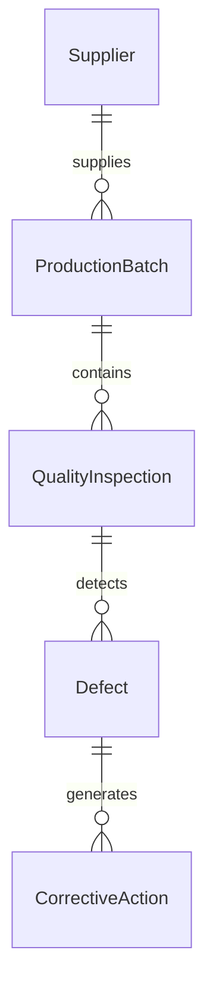
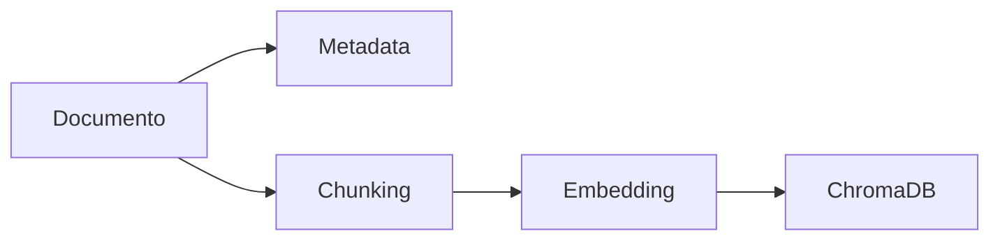
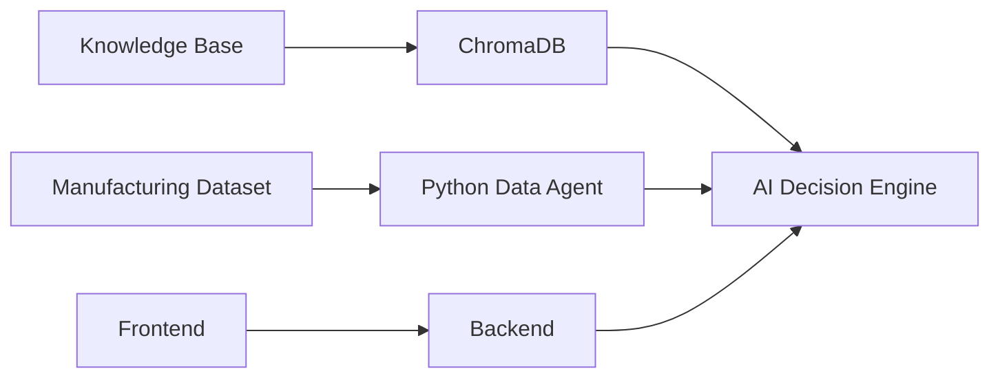
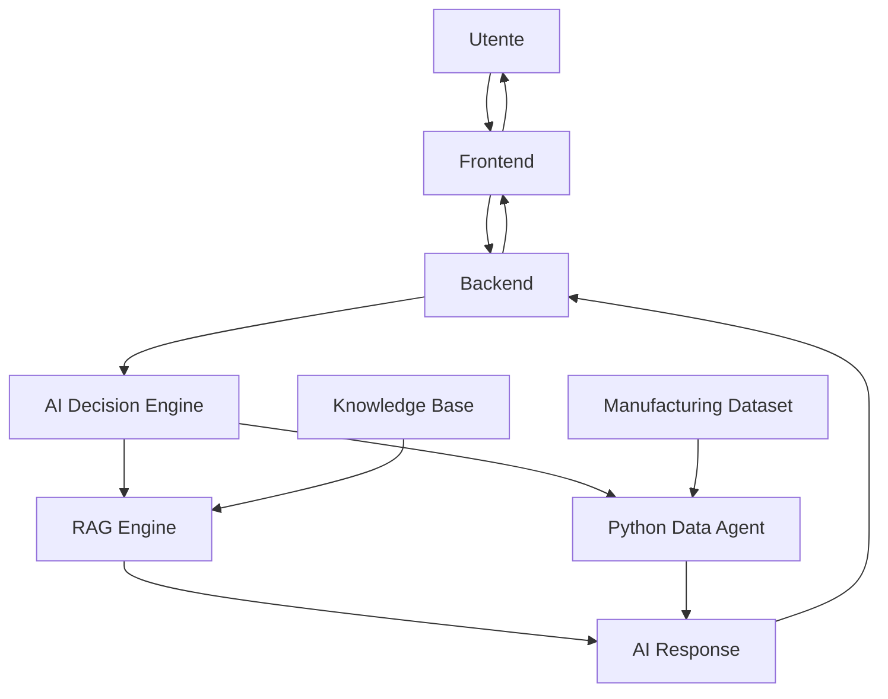

# Data Model

> **Progetto:** Maranello AI
> **Versione:** 1.0
> **Tipo documento:** Data Model
> **Stato:** Draft
> **Autore:** Marco Saccani
> **Ultimo aggiornamento:** Luglio 2026

---

# Indice

1. Introduzione
2. Obiettivi del modello dati
3. Principi di progettazione
4. Data Sources
5. Logical Data Model
6. Knowledge Base Model
7. Manufacturing Dataset Model
8. Conversation Model
9. AI Request Model
10. AI Response Model
11. Vector Database Model
12. Data Relationships
13. Data Flow
14. Data Validation
15. Future Extensions
16. Conclusioni

---

# 1. Introduzione

## 1.1 Scopo del documento

Il presente documento descrive il modello dati adottato da Maranello AI.

L'obiettivo è definire in maniera strutturata tutte le informazioni gestite dall'applicazione, indipendentemente dalla tecnologia utilizzata per la loro memorizzazione.

Il documento costituisce il riferimento per lo sviluppo del backend, del sistema RAG, del Python Data Agent e dell'interfaccia frontend.

---

## 1.2 Obiettivi

Il modello dati è progettato per:

- rappresentare i dati di produzione e qualità;
- organizzare la documentazione aziendale;
- definire i modelli di comunicazione tra i componenti;
- garantire coerenza tra frontend e backend;
- facilitare l'evoluzione futura del sistema.

---

# 2. Obiettivi del modello dati

Durante la progettazione sono stati definiti i seguenti obiettivi.

| ID | Obiettivo |
|----|-----------|
| DM-001 | Separare dati strutturati e documentazione. |
| DM-002 | Ridurre la duplicazione delle informazioni. |
| DM-003 | Favorire la modularità dei modelli. |
| DM-004 | Rendere il sistema facilmente estendibile. |
| DM-005 | Garantire la tracciabilità delle informazioni. |
| DM-006 | Consentire interrogazioni documentali e analitiche. |

---

# 3. Principi di progettazione

Il modello dati segue alcuni principi fondamentali.

## Separazione delle responsabilità

Ogni categoria di dati viene gestita da un componente dedicato.

- Knowledge Base
- Dataset produttivo
- Conversazioni
- Richieste AI
- Risposte AI

---

## Modularità

Ogni modello dati può evolvere indipendentemente dagli altri.

---

## Estendibilità

Nuovi dataset e nuove fonti informative potranno essere aggiunti senza modificare la struttura esistente.

---

## Tracciabilità

Ogni informazione deve poter essere ricondotta alla propria origine.

---

## Coerenza

Tutti i componenti utilizzano strutture dati condivise per garantire interoperabilità tra frontend, backend e servizi AI.

---

# 4. Data Sources

Maranello AI utilizza differenti sorgenti dati, ciascuna con uno scopo specifico.

| Sorgente | Tipo | Utilizzo |
|-----------|------|----------|
| Knowledge Base | Documentale | Procedure e policy aziendali |
| Manufacturing Dataset | Strutturata | Analisi KPI e qualità |
| Conversation History | Conversazionale | Contesto della chat |
| Prompt Templates | Configurazione | Costruzione dei prompt |
| Vector Database | Indicizzazione | Ricerca semantica |

---

## Classificazione delle sorgenti

| Categoria | Descrizione |
|------------|-------------|
| Documentale | Documenti aziendali utilizzati dal RAG |
| Analitica | Dataset utilizzati dal Data Agent |
| Conversazionale | Storico delle conversazioni |
| Configurazione | Prompt e impostazioni del sistema |

---

## Stato del documento

Il presente documento descrive il modello logico dei dati utilizzati dall'applicazione.

I capitoli successivi approfondiscono nel dettaglio ciascun modello informativo e le relazioni tra essi.

---

# 5. Logical Data Model

## 5.1 Panoramica

Il modello logico dei dati descrive le principali entità informative gestite da Maranello AI e le relazioni esistenti tra esse.

L'obiettivo non è rappresentare la struttura fisica dei file o dei database, bensì definire il dominio informativo dell'applicazione.

Il modello è stato progettato seguendo i principi della separazione delle responsabilità e della normalizzazione concettuale, distinguendo chiaramente le informazioni documentali da quelle analitiche.

---

## 5.2 Aree informative

Il dominio dati è suddiviso in cinque macroaree.

| Area | Descrizione |
|------|-------------|
| Production | Informazioni relative ai lotti di produzione. |
| Quality | Ispezioni, controlli e risultati qualità. |
| Defects | Gestione delle non conformità rilevate. |
| Suppliers | Informazioni sui fornitori dei componenti. |
| Corrective Actions | Azioni correttive e preventive (CAPA). |

---

## 5.3 Entità principali

Il sistema è composto dalle seguenti entità logiche.

| Entità | Descrizione |
|---------|-------------|
| Production Batch | Lotto di produzione. |
| Quality Inspection | Ispezione qualità effettuata sul lotto. |
| Defect | Difetto rilevato durante il controllo. |
| Supplier | Fornitore del componente coinvolto. |
| Corrective Action | Azione correttiva associata al difetto. |

---

## 5.4 Logical Entity Relationship Diagram

---

## 5.5 Descrizione del dominio

### Production Batch

Rappresenta un lotto di produzione.

Ogni lotto identifica un insieme di componenti prodotti in una determinata linea produttiva durante uno specifico intervallo temporale.

---

### Quality Inspection

Ogni lotto può essere sottoposto a una o più ispezioni qualità.

Le ispezioni raccolgono informazioni sullo stato del lotto e sugli eventuali difetti rilevati.

---

### Defect

Un'ispezione può individuare uno o più difetti.

Ogni difetto è classificato secondo tipologia, severità e impatto produttivo.

---

### Supplier

Ogni lotto è associato al fornitore dei componenti utilizzati.

Ciò permette di effettuare analisi sulla qualità dei fornitori e sull'affidabilità della supply chain.

---

### Corrective Action

Per ogni difetto può essere definita un'azione correttiva.

Le azioni correttive consentono di monitorare il processo di miglioramento continuo e rappresentano un elemento fondamentale dei sistemi di gestione della qualità.

---

## 5.6 Benefici del modello

La suddivisione del dominio in entità indipendenti permette di:

- migliorare la leggibilità del dataset;
- facilitare le analisi multidimensionali;
- ridurre la duplicazione delle informazioni;
- estendere facilmente il modello dati;
- simulare un ambiente produttivo realistico.

---

# 6. Knowledge Base Model

## 6.1 Panoramica

La Knowledge Base rappresenta l'insieme della documentazione aziendale utilizzata dal sistema Retrieval-Augmented Generation (RAG).

I documenti non vengono utilizzati direttamente dal modello linguistico, ma vengono preprocessati, suddivisi in blocchi informativi e indicizzati all'interno del Vector Database.

---

## 6.2 Struttura logica

Ogni documento è composto da:

- metadati;
- contenuto;
- suddivisione in chunk;
- embedding vettoriali.

---

## 6.3 Pipeline documentale

---

## 6.4 Modello del documento

Ogni documento della Knowledge Base è descritto dalle seguenti informazioni.

| Campo | Tipo | Descrizione |
|--------|------|-------------|
| document_id | UUID | Identificativo univoco |
| title | String | Titolo del documento |
| category | String | Categoria documentale |
| language | String | Lingua del documento |
| version | String | Revisione |
| owner | String | Responsabile del documento |
| creation_date | Date | Data di creazione |
| last_update | Date | Ultima revisione |
| status | Enum | Draft, Approved, Archived |

---

## 6.5 Modello del Chunk

Durante la fase di indicizzazione ogni documento viene suddiviso in blocchi informativi indipendenti.

| Campo | Tipo | Descrizione |
|--------|------|-------------|
| chunk_id | UUID | Identificativo del blocco |
| document_id | UUID | Documento di origine |
| chunk_number | Integer | Posizione nel documento |
| text | Text | Contenuto del blocco |
| embedding | Vector | Embedding vettoriale |
| metadata | JSON | Informazioni aggiuntive |

---

## 6.6 Categorie documentali

La Knowledge Base sarà composta da documentazione appartenente alle seguenti categorie.

| Categoria | Descrizione |
|------------|-------------|
| Quality Procedures | Procedure qualità |
| Manufacturing Procedures | Procedure produttive |
| Work Instructions | Istruzioni operative |
| Supplier Quality | Gestione fornitori |
| Non Conformity Management | Gestione non conformità |
| CAPA | Azioni correttive e preventive |
| Audit | Audit qualità |
| Safety | Procedure di sicurezza |
| Internal Policies | Policy aziendali |

---

## 6.7 Benefici del modello

La struttura adottata permette di:

- migliorare la precisione della ricerca semantica;
- ridurre il contesto inviato al modello linguistico;
- mantenere la tracciabilità delle fonti;
- aggiornare la documentazione senza ricostruire l'intera Knowledge Base;
- facilitare l'espansione futura del patrimonio documentale.

---

# 7. Manufacturing Dataset Model

## 7.1 Panoramica

Il Manufacturing Dataset rappresenta l'insieme dei dati strutturati utilizzati dal Python Data Agent per effettuare analisi, calcolare KPI e generare insight.

Il dataset è stato progettato per simulare un ambiente produttivo reale appartenente a un costruttore automobilistico premium.

Le informazioni sono organizzate secondo un modello logico che rappresenta le principali attività di produzione, controllo qualità, gestione dei fornitori e miglioramento continuo.

---

## 7.2 Obiettivi

Il dataset è progettato per consentire:

- analisi della qualità produttiva;
- monitoraggio dei KPI;
- analisi temporali;
- confronto tra linee produttive;
- valutazione delle performance dei fornitori;
- individuazione delle principali cause di difetto;
- monitoraggio delle azioni correttive.

---

## 7.3 Modello logico del dataset

Il dominio è composto da cinque entità principali.

| Entità | Descrizione |
|---------|-------------|
| Production Batch | Lotto di produzione |
| Quality Inspection | Controllo qualità |
| Defect | Difetto rilevato |
| Supplier | Fornitore |
| Corrective Action | Azione correttiva |

---

## 7.4 Production Batch

Questa entità rappresenta un lotto di produzione.

Ogni record identifica un insieme omogeneo di componenti prodotti nelle stesse condizioni operative.

### Campi

| Campo | Tipo | Descrizione |
|--------|------|-------------|
| batch_id | UUID | Identificativo del lotto |
| production_date | Date | Data produzione |
| production_line | String | Linea produttiva |
| plant | String | Stabilimento |
| component | String | Componente prodotto |
| supplier_id | UUID | Fornitore principale |
| quantity_produced | Integer | Quantità prodotta |
| shift | Enum | Turno produttivo |
| operator_team | String | Team responsabile |

---

## 7.5 Quality Inspection

Ogni lotto può essere sottoposto a una o più ispezioni.

### Campi

| Campo | Tipo | Descrizione |
|--------|------|-------------|
| inspection_id | UUID | Identificativo ispezione |
| batch_id | UUID | Lotto ispezionato |
| inspection_date | Date | Data controllo |
| inspector | String | Ispettore |
| inspection_type | Enum | Tipo controllo |
| result | Enum | Esito |
| inspected_quantity | Integer | Quantità controllata |

---

## 7.6 Defect

I difetti rappresentano le non conformità rilevate durante le ispezioni.

### Campi

| Campo | Tipo | Descrizione |
|--------|------|-------------|
| defect_id | UUID | Identificativo |
| inspection_id | UUID | Ispezione associata |
| defect_type | String | Tipologia difetto |
| defect_category | String | Categoria |
| severity | Enum | Gravità |
| quantity | Integer | Quantità difettosa |
| estimated_cost | Decimal | Costo stimato |
| root_cause | String | Causa principale |

---

## 7.7 Supplier

Ogni componente è associato a un fornitore.

### Campi

| Campo | Tipo | Descrizione |
|--------|------|-------------|
| supplier_id | UUID | Identificativo |
| supplier_name | String | Nome fornitore |
| country | String | Paese |
| supplier_rating | Decimal | Valutazione qualità |
| supplied_component | String | Componente fornito |

---

## 7.8 Corrective Action

Le azioni correttive descrivono le attività intraprese per eliminare le cause delle non conformità.

### Campi

| Campo | Tipo | Descrizione |
|--------|------|-------------|
| capa_id | UUID | Identificativo |
| defect_id | UUID | Difetto associato |
| action_type | String | Tipologia azione |
| owner | String | Responsabile |
| status | Enum | Stato |
| opening_date | Date | Apertura |
| closing_date | Date | Chiusura |
| effectiveness | Enum | Valutazione finale |

---

## 7.9 Relazioni tra le entità

| Relazione | Cardinalità |
|------------|-------------|
| Supplier → Production Batch | 1:N |
| Production Batch → Quality Inspection | 1:N |
| Quality Inspection → Defect | 1:N |
| Defect → Corrective Action | 1:N |

---

## 7.10 KPI derivabili

Il modello dati consente il calcolo di numerosi indicatori.

Tra i principali:

- First Pass Yield (FPY)
- Defect Rate
- Defects Per Million Opportunities (DPMO)
- Scrap Rate
- Rework Rate
- Supplier Defect Rate
- Average Inspection Time
- Average Corrective Action Closure Time
- Cost of Poor Quality (COPQ)
- Defect Distribution by Category
- Defect Distribution by Production Line
- Supplier Performance Index

---

## 7.11 Utilizzo nel Python Data Agent

Il Python Data Agent utilizza il Manufacturing Dataset per:

- analisi statistiche;
- confronti temporali;
- individuazione di trend;
- generazione di dashboard;
- costruzione di grafici;
- risposta a richieste formulate in linguaggio naturale.

Le elaborazioni vengono eseguite utilizzando librerie Python dedicate all'analisi dei dati, garantendo flessibilità e possibilità di estensione futura.

---

# 8. Conversation Model

## 8.1 Panoramica

Il Conversation Model rappresenta la struttura dati utilizzata per gestire il contesto delle conversazioni tra l'utente e Maranello AI.

Il mantenimento del contesto è fondamentale per consentire al sistema di interpretare richieste dipendenti dai messaggi precedenti e garantire un'interazione naturale e coerente.

Il modello viene gestito dal Conversation Manager ed è condiviso con l'AI Decision Engine durante l'elaborazione delle richieste.

---

## 8.2 Informazioni gestite

Per ogni conversazione vengono memorizzate le seguenti informazioni.

| Campo | Tipo | Descrizione |
|--------|------|-------------|
| session_id | UUID | Identificativo della sessione |
| conversation_id | UUID | Identificativo della conversazione |
| created_at | DateTime | Data di creazione |
| updated_at | DateTime | Ultimo aggiornamento |
| language | String | Lingua della conversazione |
| messages | Array | Storico dei messaggi |

---

## 8.3 Modello del messaggio

Ogni messaggio della conversazione è rappresentato dalla seguente struttura.

| Campo | Tipo | Descrizione |
|--------|------|-------------|
| message_id | UUID | Identificativo |
| sender | Enum | User o Assistant |
| timestamp | DateTime | Data e ora |
| content | Text | Contenuto del messaggio |
| message_type | Enum | Text, Chart, Table, System |
| metadata | JSON | Informazioni aggiuntive |

---

## 8.4 Gestione del contesto

Il Conversation Manager utilizza lo storico dei messaggi per:

- mantenere il contesto della conversazione;
- evitare richieste ridondanti;
- interpretare riferimenti impliciti;
- costruire prompt contestualizzati.

---

# 9. AI Request Model

## 9.1 Panoramica

Ogni richiesta inviata dal frontend viene trasformata in un modello dati standardizzato prima di essere elaborata dal backend.

Questo approccio consente di disaccoppiare l'interfaccia utente dalla logica interna del sistema.

---

## 9.2 Struttura della richiesta

| Campo | Tipo | Descrizione |
|--------|------|-------------|
| request_id | UUID | Identificativo della richiesta |
| session_id | UUID | Sessione corrente |
| user_message | Text | Messaggio dell'utente |
| language | String | Lingua rilevata |
| timestamp | DateTime | Data della richiesta |
| conversation_context | Array | Cronologia conversazione |

---

## 9.3 Informazioni aggiuntive

Durante l'elaborazione il backend può arricchire la richiesta con informazioni interne.

| Campo | Descrizione |
|---------|-------------|
| detected_intent | Intento rilevato |
| execution_type | Documentale, Analitica, Ibrida, Conversazionale |
| selected_tools | Componenti selezionati |
| execution_id | Identificativo interno |

---

# 10. AI Response Model

## 10.1 Panoramica

La risposta prodotta dal sistema viene rappresentata attraverso un modello dati unificato indipendentemente dal numero di servizi coinvolti.

In questo modo il frontend riceve sempre una struttura coerente e facilmente interpretabile.

---

## 10.2 Struttura della risposta

| Campo | Tipo | Descrizione |
|--------|------|-------------|
| response_id | UUID | Identificativo |
| answer | Text | Risposta generata |
| execution_type | Enum | Tipo di elaborazione |
| generated_at | DateTime | Data di generazione |

---

## 10.3 Contenuti opzionali

La risposta può contenere informazioni aggiuntive.

| Campo | Tipo |
|--------|------|
| sources | Array |
| charts | Array |
| tables | Array |
| kpis | Array |
| recommendations | Array |

---

## 10.4 Provenienza delle informazioni

Per garantire trasparenza e tracciabilità, il sistema mantiene informazioni sull'origine dei dati utilizzati.

| Campo | Descrizione |
|---------|-------------|
| source_type | Knowledge Base o Dataset |
| document_reference | Documento utilizzato |
| confidence | Livello di affidabilità |
| retrieved_chunks | Chunk recuperati |

---

# 11. Vector Database Model

## 11.1 Panoramica

Il Vector Database rappresenta il componente responsabile della memorizzazione degli embedding della Knowledge Base.

Non contiene semplicemente i documenti originali, ma una rappresentazione vettoriale dei loro contenuti.

---

## 11.2 Struttura logica

Ogni record del Vector Database contiene:

| Campo | Tipo |
|--------|------|
| vector_id | UUID |
| chunk_id | UUID |
| document_id | UUID |
| embedding | Float[] |
| metadata | JSON |
| text | Text |

---

## 11.3 Processo di indicizzazione

---

## 11.4 Metadati

Ogni embedding mantiene informazioni utili alla ricerca.

Tra queste:

- categoria documentale;
- lingua;
- versione del documento;
- data di revisione;
- identificativo del documento;
- posizione del chunk.

---

## 11.5 Benefici

L'utilizzo del Vector Database permette di:

- effettuare ricerche semantiche;
- recuperare documenti rilevanti;
- migliorare la qualità delle risposte;
- ridurre le allucinazioni del modello linguistico;
- mantenere la tracciabilità delle fonti.

---

# 12. Data Relationships

## 12.1 Panoramica

Le entità descritte nei capitoli precedenti non costituiscono elementi isolati, ma fanno parte di un ecosistema informativo integrato.

Le relazioni tra le diverse sorgenti dati consentono al sistema di ricostruire il contesto produttivo, analizzare le prestazioni della qualità e fornire risposte complete attraverso il motore AI.

---

## 12.2 Relazioni tra le principali entità

| Entità origine | Entità destinazione | Relazione |
|----------------|---------------------|-----------|
| Supplier | Production Batch | Un fornitore può essere associato a più lotti di produzione. |
| Production Batch | Quality Inspection | Ogni lotto può essere sottoposto a più controlli qualità. |
| Quality Inspection | Defect | Un'ispezione può rilevare uno o più difetti. |
| Defect | Corrective Action | Ogni difetto può generare una o più azioni correttive. |
| Knowledge Base | ChromaDB | I documenti vengono indicizzati nel Vector Database. |
| ChromaDB | AI Decision Engine | I chunk recuperati vengono utilizzati per costruire il contesto della risposta. |
| Manufacturing Dataset | Python Data Agent | I dati vengono analizzati per il calcolo di KPI e insight. |

---

## 12.3 Relazioni tra i componenti applicativi

---

## 12.4 Tracciabilità delle informazioni

Ogni risposta generata dal sistema può essere ricondotta alla propria origine.

A seconda della tipologia di richiesta, il sistema mantiene la tracciabilità delle informazioni provenienti da:

- documentazione aziendale;
- dataset produttivo;
- risultati analitici;
- fonti multiple nel caso di richieste ibride.

Questo approccio aumenta l'affidabilità delle risposte e facilita la verifica delle informazioni da parte dell'utente.

---

# 13. Data Flow

## 13.1 Panoramica

Il ciclo di vita dei dati descrive il percorso seguito dalle informazioni all'interno dell'applicazione, dalla loro acquisizione fino alla generazione della risposta finale.

---

## 13.2 Flusso dei dati

---

## 13.3 Ciclo di vita dei dati

Ogni richiesta attraversa le seguenti fasi:

1. Acquisizione della richiesta dal frontend.
2. Analisi dell'intento da parte del Decision Engine.
3. Selezione dei servizi necessari.
4. Recupero dei dati documentali o analitici.
5. Elaborazione delle informazioni.
6. Costruzione della risposta.
7. Restituzione della risposta al frontend.

---

# 14. Data Validation

## 14.1 Obiettivi

La validazione dei dati garantisce la qualità e la coerenza delle informazioni utilizzate dal sistema.

Le verifiche vengono effettuate sia durante il caricamento della Knowledge Base sia durante l'elaborazione del Manufacturing Dataset.

---

## 14.2 Regole di validazione

| ID | Regola |
|----|---------|
| DV-001 | Ogni record deve possedere un identificativo univoco. |
| DV-002 | I campi obbligatori non possono essere nulli. |
| DV-003 | Le date devono rispettare il formato previsto. |
| DV-004 | I valori enumerati devono appartenere ai domini consentiti. |
| DV-005 | Le relazioni tra le entità devono essere consistenti. |
| DV-006 | I valori numerici devono rientrare negli intervalli previsti. |

---

## 14.3 Controlli sul dataset

Prima dell'analisi il Python Data Agent verifica:

- valori mancanti;
- record duplicati;
- tipi di dato;
- valori anomali;
- consistenza delle relazioni;
- completezza delle informazioni.

---

## 14.4 Controlli sulla Knowledge Base

Prima dell'indicizzazione vengono verificati:

- formato dei documenti;
- metadati obbligatori;
- versione del documento;
- lingua;
- corretta suddivisione in chunk.

---

# 15. Future Extensions

L'architettura del modello dati è progettata per supportare future evoluzioni del progetto.

Tra le possibili estensioni:

- integrazione con database relazionali;
- supporto a database NoSQL;
- gestione di dataset provenienti da sistemi MES;
- integrazione con sistemi ERP;
- acquisizione di dati in tempo reale tramite API;
- supporto a sensori IoT;
- gestione di più stabilimenti produttivi;
- introduzione di modelli predittivi basati su Machine Learning.

---

# 16. Conclusioni

Il modello dati definisce una rappresentazione strutturata delle informazioni gestite da Maranello AI.

La separazione tra dati documentali, dati analitici e dati conversazionali consente al sistema di fornire risposte accurate, contestualizzate e facilmente estendibili.

La progettazione modulare permette inoltre di evolvere il sistema senza modificare le componenti esistenti, garantendo coerenza tra architettura software, Knowledge Base e Data Analytics.

---

## Stato del documento

| Informazione | Valore |
|--------------|--------|
| Documento | Data Model |
| Versione | 1.0 |
| Stato | Draft |
| Lingua | Italiano |
| Prossimo documento | 05_API_Specification.md |

---