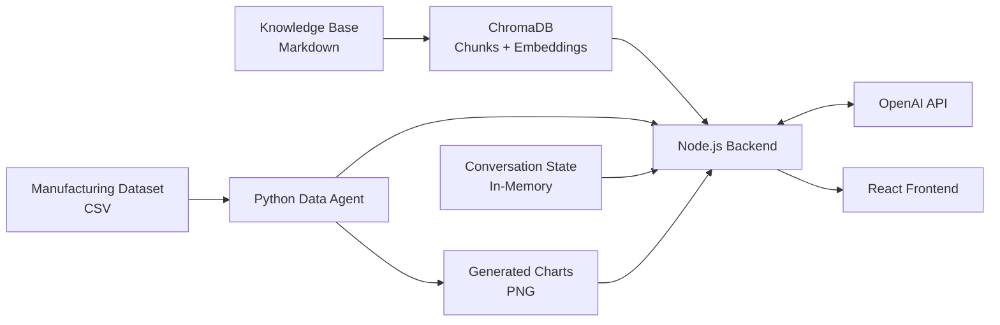
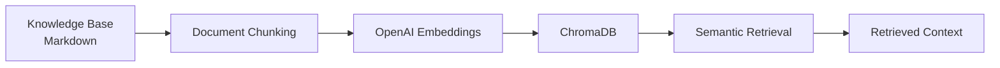
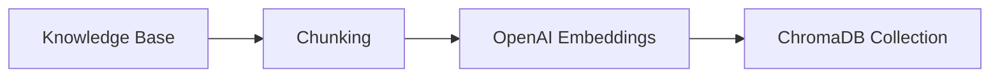
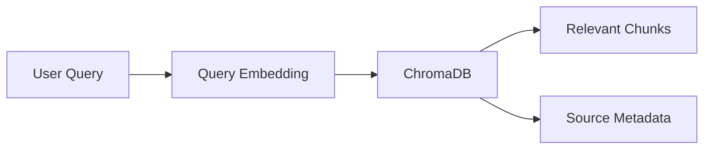
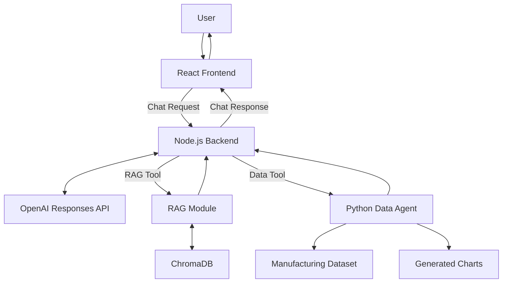

# Data Model

> **Progetto:** Maranello AI  
> **Versione:** 2.0  
> **Tipo documento:** Data Model  
> **Stato:** Final  
> **Autore:** Marco Saccani  
> **Ultimo aggiornamento:** Settembre 2026

---

# Indice

1. Introduzione
2. Obiettivi del modello dati
3. Principi di progettazione
4. Data Sources
5. Logical Data Model
6. Knowledge Base Model
7. Manufacturing Dataset Model
8. Conversation Model
9. AI Request Model
10. AI Response Model
11. Vector Database Model
12. Data Relationships
13. Data Flow
14. Data Validation
15. Future Extensions
16. Conclusioni

---

# 1. Introduzione

## 1.1 Scopo del documento

Il presente documento descrive il modello dati finale adottato dal progetto **Maranello AI**.

L'obiettivo è rappresentare in modo strutturato le principali categorie di informazioni gestite dall'applicazione e definire come tali informazioni vengono utilizzate dai diversi componenti del sistema.

Il documento rappresenta il modello dati **as-built**, ovvero la struttura effettivamente implementata al termine dello sviluppo.

Il Data Model costituisce il riferimento per:

- Manufacturing Dataset;
- Knowledge Base;
- Vector Database;
- Conversation Manager;
- API request e response model;
- Python Data Agent;
- sistema RAG;
- frontend React;
- backend Node.js.

---

## 1.2 Ambito

Maranello AI utilizza differenti tipologie di dati, ciascuna associata a uno specifico componente applicativo.

Le principali categorie informative sono:

- dati strutturati di produzione e qualità;
- documentazione aziendale;
- embedding e metadati utilizzati dal sistema RAG;
- dati conversazionali;
- richieste e risposte scambiate tramite API;
- output analitici generati dal Python Data Agent;
- riferimenti ai grafici generati durante le analisi.

Il modello dati non rappresenta un database relazionale tradizionale.

L'implementazione finale utilizza invece differenti meccanismi di persistenza e rappresentazione:

- file CSV per il Manufacturing Dataset;
- file Markdown per la Knowledge Base;
- ChromaDB per gli embedding documentali;
- strutture dati in-memory per le sessioni conversazionali;
- JSON per la comunicazione tra servizi.

---

## 1.3 Obiettivi

Il Data Model è stato progettato per:

- separare dati strutturati e documentazione;
- garantire coerenza tra i componenti;
- preservare la provenienza delle informazioni;
- supportare analisi quantitative;
- supportare retrieval semantico;
- supportare il contesto conversazionale;
- facilitare testing e validazione;
- rendere semplice l'estensione futura del sistema.

---

# 2. Obiettivi del modello dati

Gli obiettivi architetturali del modello dati sono definiti nella seguente tabella.

| ID | Obiettivo |
|----|-----------|
| DM-001 | Separare chiaramente dati strutturati, documentali e conversazionali. |
| DM-002 | Utilizzare strutture dati coerenti con i componenti applicativi responsabili della loro gestione. |
| DM-003 | Garantire la tracciabilità della provenienza delle informazioni. |
| DM-004 | Supportare interrogazioni quantitative sul Manufacturing Dataset. |
| DM-005 | Supportare retrieval semantico sulla Knowledge Base. |
| DM-006 | Supportare il mantenimento del contesto conversazionale. |
| DM-007 | Definire contratti dati chiari tra frontend, backend e Python Data Agent. |
| DM-008 | Consentire la validazione e il testing dei dati. |
| DM-009 | Consentire l'evoluzione futura delle sorgenti senza modificare il modello di interazione dell'utente. |

---

# 3. Principi di progettazione

## 3.1 Separation of Concerns

Ogni tipologia di dato viene gestita dal componente responsabile della relativa funzione.

In particolare:

- il Manufacturing Dataset viene gestito dal Python Data Agent;
- la Knowledge Base viene utilizzata dal modulo RAG;
- gli embedding vengono memorizzati in ChromaDB;
- le sessioni vengono gestite dal Conversation Manager;
- le request e response HTTP vengono gestite dal backend Node.js;
- i grafici vengono generati dal Data Agent e distribuiti tramite il backend.

Questa separazione evita che un singolo componente debba conoscere la struttura interna di tutte le sorgenti dati.

---

## 3.2 Single Source of Truth

Ogni categoria di informazione possiede una sorgente principale.

| Informazione | Source of Truth |
|-------------|-----------------|
| Dati di produzione e qualità | Manufacturing Dataset CSV |
| Policy e procedure | Knowledge Base Markdown |
| Embedding documentali | ChromaDB |
| Stato della conversazione | Conversation Manager |
| Risultati analitici | Python Data Agent |
| Risposta finale | Backend / AI Decision Engine |

---

## 3.3 Tracciabilità

Le informazioni utilizzate dall'agente devono poter essere ricondotte alla loro origine.

Per il RAG questo significa preservare:

- documento di origine;
- sezione;
- chunk;
- metadati.

Per le analisi quantitative significa mantenere un collegamento diretto tra:

- Manufacturing Dataset;
- operazione analitica eseguita;
- risultato restituito.

---

## 3.4 Data Quality

Il Manufacturing Dataset contiene intenzionalmente dati sporchi e anomalie.

Il modello dati deve quindi distinguere tra:

- dati raw;
- dati normalizzati;
- valori mancanti;
- record non validi;
- valori anomali.

Il processo di cleaning non deve modificare arbitrariamente i dati, ma applicare solamente trasformazioni definite e riproducibili.

---

## 3.5 Estendibilità

Il sistema è progettato affinché nuove sorgenti dati possano essere introdotte senza modificare l'interfaccia conversazionale.

Esempi futuri includono:

- database SQL;
- sistemi MES;
- sistemi ERP;
- API aziendali;
- ulteriori dataset;
- nuove Knowledge Base;
- sistemi di monitoraggio industriale.

---

# 4. Data Sources

## 4.1 Panoramica

Maranello AI utilizza più sorgenti dati con caratteristiche differenti.

| Sorgente | Tipo | Formato / Tecnologia | Utilizzo |
|----------|------|----------------------|----------|
| Manufacturing Dataset | Strutturata | CSV | KPI e analisi quantitative |
| Knowledge Base | Documentale | Markdown | Policy e procedure |
| Vector Store | Semantica | ChromaDB | Retrieval RAG |
| Conversation State | Runtime | In-memory | Memoria della sessione |
| API Messages | Transazionale | JSON | Comunicazione tra componenti |
| Generated Charts | Runtime Artifact | PNG | Visualizzazione dei risultati analitici |

---

## 4.2 Manufacturing Dataset

Il Manufacturing Dataset costituisce la principale sorgente strutturata del progetto.

Ogni riga rappresenta un batch produttivo e contiene:

- informazioni temporali;
- informazioni sull'impianto;
- informazioni sulla linea;
- informazioni sul modello;
- informazioni sul turno;
- KPI produttivi;
- dati di qualità;
- dati relativi ai fornitori;
- dati relativi ai componenti;
- informazioni operative.

Il dataset viene utilizzato esclusivamente dal Python Data Agent per analisi numeriche e generazione di grafici.

---

## 4.3 Knowledge Base

La Knowledge Base contiene policy e procedure aziendali fittizie relative al dominio **Quality & Manufacturing Operations**.

I documenti vengono preprocessati e indicizzati nel Vector Database.

Il contenuto della Knowledge Base viene utilizzato esclusivamente per rispondere a domande documentali o per integrare analisi quantitative con regole e procedure operative.

---

## 4.4 Vector Database

ChromaDB contiene la rappresentazione vettoriale dei chunk generati dalla Knowledge Base.

Ogni record consente di associare:

- embedding;
- contenuto del chunk;
- informazioni sulla sorgente;
- metadati utili al retrieval.

Il Vector Database non viene utilizzato per memorizzare dati produttivi.

---

## 4.5 Conversation State

Lo stato della conversazione viene mantenuto dal backend Node.js.

Per ogni sessione vengono conservati:

- identificativo della sessione;
- messaggi della conversazione;
- identificativo dell'ultima risposta OpenAI.

La persistenza è in-memory e riguarda esclusivamente la durata del processo applicativo.

---

## 4.6 Generated Charts

I grafici vengono generati dal Python Data Agent come file PNG.

Questi file:

- sono artefatti runtime;
- non appartengono al Manufacturing Dataset;
- non vengono versionati;
- vengono esposti dal Data Agent;
- vengono recuperati dal frontend attraverso il Chart Proxy del backend.

---

# 5. Logical Data Model

## 5.1 Panoramica

Il modello logico finale di Maranello AI non è basato su una struttura relazionale composta da entità separate.

Il Manufacturing Dataset utilizza invece un modello **tabellare denormalizzato**, progettato specificamente per supportare analisi quantitative tramite Pandas.

Parallelamente, il sistema utilizza modelli distinti per:

- documentazione;
- embedding;
- conversazioni;
- richieste API;
- risposte API.

Questa struttura riflette direttamente l'architettura implementata.

---

## 5.2 Macroaree informative

Il modello dati è organizzato in quattro macroaree principali.

| Area | Descrizione |
|------|-------------|
| Manufacturing Data | Dati strutturati relativi a produzione e qualità. |
| Knowledge Data | Policy e procedure utilizzate dal sistema RAG. |
| Vector Data | Chunk, embedding e metadati utilizzati per il retrieval semantico. |
| Runtime Data | Sessioni, messaggi, request, response e riferimenti ai grafici. |

---

## 5.3 Logical Data Model Diagram



---

## 5.4 Manufacturing Data Model

Il Manufacturing Dataset è rappresentato da una singola struttura tabellare.

Ogni record corrisponde a un batch produttivo.

Non vengono utilizzate tabelle separate per:

- supplier;
- inspection;
- defect;
- corrective action.

Le informazioni necessarie alle analisi sono direttamente contenute nel record del batch.

Questa scelta semplifica:

- caricamento tramite Pandas;
- cleaning;
- aggregazioni;
- calcolo dei KPI;
- generazione di grafici;
- riproducibilità delle analisi.

---

## 5.5 Knowledge Data Model

La Knowledge Base utilizza documenti Markdown come sorgente originale.

Durante l'indicizzazione ogni documento viene trasformato in una sequenza di chunk.

Ogni chunk viene successivamente associato a:

- contenuto testuale;
- embedding;
- sorgente;
- metadati.

Questi elementi costituiscono il modello utilizzato dal sistema RAG.

---

## 5.6 Runtime Data Model

I dati runtime includono:

- sessioni conversazionali;
- messaggi;
- identificativi delle risposte OpenAI;
- request e response HTTP;
- lista dei tool utilizzati;
- riferimenti ai grafici generati.

Questi dati non vengono memorizzati in un database persistente nell'implementazione attuale.

---

## 5.7 Relazioni logiche principali

Le principali relazioni informative sono:

```text
Manufacturing Dataset
        |
        v
Python Data Agent
        |
        v
Analytical Results
        |
        v
AI Decision Engine


Knowledge Base
        |
        v
Chunking + Embeddings
        |
        v
ChromaDB
        |
        v
RAG Results
        |
        v
AI Decision Engine


Conversation State
        |
        v
AI Decision Engine
        |
        v
Final Response
```

Il modello evidenzia una separazione netta tra:

- dati quantitativi;
- dati documentali;
- dati conversazionali.

L'unificazione avviene solamente a livello dell'AI Decision Engine durante la generazione della risposta finale.

---

## 5.8 Benefici del modello

Il modello as-built offre i seguenti vantaggi:

- semplicità del dataset analitico;
- separazione tra fonti documentali e strutturate;
- tracciabilità;
- facile utilizzo con Pandas;
- supporto naturale al RAG;
- ridotto accoppiamento tra componenti;
- maggiore testabilità;
- possibilità di estendere le sorgenti dati in futuro.

---

# 6. Knowledge Base Model

## 6.1 Panoramica

La Knowledge Base rappresenta la sorgente documentale utilizzata dal sistema Retrieval-Augmented Generation.

Contiene documentazione aziendale fittizia relativa al reparto **Quality & Manufacturing Operations** di un produttore automotive premium fittizio.

I documenti sono stati creati specificamente per il progetto e non rappresentano documentazione ufficiale di aziende reali.

La Knowledge Base viene utilizzata per rispondere a richieste relative a:

- policy;
- procedure;
- soglie operative;
- gestione delle non conformità;
- supplier quality;
- rework e scrap;
- escalation produttiva.

---

## 6.2 Documenti implementati

La Knowledge Base finale è composta da cinque documenti Markdown.

| File | Ambito |
|------|--------|
| `manufacturing_quality_policy.md` | Policy generale relativa alla qualità produttiva e alle principali soglie operative. |
| `non_conformity_procedure.md` | Procedura per la gestione delle non conformità. |
| `supplier_quality_procedure.md` | Procedura relativa alla qualità dei fornitori e alle relative soglie di escalation. |
| `rework_and_scrap_procedure.md` | Procedura relativa a rework e scrap. |
| `production_escalation_policy.md` | Policy relativa alle condizioni che richiedono escalation produttiva. |

---

## 6.3 Struttura documentale

Ogni documento è una sorgente Markdown leggibile sia dagli sviluppatori sia dal processo di indicizzazione.

La struttura logica contiene:

- titolo;
- sezioni;
- sottosezioni;
- contenuto procedurale;
- soglie;
- regole operative;
- eventuali riferimenti interni.

I documenti vengono successivamente trasformati in chunk per il retrieval semantico.

---

## 6.4 Pipeline documentale



---

## 6.5 Chunk Model

Durante l'indicizzazione, il contenuto dei documenti viene suddiviso in blocchi testuali più piccoli.

La configurazione finale produce:

```text
5 documents
149 chunks
```

Ogni chunk rappresenta una porzione semanticamente utilizzabile del documento originale.

Le informazioni principali associate a un chunk sono:

| Informazione | Descrizione |
|-------------|-------------|
| Content | Testo del chunk. |
| Source | Documento Markdown di origine. |
| Section | Sezione del documento, quando disponibile. |
| Metadata | Informazioni aggiuntive necessarie alla tracciabilità. |
| Embedding | Rappresentazione vettoriale utilizzata per il retrieval. |

---

## 6.6 Identificazione dei chunk

Ogni chunk indicizzato possiede un identificativo utilizzato dal Vector Database.

L'identificativo permette di distinguere in modo univoco i blocchi inseriti nella collection ChromaDB.

L'identità del chunk è separata dal contenuto semantico e viene utilizzata principalmente per:

- indicizzazione;
- retrieval;
- debugging;
- tracciabilità.

---

## 6.7 Embedding Model

I chunk vengono trasformati in vettori tramite il modello:

```text
text-embedding-3-small
```

Lo stesso modello viene utilizzato per generare l'embedding delle query dell'utente.

La similarità tra query e chunk permette al sistema di recuperare le sezioni più rilevanti.

---

## 6.8 Metadati

I metadati associati ai chunk permettono di preservare la provenienza delle informazioni.

Le informazioni rilevanti includono principalmente:

- nome del documento;
- riferimento alla sorgente;
- sezione, quando disponibile;
- posizione logica del chunk.

Questi metadati permettono all'AI Decision Engine di produrre risposte source-aware.

---

## 6.9 Tracciabilità documentale

La Knowledge Base è progettata affinché ogni informazione recuperata possa essere ricondotta al documento sorgente.

Il flusso di tracciabilità è:

```text
User Query
    |
    v
Query Embedding
    |
    v
ChromaDB Retrieval
    |
    v
Chunk
    |
    v
Source Metadata
    |
    v
AI Decision Engine
    |
    v
Final Answer
```

---

## 6.10 Supporto multilingua

La Knowledge Base è scritta in inglese.

Il sistema supporta tuttavia query in:

- inglese;
- italiano.

La compatibilità cross-language viene ottenuta tramite il modello di embedding utilizzato dal RAG.

Questo permette, ad esempio, di formulare una domanda in italiano e recuperare correttamente una sezione disponibile esclusivamente in inglese.

---

## 6.11 Scope della Knowledge Base

La Knowledge Base contiene esclusivamente informazioni relative allo scenario aziendale fittizio del progetto.

Non contiene:

- documentazione reale di Ferrari;
- procedure proprietarie di aziende reali;
- informazioni aziendali riservate;
- dati provenienti da sistemi produttivi reali.

Questo vincolo consente di mantenere il progetto completamente dimostrativo e riproducibile.

---

# 7. Manufacturing Dataset Model

## 7.1 Panoramica

Il Manufacturing Dataset rappresenta la principale sorgente dati strutturata utilizzata dal Python Data Agent.

Il dataset è sintetico ed è stato progettato per simulare dati realistici relativi a **Quality & Manufacturing Operations**.

Ogni riga rappresenta un singolo batch produttivo.

Il dataset finale contiene:

```text
2000 rows
20 columns
```

Le 2000 righe includono intenzionalmente duplicati e anomalie utilizzati per validare il processo di data cleaning.

---

## 7.2 Granularità

La granularità del dataset è definita a livello di **production batch**.

Ogni record contiene informazioni relative a:

- data;
- plant;
- linea produttiva;
- modello;
- turno;
- volumi prodotti;
- difettosità;
- rework;
- scrap;
- downtime;
- cycle time;
- qualità;
- supplier;
- component category;
- stato dell'ispezione;
- temperatura;
- team operativo;
- note.

Questa struttura consente di effettuare analisi multidimensionali senza introdurre join tra tabelle differenti.

---

## 7.3 Schema del dataset

Il dataset contiene le seguenti 20 colonne.

| Campo | Tipo logico | Descrizione |
|------|-------------|-------------|
| `batch_id` | String | Identificativo del batch produttivo. |
| `production_date` | Date | Data di produzione. |
| `plant` | Categorical String | Stabilimento produttivo. |
| `production_line` | Categorical String | Linea produttiva. |
| `vehicle_model` | Categorical String | Modello del veicolo. |
| `shift` | Categorical String | Turno produttivo. |
| `units_produced` | Integer | Numero di unità prodotte. |
| `defective_units` | Integer | Numero di unità difettose. |
| `defect_category` | Categorical String | Categoria principale del difetto. |
| `rework_units` | Integer | Numero di unità sottoposte a rework. |
| `scrap_units` | Integer | Numero di unità scartate. |
| `downtime_minutes` | Numeric | Minuti di fermo produzione. |
| `cycle_time_seconds` | Numeric | Tempo medio di ciclo espresso in secondi. |
| `quality_score` | Numeric | Indicatore sintetico della qualità del batch. |
| `supplier_id` | Categorical String | Identificativo del fornitore. |
| `component_category` | Categorical String | Categoria del componente. |
| `inspection_status` | Categorical String | Stato dell'ispezione qualità. |
| `temperature_c` | Numeric | Temperatura associata al processo produttivo. |
| `operator_team` | Categorical String | Team operativo responsabile. |
| `notes` | Text | Note aggiuntive relative al batch. |

---

## 7.4 Domini categorici principali

Il dataset utilizza domini controllati per diverse colonne categoriche.

### Plant

```text
Plant 01
Plant 02
```

### Production Line

```text
Line 1
Line 2
Line 3
Line 4
```

### Vehicle Model

```text
Aquila GT
Veloce S
Strada X
Eterna
```

### Shift

```text
Morning
Afternoon
Night
```

### Supplier

```text
SUP-01
...
SUP-12
```

### Component Category

```text
Body
Powertrain
Electronics
Interior
Braking
Suspension
```

### Operator Team

```text
Alpha
Beta
Gamma
Delta
```

---

## 7.5 Struttura del record

Un record logico può essere rappresentato come:

```json
{
  "batch_id": "BATCH-000001",
  "production_date": "2025-01-01",
  "plant": "Plant 01",
  "production_line": "Line 3",
  "vehicle_model": "Aquila GT",
  "shift": "Night",
  "units_produced": 85,
  "defective_units": 3,
  "defect_category": "Electronics",
  "rework_units": 2,
  "scrap_units": 1,
  "downtime_minutes": 42.0,
  "cycle_time_seconds": 86.5,
  "quality_score": 94.2,
  "supplier_id": "SUP-07",
  "component_category": "Electronics",
  "inspection_status": "Completed",
  "temperature_c": 23.1,
  "operator_team": "Alpha",
  "notes": ""
}
```

Il record precedente è illustrativo e serve esclusivamente a rappresentare la struttura logica.

---

## 7.6 Anomalie intenzionali

Il dataset include intenzionalmente problemi di qualità dei dati.

Le anomalie introdotte comprendono:

| Tipo di anomalia | Quantità |
|------------------|----------|
| Duplicati esatti | 20 |
| `quality_score` mancanti | 20 |
| `supplier_id` mancanti | 15 |
| `downtime_minutes` mancanti | 19 |
| Formati data misti | 12 |
| `quality_score` non validi | 6 |
| Relazioni numeriche non valide | 6 |
| Downtime outlier | 8 |
| Cycle time outlier | 8 |
| Valori `shift` non normalizzati | 12 |
| Valori `production_line` non normalizzati | 10 |
| Valori `supplier_id` non normalizzati | 10 |

Le anomalie sono state introdotte deliberatamente per rendere il Data Agent responsabile di una reale fase di cleaning prima dell'analisi.

---

## 7.7 Record duplicati

Il dataset è stato generato inizialmente con:

```text
1980 unique rows
```

Successivamente sono stati aggiunti:

```text
20 exact duplicates
```

ottenendo:

```text
2000 total rows
```

Il Python Data Agent rimuove i duplicati prima dell'esecuzione delle analisi.

---

## 7.8 Missing Values

Alcune colonne includono valori mancanti intenzionali.

In particolare:

- `quality_score`;
- `supplier_id`;
- `downtime_minutes`.

I valori mancanti non vengono automaticamente sostituiti con valori sintetici.

Il Data Agent preserva il missing value quando non esiste una regola di imputazione affidabile.

---

## 7.9 Normalizzazione delle categorie

Alcune colonne categoriche contengono intenzionalmente valori scritti in formati non uniformi.

Le principali colonne interessate sono:

- `shift`;
- `production_line`;
- `supplier_id`.

Il processo di cleaning normalizza questi valori verso i domini categorici ufficiali.

---

## 7.10 Date

La colonna:

```text
production_date
```

contiene intenzionalmente una piccola quantità di date espresse con formati differenti.

Durante il cleaning il Data Agent esegue il parsing e normalizza le date in una rappresentazione coerente.

---

## 7.11 Quality Score

Il campo:

```text
quality_score
```

rappresenta un indicatore sintetico della qualità del batch.

Il range logico previsto è:

```text
0 <= quality_score <= 100
```

I valori superiori a 100 vengono considerati non validi durante il cleaning.

Il processo non forza tali valori all'interno del range, ma li converte in valori mancanti per evitare di introdurre dati artificiali.

---

## 7.12 Relazioni numeriche

Alcuni record contengono intenzionalmente combinazioni numeriche incompatibili.

Esempi di vincoli logici includono:

```text
defective_units <= units_produced
rework_units <= units_produced
scrap_units <= units_produced
```

I record che violano le relazioni previste vengono identificati dal processo di cleaning e gestiti in modo controllato nelle analisi.

---

## 7.13 Outlier

Il dataset contiene intenzionalmente valori anomali in:

- `downtime_minutes`;
- `cycle_time_seconds`.

Gli outlier vengono mantenuti come parte del dataset raw per simulare condizioni operative anomale.

La loro presenza consente di verificare che il Data Agent sia in grado di lavorare con dati non perfettamente puliti senza compromettere l'intera analisi.

---

## 7.14 Relazioni sintetiche incorporate

Il dataset non è generato in modo completamente casuale.

Sono state introdotte alcune relazioni sintetiche affinché le analisi producano risultati significativi.

Tra le principali:

- `Line 3` presenta una probabilità di difetto superiore al baseline;
- il turno `Night` presenta una probabilità di difetto leggermente superiore;
- `SUP-07` presenta un comportamento qualitativo peggiore rispetto alla media;
- la categoria `Electronics` presenta una maggiore probabilità di difetto;
- l'aumento del defect rate influenza negativamente il `quality_score`;
- un downtime elevato influenza negativamente il `quality_score`;
- `Line 3` presenta mediamente downtime maggiore;
- il turno `Night` presenta un cycle time leggermente superiore.

Queste relazioni permettono al sistema di produrre insight coerenti e verificabili.

---

## 7.15 KPI globali

Il Python Data Agent calcola i seguenti KPI globali:

| KPI | Descrizione |
|-----|-------------|
| Total Production | Somma delle unità prodotte. |
| Total Defective Units | Somma delle unità difettose. |
| Defect Rate | Rapporto tra unità difettose e unità prodotte. |
| Rework Rate | Rapporto tra unità sottoposte a rework e unità prodotte. |
| Scrap Rate | Rapporto tra unità scartate e unità prodotte. |
| Average Quality Score | Media dei quality score validi. |
| Average Downtime Minutes | Media del downtime. |
| Average Cycle Time Seconds | Media del cycle time. |

---

## 7.16 Formule principali

Le principali formule utilizzate sono:

```text
Defect Rate =
    total defective units
    -----------------------
    total units produced
```

```text
Rework Rate =
    total rework units
    ------------------
    total units produced
```

```text
Scrap Rate =
    total scrap units
    -----------------
    total units produced
```

I risultati percentuali vengono convertiti nella scala percentuale utilizzata nelle risposte del Data Agent.

---

## 7.17 KPI risultanti dal dataset finale

Dopo il cleaning, il dataset produce i seguenti KPI globali:

| KPI | Valore |
|-----|--------|
| Total Production | 164060 |
| Total Defective Units | 3272 |
| Defect Rate | 1.99% |
| Rework Rate | 0.96% |
| Scrap Rate | 0.51% |
| Average Quality Score | 95.82 |
| Average Downtime Minutes | 33.04 |
| Average Cycle Time Seconds | 84.74 |

Questi valori costituiscono una baseline verificabile per i test del Python Data Agent.

---

## 7.18 Analisi per dimensione

Il Data Agent supporta l'aggregazione del defect rate secondo le seguenti dimensioni:

- `production_line`;
- `shift`;
- `supplier_id`;
- `component_category`;
- `vehicle_model`;
- `plant`;
- `operator_team`.

L'aggregazione viene calcolata utilizzando i volumi complessivi e non la semplice media aritmetica dei defect rate dei singoli batch.

---

## 7.19 Risultati analitici rilevanti

Alcuni risultati osservabili nel dataset finale sono:

| Dimensione | Valore rilevante | Defect Rate |
|------------|------------------|-------------|
| Production Line | Line 3 | 2.47% |
| Shift | Night | 2.35% |
| Supplier | SUP-07 | 2.99% |
| Component Category | Electronics | 2.49% |

Questi risultati riflettono le relazioni sintetiche introdotte durante la generazione del dataset.

---

## 7.20 Analisi temporale

Il Data Agent supporta inoltre il calcolo del:

```text
Monthly Defect Rate Trend
```

Le date vengono aggregate per mese e il defect rate viene calcolato utilizzando le unità prodotte e difettose del periodo.

Il dataset contiene dati relativi a tutti i mesi dell'anno.

Tra i valori osservabili:

```text
Highest monthly defect rate:
2.10%

Months:
2025-04
2025-05
```

```text
Lowest monthly defect rate:
1.78%

Month:
2025-08
```

---

## 7.21 Generazione dei grafici

Le analisi supportate possono produrre visualizzazioni tramite Matplotlib.

Il grafico viene salvato come file PNG e il risultato analitico mantiene il riferimento all'immagine generata.

Il file non viene inserito nel dataset e costituisce un artefatto runtime separato.

---

## 7.22 Ruolo nel sistema ibrido

Il Manufacturing Dataset risponde principalmente alla domanda:

> "What happened?"

Permette infatti di misurare:

- KPI;
- performance;
- trend;
- differenze tra gruppi;
- anomalie osservabili nei dati.

La Knowledge Base risponde invece principalmente alla domanda:

> "What should happen according to company policy?"

L'AI Decision Engine può combinare le due sorgenti nelle richieste ibride.

Esempio:

```text
Which supplier has the highest defect rate,
and according to the Supplier Quality Procedure,
what action should be taken?
```

In questo scenario:

1. il Data Agent identifica il supplier e il relativo defect rate;
2. il RAG recupera la procedura applicabile;
3. l'AI Decision Engine sintetizza una risposta unica.

---

# 8. Conversation Model

## 8.1 Panoramica

Il Conversation Model rappresenta lo stato conversazionale mantenuto dal backend Node.js durante una sessione utente.

L'obiettivo è consentire al sistema di:

- associare messaggi consecutivi alla stessa sessione;
- mantenere una cronologia applicativa;
- preservare il contesto semantico tra turni successivi;
- supportare riferimenti impliciti;
- continuare la conversazione tramite OpenAI Responses API.

La persistenza è attualmente in-memory ed è adeguata allo scope dimostrativo del progetto.

---

## 8.2 Session Model

Ogni sessione viene identificata da un UUID generato dal backend.

La struttura logica può essere rappresentata come:

```text
ConversationSession
├── sessionId
├── messages
└── lastResponseId
```

I principali campi sono:

| Campo | Tipo logico | Descrizione |
|------|-------------|-------------|
| `sessionId` | UUID / String | Identificativo univoco della sessione. |
| `messages` | Array | Cronologia applicativa dei messaggi. |
| `lastResponseId` | String / Optional | Identificativo dell'ultima risposta OpenAI utilizzato per continuare il contesto. |

---

## 8.3 Message Model

La cronologia applicativa mantiene i messaggi essenziali della conversazione.

La struttura logica di un messaggio è:

| Campo | Tipo | Descrizione |
|------|------|-------------|
| `role` | Enum | Ruolo del messaggio, ad esempio user o assistant. |
| `content` | Text | Contenuto testuale del messaggio. |

Il modello rimane intenzionalmente semplice.

Informazioni come timestamp, classificazioni dell'intento o identificativi separati dei singoli messaggi non sono necessarie nell'implementazione attuale.

---

## 8.4 Creazione della sessione

Quando il frontend invia una richiesta senza un `sessionId` valido, il backend crea una nuova sessione.

L'identificativo viene generato tramite UUID.

Il nuovo `sessionId` viene restituito al frontend e utilizzato nelle richieste successive.

---

## 8.5 Continuazione della sessione

Quando il frontend invia un `sessionId` esistente, il backend recupera:

- cronologia applicativa;
- ultimo identificativo di risposta OpenAI.

Queste informazioni vengono utilizzate per mantenere la continuità della conversazione.

---

## 8.6 OpenAI Response Continuation

Oltre allo storico applicativo, il sistema utilizza l'identificativo della precedente risposta OpenAI.

La struttura logica è:

```text
Session
   |
   v
lastResponseId
   |
   v
previous_response_id
   |
   v
OpenAI Responses API
```

Questo permette alla Responses API di proseguire il contesto precedente senza ricostruire manualmente l'intera conversazione all'interno di ogni nuova richiesta.

---

## 8.7 Esempio di continuità

Esempio:

```text
User:
Which supplier has the highest defect rate?

Assistant:
SUP-07 has the highest defect rate at 2.99%.

User:
What would happen if that supplier increased to 3.2%?
```

Nel secondo turno il sistema deve comprendere che:

```text
that supplier = SUP-07
```

La continuità deriva dalla combinazione di:

- session state;
- cronologia applicativa;
- OpenAI response continuation.

---

## 8.8 Persistenza

La sessione è memorizzata in-memory.

Questo significa che:

- lo stato è disponibile durante l'esecuzione del backend;
- non viene utilizzato un database persistente;
- un riavvio del backend elimina le sessioni attive.

Questa limitazione è accettabile per lo scope dimostrativo del progetto.

Una futura implementazione enterprise potrebbe utilizzare:

- Redis;
- database relazionale;
- database documentale;
- distributed cache.

---

## 8.9 Aggiornamento transazionale

La sessione viene aggiornata solamente dopo il completamento corretto dell'elaborazione.

Il flusso è:

```text
User Request
    |
    v
AI Orchestration
    |
    v
Tool Execution
    |
    v
Final Answer
    |
    v
Update Session
```

Se l'elaborazione fallisce prima della risposta finale, la conversazione non viene aggiornata con uno stato parziale.

Questo evita di memorizzare interazioni incomplete dovute a errori dei servizi dipendenti.

---

# 9. AI Request Model

## 9.1 Panoramica

Il frontend comunica con il backend attraverso l'endpoint:

```text
POST /api/chat
```

Il request model è intenzionalmente semplice.

Il frontend invia:

- messaggio dell'utente;
- eventuale identificativo della sessione.

Il frontend non specifica:

- quale tool utilizzare;
- quale tipo di analisi eseguire;
- se la richiesta è documentale o quantitativa.

La selezione degli strumenti rimane responsabilità dell'AI Decision Engine.

---

## 9.2 Chat Request

La struttura della richiesta è:

```json
{
  "message": "Which supplier has the highest defect rate?",
  "sessionId": "optional-session-id"
}
```

I campi sono:

| Campo | Tipo | Obbligatorio | Descrizione |
|------|------|-------------|-------------|
| `message` | String | Sì | Messaggio dell'utente. |
| `sessionId` | String | No | Identificativo di una sessione esistente. |

---

## 9.3 Nuova conversazione

Per iniziare una nuova conversazione il frontend può inviare:

```json
{
  "message": "What is the critical defect rate threshold?"
}
```

Il backend crea automaticamente una nuova sessione.

---

## 9.4 Conversazione esistente

Per continuare una conversazione:

```json
{
  "message": "And what happens at 4.2%?",
  "sessionId": "existing-session-id"
}
```

Il backend recupera il contesto associato alla sessione e continua l'elaborazione.

---

## 9.5 Validazione

La proprietà:

```text
message
```

deve contenere testo valido.

Una richiesta con:

- stringa vuota;
- soli spazi;
- contenuto assente;

viene rifiutata prima dell'invocazione dell'AI Orchestrator.

Il comportamento previsto è una risposta HTTP:

```text
400 Bad Request
```

---

## 9.6 Separazione dal routing

Il request model non include proprietà come:

```text
intent
execution_type
selected_tool
use_rag
use_data_agent
```

Questa scelta è intenzionale.

Il client non controlla il processo di routing.

La decisione viene effettuata autonomamente dal modello linguistico attraverso il function calling.

---

# 10. AI Response Model

## 10.1 Panoramica

Il backend restituisce al frontend una risposta unificata indipendentemente dal percorso di elaborazione utilizzato.

La stessa struttura generale viene utilizzata per:

- risposte conversazionali;
- risposte RAG;
- analisi quantitative;
- richieste ibride.

Questo permette al frontend di rimanere indipendente dalla logica interna dell'orchestrazione.

---

## 10.2 Chat Response

La struttura logica della risposta è:

```json
{
  "sessionId": "session-id",
  "answer": "Generated response",
  "toolsUsed": [
    "analyze_manufacturing_data"
  ],
  "chartUrl": "/api/charts/example.png"
}
```

Il campo `chartUrl` è opzionale.

---

## 10.3 Campi della risposta

| Campo | Tipo | Obbligatorio | Descrizione |
|------|------|-------------|-------------|
| `sessionId` | String | Sì | Identificativo della conversazione. |
| `answer` | String | Sì | Risposta finale prodotta dal sistema. |
| `toolsUsed` | Array of String | Sì | Elenco dei tool effettivamente utilizzati. |
| `chartUrl` | String | No | URL backend del grafico generato durante l'analisi. |

---

## 10.4 `sessionId`

Il `sessionId` permette al frontend di continuare la stessa conversazione.

Alla prima richiesta viene generato dal backend.

Il frontend lo conserva nello stato applicativo e lo riutilizza nei messaggi successivi.

---

## 10.5 `answer`

Il campo:

```text
answer
```

contiene la risposta finale sintetizzata dall'AI Decision Engine.

Può includere:

- testo conversazionale;
- risultati quantitativi;
- riferimenti a procedure;
- KPI;
- interpretazione dei dati;
- fonti documentali espresse nel testo.

La risposta viene generata nella lingua della richiesta dell'utente.

---

## 10.6 `toolsUsed`

Il campo:

```text
toolsUsed
```

rappresenta la traccia applicativa degli strumenti invocati durante l'elaborazione.

I valori principali sono:

```text
search_knowledge_base
analyze_manufacturing_data
```

Possibili esempi:

### Nessun tool

```json
{
  "toolsUsed": []
}
```

### Solo RAG

```json
{
  "toolsUsed": [
    "search_knowledge_base"
  ]
}
```

### Solo Data Agent

```json
{
  "toolsUsed": [
    "analyze_manufacturing_data"
  ]
}
```

### Richiesta ibrida

```json
{
  "toolsUsed": [
    "search_knowledge_base",
    "analyze_manufacturing_data"
  ]
}
```

Questo campo rende osservabile il comportamento dell'agente e facilita testing e debugging.

---

## 10.7 `chartUrl`

Quando il Python Data Agent genera un grafico, il backend può restituire:

```json
{
  "chartUrl": "/api/charts/generated-chart.png"
}
```

Il riferimento originale prodotto dal Python Data Agent viene convertito dal backend nell'endpoint del Chart Proxy.

In questo modo il frontend non deve conoscere direttamente:

- URL del servizio Python;
- porta del Data Agent;
- struttura interna del servizio.

---

## 10.8 Risposta senza grafico

Quando nessun grafico viene prodotto, il campo `chartUrl` può non essere presente nella risposta.

Esempio:

```json
{
  "sessionId": "session-id",
  "answer": "The critical defect rate threshold is above 3.5%.",
  "toolsUsed": [
    "search_knowledge_base"
  ]
}
```

---

## 10.9 Risposta con grafico

Esempio concettuale:

```json
{
  "sessionId": "session-id",
  "answer": "The monthly defect rate reached its highest value in April and May.",
  "toolsUsed": [
    "analyze_manufacturing_data"
  ],
  "chartUrl": "/api/charts/monthly-defect-rate-example.png"
}
```

Il nome del file è dinamico e può variare tra esecuzioni.

---

## 10.10 Separation of Concerns

Il response model non espone direttamente:

- output interno di ChromaDB;
- struttura completa dei chunk;
- payload interni del Data Agent;
- response object completo di OpenAI;
- dettagli dell'infrastruttura.

Il backend trasforma i risultati dei diversi servizi in un contratto applicativo stabile per il frontend.

---

# 11. Vector Database Model

## 11.1 Panoramica

ChromaDB rappresenta il Vector Database utilizzato dal modulo RAG.

Il database contiene le rappresentazioni vettoriali dei chunk generati dalla Knowledge Base.

La collection utilizzata dal progetto è:

```text
maranello_ai_knowledge_base
```

---

## 11.2 Funzione del Vector Database

ChromaDB permette di:

- memorizzare i chunk indicizzati;
- associare embedding ai contenuti testuali;
- conservare i metadati;
- eseguire similarity search;
- recuperare i chunk semanticamente più rilevanti.

Il Vector Database contiene esclusivamente informazioni documentali.

I dati del Manufacturing Dataset non vengono memorizzati in ChromaDB.

---

## 11.3 Struttura logica del record

Un record logico della collection contiene le seguenti informazioni:

| Informazione | Tipo logico | Descrizione |
|-------------|-------------|-------------|
| ID | String | Identificativo univoco del chunk indicizzato. |
| Document | Text | Contenuto testuale del chunk. |
| Embedding | Vector | Rappresentazione vettoriale del contenuto. |
| Metadata | Object | Informazioni sulla sorgente e sul chunk. |

---

## 11.4 Metadata Model

I metadati vengono utilizzati per preservare la tracciabilità della sorgente.

Possono includere informazioni quali:

- source document;
- section;
- chunk position;
- altri riferimenti utili all'indicizzazione.

I metadati vengono restituiti insieme ai risultati del retrieval quando necessari.

---

## 11.5 Embedding

L'embedding viene generato utilizzando:

```text
text-embedding-3-small
```

Il processo viene applicato sia:

- ai chunk durante l'indicizzazione;
- alla query durante il retrieval.

La similarity search confronta la rappresentazione vettoriale della query con quelle memorizzate nella collection.

---

## 11.6 Collection

Il progetto utilizza la collection:

```text
maranello_ai_knowledge_base
```

La configurazione finale contiene:

```text
5 documents
149 chunks
```

La collection viene costruita attraverso il processo di ingestion della Knowledge Base.

---

## 11.7 Indicizzazione

Il flusso logico è:



---

## 11.8 Retrieval

Durante una richiesta RAG:



I risultati vengono successivamente trasformati dal RAG Module in contesto utilizzabile dall'AI Decision Engine.

---

## 11.9 Persistenza

ChromaDB viene eseguito come servizio locale con persistenza su filesystem.

La persistenza permette di mantenere la collection tra esecuzioni del servizio senza dover indicizzare la Knowledge Base ad ogni richiesta.

L'indicizzazione viene eseguita separatamente dal normale flusso conversazionale.

---

## 11.10 Separazione dal contenuto originale

La Knowledge Base Markdown rimane la sorgente documentale originale.

ChromaDB rappresenta invece una struttura derivata utilizzata per il retrieval.

La relazione è quindi:

```text
Markdown Documents
        |
        v
Chunking
        |
        v
Embeddings
        |
        v
ChromaDB
```

Una modifica significativa ai documenti richiede una nuova indicizzazione affinché il Vector Database rifletta il contenuto aggiornato.

---

## 11.11 Benefici

Il modello adottato offre:

- retrieval semantico;
- supporto cross-language;
- tracciabilità delle fonti;
- separazione tra sorgente documentale e indice;
- persistenza locale;
- possibilità di ricostruire la collection;
- integrazione diretta con il RAG Module del backend.

---

# 12. Data Relationships

## 12.1 Panoramica

Il modello dati di Maranello AI integra sorgenti con caratteristiche differenti senza introdurre un unico database centralizzato.

Le relazioni tra i dati sono determinate dal flusso applicativo e dalle responsabilità dei componenti.

Le tre principali categorie informative sono:

- dati strutturati del Manufacturing Dataset;
- dati documentali della Knowledge Base;
- dati runtime relativi alla conversazione e all'orchestrazione.

L'AI Decision Engine rappresenta il punto nel quale le informazioni provenienti dalle diverse sorgenti possono essere combinate per generare la risposta finale.

---

## 12.2 Relazioni principali

| Origine | Destinazione | Relazione |
|---------|--------------|-----------|
| Manufacturing Dataset | Python Data Agent | Il dataset viene caricato, pulito e analizzato dal servizio Python. |
| Python Data Agent | AI Decision Engine | I risultati analitici vengono restituiti al backend come output del tool. |
| Knowledge Base | ChromaDB | I documenti vengono suddivisi in chunk, trasformati in embedding e indicizzati. |
| ChromaDB | RAG Module | I chunk rilevanti vengono recuperati tramite similarity search. |
| RAG Module | AI Decision Engine | Il contesto documentale viene restituito come output del tool. |
| Conversation State | AI Decision Engine | Lo stato della sessione supporta la continuità tra richieste successive. |
| AI Decision Engine | Chat Response | I risultati dei tool vengono sintetizzati nella risposta finale. |
| Python Data Agent | Generated Charts | Le analisi possono produrre file PNG. |
| Generated Charts | Backend Chart Proxy | Il backend recupera le immagini dal servizio Python. |
| Backend Chart Proxy | Frontend | Il grafico viene distribuito attraverso l'endpoint del backend. |

---

## 12.3 Relazione tra dati strutturati e documentali

Manufacturing Dataset e Knowledge Base rappresentano sorgenti indipendenti.

Il Manufacturing Dataset contiene informazioni quantitative e risponde principalmente a domande relative a:

- KPI;
- performance;
- trend;
- confronti;
- comportamento osservato nei dati.

La Knowledge Base contiene invece informazioni normative e procedurali relative a:

- policy;
- procedure;
- soglie;
- escalation;
- azioni operative.

Le due sorgenti non vengono unite fisicamente.

La loro integrazione avviene logicamente durante l'orchestrazione.

---

## 12.4 Richieste ibride

Una richiesta ibrida richiede informazioni provenienti da entrambe le sorgenti.

Il modello logico è:

```text
                    User Question
                         |
                         v
                 AI Decision Engine
                    /           \
                   /             \
                  v               v
       Manufacturing Data    Knowledge Base
                  |               |
                  v               v
            Data Agent           RAG
                  \               /
                   \             /
                    v           v
                     Tool Outputs
                          |
                          v
                    Final Answer
```

Questo permette di combinare un fatto osservato nei dati con una regola aziendale.

---

## 12.5 Tracciabilità

La provenienza delle informazioni viene preservata in modo differente a seconda della sorgente.

### Dati documentali

La tracciabilità utilizza:

- source document;
- section;
- chunk metadata.

### Dati quantitativi

La tracciabilità deriva da:

- Manufacturing Dataset;
- tipo di analisi eseguita;
- aggregazione applicata;
- risultato calcolato.

### Orchestrazione

Il campo:

```text
toolsUsed
```

permette inoltre di osservare quali strumenti sono stati effettivamente utilizzati durante una richiesta.

---

# 13. Data Flow

## 13.1 Panoramica

Il Data Flow descrive il percorso seguito dalle informazioni dal momento in cui l'utente invia una richiesta fino alla generazione della risposta finale.

Il backend Node.js costituisce il punto centrale del flusso.

Il frontend non accede direttamente alle sorgenti interne.

---

## 13.2 Data Flow generale



---

## 13.3 Flusso documentale

Quando il modello invoca:

```text
search_knowledge_base
```

il flusso dei dati è:

```text
User Question
    |
    v
Backend
    |
    v
Query Embedding
    |
    v
ChromaDB
    |
    v
Relevant Chunks + Metadata
    |
    v
AI Decision Engine
    |
    v
Final Answer
```

La Knowledge Base originale non viene modificata durante il retrieval.

---

## 13.4 Flusso analitico

Quando il modello invoca:

```text
analyze_manufacturing_data
```

il flusso è:

```text
User Question
    |
    v
Backend
    |
    v
Python Data Agent
    |
    v
Question Interpreter
    |
    v
Clean Manufacturing Data
    |
    v
Analytics Engine
    |
    +----> Metrics / Aggregations
    |
    +----> Narrative Insight
    |
    +----> Optional Chart
    |
    v
Backend
    |
    v
AI Decision Engine
    |
    v
Final Answer
```

---

## 13.5 Flusso conversazionale

La continuità della conversazione utilizza:

```text
Frontend sessionId
        |
        v
Conversation Manager
        |
        +----> Message History
        |
        +----> lastResponseId
                    |
                    v
          OpenAI previous_response_id
```

Dopo il completamento corretto della richiesta, lo stato della sessione viene aggiornato con i nuovi dati conversazionali.

---

## 13.6 Flusso dei grafici

I grafici seguono un percorso separato rispetto alla risposta JSON.

```text
Python Data Agent
        |
        v
Generated PNG
        |
        v
/chart reference
        |
        v
Node.js Backend
        |
        v
/api/charts/:filename
        |
        v
React Frontend
```

Il frontend recupera quindi l'immagine attraverso il backend senza comunicare direttamente con il servizio Python.

---

# 14. Data Validation

## 14.1 Panoramica

La validazione dei dati viene applicata a più livelli dell'architettura.

Gli obiettivi principali sono:

- impedire l'elaborazione di input applicativi non validi;
- normalizzare il Manufacturing Dataset prima dell'analisi;
- identificare anomalie intenzionali;
- evitare che record incompatibili compromettano i risultati;
- mantenere il comportamento del sistema prevedibile e testabile.

---

## 14.2 Validazione delle richieste API

L'endpoint:

```text
POST /api/chat
```

richiede un messaggio testuale valido.

Vengono rifiutate richieste con:

- messaggio assente;
- stringa vuota;
- contenuto composto esclusivamente da spazi.

La validazione viene effettuata prima dell'invocazione dell'AI Orchestrator.

---

## 14.3 Validazione del Manufacturing Dataset

Il Data Agent applica un processo di cleaning prima dell'esecuzione delle analisi.

Le principali categorie controllate sono:

| Categoria | Gestione |
|-----------|----------|
| Duplicati | Rimossi prima dell'analisi. |
| Missing values | Preservati quando non esiste una regola di imputazione affidabile. |
| Date | Parsing e normalizzazione dei formati. |
| Categorie | Normalizzazione dei valori testuali. |
| Quality score | Valori fuori range gestiti come non validi. |
| Relazioni numeriche | Record incompatibili identificati e gestiti in modo controllato. |
| Outlier | Conservati quando rappresentano possibili condizioni operative anomale. |

---

## 14.4 Baseline di validazione del dataset

Il dataset raw contiene intenzionalmente:

| Controllo | Valore atteso |
|-----------|---------------|
| Total rows | 2000 |
| Exact duplicates | 20 |
| Missing `quality_score` | 20 |
| Missing `supplier_id` | 15 |
| Missing `downtime_minutes` | 19 |
| Mixed date formats | 12 |
| Invalid `quality_score` | 6 |
| Invalid numeric relationships | 6 |
| Downtime outliers | 8 |
| Cycle time outliers | 8 |
| Dirty `shift` values | 12 |
| Dirty `production_line` values | 10 |
| Dirty `supplier_id` values | 10 |

Questa baseline permette di verificare in modo riproducibile il comportamento del processo di cleaning.

---

## 14.5 Validazione dei risultati analitici

I risultati prodotti dal Data Agent possono essere verificati rispetto a una baseline nota.

I principali KPI attesi sono:

| KPI | Valore atteso |
|-----|---------------|
| Total Production | 164060 |
| Total Defective Units | 3272 |
| Defect Rate | 1.99% |
| Rework Rate | 0.96% |
| Scrap Rate | 0.51% |
| Average Quality Score | 95.82 |
| Average Downtime Minutes | 33.04 |
| Average Cycle Time Seconds | 84.74 |

Questi valori permettono di rilevare regressioni nella logica di cleaning o aggregazione.

---

## 14.6 Validazione dello scope analitico

Il Question Interpreter accetta solamente analisi appartenenti allo scope supportato.

Sono gestite:

- KPI globali;
- una dimensione di grouping supportata;
- monthly defect rate trend.

Richieste che introducono combinazioni analitiche non supportate vengono rifiutate in modo controllato.

In particolare, il sistema protegge da:

- più dimensioni di grouping simultanee non supportate;
- combinazioni non supportate tra grouping e analisi temporale.

---

## 14.7 Validazione della Knowledge Base

Durante il processo di ingestion vengono considerati esclusivamente i documenti previsti dalla Knowledge Base del progetto.

Il processo produce una baseline nota:

```text
5 documents
149 chunks
```

Questa informazione permette di verificare che l'indicizzazione sia stata completata correttamente.

---

## 14.8 Validazione del Chart Proxy

Il backend valida il nome del file richiesto prima di inoltrare la richiesta al Python Data Agent.

Questa validazione impedisce l'utilizzo di percorsi arbitrari attraverso l'endpoint:

```text
GET /api/charts/:filename
```

Il chart reference restituito al frontend rimane quindi controllato dal backend.

---

# 15. Future Extensions

## 15.1 Panoramica

Il modello dati attuale è progettato per lo scope dimostrativo di Maranello AI.

La separazione tra dati strutturati, documentali, vettoriali e conversazionali permette tuttavia di introdurre nuove sorgenti senza riprogettare l'intero sistema.

---

## 15.2 Persistenza conversazionale

Lo stato in-memory potrebbe essere sostituito o affiancato da:

- Redis;
- database relazionale;
- database documentale;
- distributed cache.

Questo permetterebbe di preservare le conversazioni tra riavvii e supportare più istanze backend.

---

## 15.3 Nuove sorgenti strutturate

Il Data Agent potrebbe essere esteso per utilizzare:

- database SQL;
- sistemi MES;
- sistemi ERP;
- data warehouse;
- API operative;
- streaming industriale;
- sensori IoT.

---

## 15.4 Estensione della Knowledge Base

Il modello documentale potrebbe essere esteso introducendo:

- ulteriori policy;
- nuove procedure;
- documentazione relativa ad altri reparti;
- document repository aziendali;
- versioning documentale più avanzato;
- controllo degli accessi basato sul ruolo.

---

## 15.5 Evoluzione analitica

Il modello strutturato potrebbe supportare in futuro:

- nuove dimensioni di aggregazione;
- analisi multidimensionali;
- anomaly detection;
- forecasting;
- predictive maintenance;
- analisi statistiche avanzate;
- modelli Machine Learning.

Queste funzionalità non fanno parte dell'implementazione corrente.

---

## 15.6 Persistenza dei risultati

In una futura versione enterprise potrebbe essere introdotto uno storage dedicato per:

- risultati analitici;
- audit trail;
- tool execution history;
- grafici;
- metriche operative;
- log applicativi.

L'implementazione attuale mantiene solamente i dati necessari allo scope dimostrativo.

---

# 16. Conclusioni

Il Data Model finale di Maranello AI riflette direttamente l'architettura implementata.

Il sistema utilizza differenti rappresentazioni in base alla natura delle informazioni:

- CSV per i dati strutturati di produzione e qualità;
- Markdown per la Knowledge Base;
- ChromaDB per chunk ed embedding;
- strutture in-memory per la conversazione;
- JSON per la comunicazione tra servizi;
- PNG per i grafici generati runtime.

Il Manufacturing Dataset utilizza un modello tabellare denormalizzato a livello di production batch, progettato per consentire analisi efficienti tramite Pandas.

La Knowledge Base mantiene invece una struttura documentale indipendente e viene trasformata in chunk ed embedding durante il processo di ingestion.

L'AI Decision Engine rappresenta il punto di integrazione logica tra queste sorgenti.

Questa separazione permette a Maranello AI di gestire:

- richieste quantitative;
- richieste documentali;
- richieste ibride;
- conversazioni contestuali.

Il modello adottato privilegia:

- semplicità;
- tracciabilità;
- riproducibilità;
- testabilità;
- separazione delle responsabilità;
- estendibilità.

Il Data Model costituisce quindi una rappresentazione **as-built** coerente con l'implementazione finale del progetto.

---

## Stato del documento

| Informazione | Valore |
|--------------|--------|
| Documento | Data Model |
| Versione | 2.0 |
| Stato | Final |
| Tipologia | As-Built Data Model |
| Lingua | Italiano |
| Ultimo aggiornamento | Settembre 2026 |

---