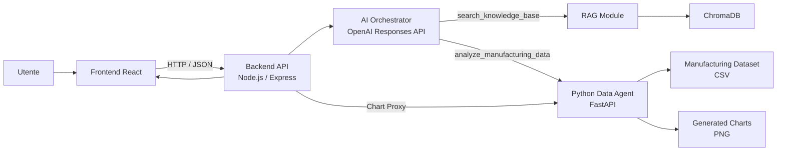
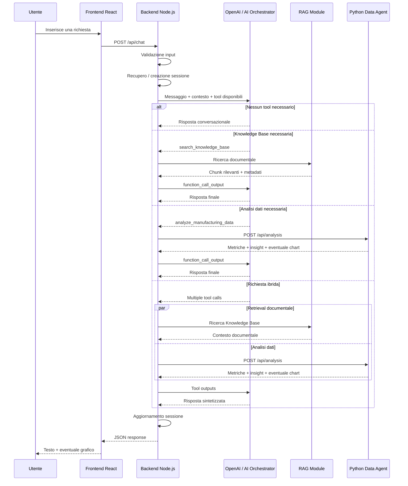
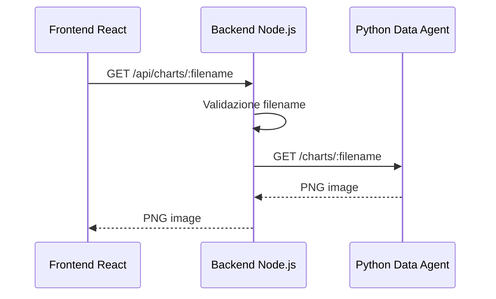

# API Specification

> **Progetto:** Maranello AI  
> **Versione:** 2.0  
> **Tipo documento:** API Specification  
> **Stato:** Final  
> **Autore:** Marco Saccani  
> **Ultimo aggiornamento:** Settembre 2026  

---

# Indice

1. Introduzione  
2. Obiettivi  
3. Architettura delle API  
4. Principi di progettazione  
5. Convenzioni generali  
6. Formato delle richieste e delle risposte  
7. Gestione degli errori  
8. Health Check API  
9. Backend API  
10. Chat API  
11. Chart Proxy API  
12. Python Data Agent API  
13. Sicurezza  
14. Logging e osservabilità  
15. Testing delle API  
16. Evoluzioni future  
17. Conclusioni  

---

# 1. Introduzione

Il presente documento descrive le API implementate nel sistema **Maranello AI**, definendone responsabilità, contratti di comunicazione, formati delle richieste e delle risposte, gestione degli errori e modalità di integrazione tra i diversi componenti applicativi.

Il documento rappresenta la specifica **as-built** delle API della versione finale del progetto e riflette quindi il comportamento effettivamente implementato.

Maranello AI adotta un'architettura distribuita composta principalmente da:

- frontend React;
- backend Node.js ed Express;
- AI Orchestrator basato su OpenAI Responses API e function calling;
- motore RAG integrato con ChromaDB;
- Python Data Agent basato su FastAPI e Pandas;
- Manufacturing Dataset in formato CSV;
- Knowledge Base documentale indicizzata nel vector database.

L'interfaccia conversazionale React utilizza il backend Node.js come unico punto di accesso applicativo.

Il frontend non comunica direttamente con il Python Data Agent, con ChromaDB o con OpenAI. Il backend agisce come livello di orchestrazione e coordina le dipendenze interne necessarie all'elaborazione delle richieste.

Le principali interfacce HTTP implementate sono:

| Componente | Tecnologia | Responsabilità |
|------------|------------|----------------|
| Backend API | Node.js ed Express | Espone i servizi utilizzati dal frontend e coordina l'elaborazione AI. |
| Chat API | Node.js ed Express | Gestisce le richieste conversazionali e mantiene la continuità della sessione. |
| Chart Proxy API | Node.js ed Express | Espone in modo controllato al frontend i grafici prodotti dal Data Agent. |
| Data Agent API | Python e FastAPI | Espone le funzionalità di analisi del Manufacturing Dataset. |
| Health Check API | Express e FastAPI | Consente di verificare lo stato operativo dei servizi applicativi. |

Le integrazioni con OpenAI e ChromaDB sono considerate dipendenze interne del backend e non vengono esposte direttamente al frontend.

---

## 1.1 Scope del documento

La specifica copre le API applicative implementate nella versione finale di Maranello AI.

In particolare vengono documentati:

- il contratto tra frontend React e backend Node.js;
- l'endpoint conversazionale principale;
- la gestione del `sessionId`;
- la struttura delle risposte generate dal backend;
- il recupero dei grafici tramite backend proxy;
- la comunicazione tra backend e Python Data Agent;
- gli endpoint di health check;
- la gestione degli errori applicativi e delle dipendenze non disponibili;
- i principi di sicurezza e separazione tra API pubbliche e servizi interni.

Le chiamate effettuate dal backend verso OpenAI e ChromaDB non costituiscono API pubbliche di Maranello AI e vengono pertanto descritte soltanto quando necessario per comprendere il flusso applicativo.

---

## 1.2 Contesto applicativo

Maranello AI è un assistente enterprise dimostrativo progettato per il dominio **Quality & Manufacturing Operations** di un produttore automobilistico premium fittizio.

Il sistema deve poter gestire differenti categorie di richieste attraverso una singola interfaccia conversazionale.

Una domanda dell'utente può richiedere:

- una risposta conversazionale;
- il recupero di informazioni dalla Knowledge Base;
- un'analisi quantitativa del Manufacturing Dataset;
- una combinazione di retrieval documentale e analisi strutturata.

La scelta degli strumenti non viene effettuata dal frontend e non viene determinata tramite una semplice regola statica sugli endpoint.

Il backend mette a disposizione dell'LLM gli strumenti applicativi disponibili e utilizza il **native function calling** per consentire al modello di selezionare autonomamente il percorso di elaborazione più appropriato.

---

# 2. Obiettivi

La progettazione delle API di Maranello AI persegue i seguenti obiettivi.

| ID | Obiettivo |
|----|-----------|
| API-OBJ-001 | Definire un contratto stabile tra frontend React e backend Node.js. |
| API-OBJ-002 | Utilizzare il backend come unico punto di accesso applicativo per il frontend. |
| API-OBJ-003 | Separare le API esposte al client dai servizi e dalle dipendenze interne. |
| API-OBJ-004 | Supportare richieste conversazionali, documentali, analitiche e ibride attraverso una singola Chat API. |
| API-OBJ-005 | Consentire all'LLM di selezionare autonomamente gli strumenti mediante function calling. |
| API-OBJ-006 | Mantenere la continuità conversazionale mediante un identificativo di sessione. |
| API-OBJ-007 | Standardizzare la comunicazione JSON tra i componenti applicativi. |
| API-OBJ-008 | Isolare il Python Data Agent dal frontend attraverso il backend Node.js. |
| API-OBJ-009 | Consentire il recupero sicuro dei grafici tramite un Chart Proxy dedicato. |
| API-OBJ-010 | Gestire in modo controllato indisponibilità e errori delle dipendenze interne. |
| API-OBJ-011 | Facilitare testing, debugging e manutenzione dei servizi. |
| API-OBJ-012 | Mantenere un'architettura estendibile verso future integrazioni e modalità di persistenza. |

---

## 2.1 Separazione delle responsabilità

Uno dei principi fondamentali della progettazione consiste nel mantenere separate le responsabilità dei diversi servizi.

Il frontend è responsabile della presentazione e dell'interazione con l'utente.

Il backend Node.js è responsabile della validazione delle richieste, della gestione della sessione, dell'orchestrazione AI, dell'esecuzione dei tool e della costruzione della risposta applicativa.

Il Python Data Agent è responsabile esclusivamente dell'analisi deterministica dei dati manifatturieri e della generazione degli eventuali grafici.

Il motore RAG è responsabile del retrieval delle informazioni dalla Knowledge Base indicizzata in ChromaDB.

L'LLM coordina il processo decisionale selezionando, tramite function calling, gli strumenti necessari alla richiesta corrente.

Questa separazione riduce l'accoppiamento tra i componenti e consente di modificare o sostituire un servizio senza modificare direttamente l'interfaccia utilizzata dal frontend.

---

## 2.2 API come boundary applicativo

Il backend Node.js costituisce il principale **application boundary** del sistema.

Dal punto di vista del frontend, le implementazioni interne utilizzate per produrre una risposta sono trasparenti.

Una richiesta può quindi richiedere:

```text
Frontend
    ↓
Backend
    ↓
LLM
```

oppure:

```text
Frontend
    ↓
Backend
    ↓
LLM
    ↓
RAG
    ↓
ChromaDB
```

oppure:

```text
Frontend
    ↓
Backend
    ↓
LLM
    ↓
Python Data Agent
    ↓
Manufacturing Dataset
```

oppure una combinazione dei due strumenti:

```text
Frontend
    ↓
Backend
    ↓
LLM
   ↙   ↘
 RAG   Data Agent
   ↘   ↙
Backend
    ↓
Frontend
```

In tutti i casi il contratto principale utilizzato dal frontend rimane invariato.

---

# 3. Architettura delle API

## 3.1 Panoramica

L'architettura API di Maranello AI distingue tra:

1. **API esposte al frontend**;
2. **API interne tra servizi**;
3. **integrazioni applicative verso servizi esterni o infrastrutturali**.

Il frontend comunica esclusivamente con il backend Node.js.

Il backend coordina l'elaborazione AI e, in funzione delle tool call richieste dall'LLM, può:

- interrogare il motore RAG;
- comunicare con ChromaDB;
- invocare il Python Data Agent;
- utilizzare direttamente il modello per una risposta conversazionale;
- combinare più strumenti nella stessa elaborazione.

Il seguente diagramma rappresenta il modello generale.



---

## 3.2 API esposte al frontend

Nella versione finale del progetto il frontend utilizza un insieme limitato di endpoint del backend.

Le principali interfacce applicative sono:

| Metodo | Endpoint | Responsabilità |
|--------|----------|----------------|
| POST | `/api/chat` | Invia un messaggio e riceve la risposta generata dal sistema. |
| GET | `/api/charts/:filename` | Recupera tramite backend proxy un grafico generato dal Python Data Agent. |
| GET | `/health` | Verifica lo stato operativo del backend Node.js. |

Il frontend non deve conoscere gli indirizzi interni di:

- Python Data Agent;
- ChromaDB;
- OpenAI.

Questa scelta mantiene il client indipendente dalla topologia interna dell'applicazione.

---

## 3.3 API interne

Il Python Data Agent espone un'API REST utilizzata dal backend Node.js.

Le principali interfacce interne sono:

| Metodo | Endpoint | Responsabilità |
|--------|----------|----------------|
| POST | `/api/analysis` | Esegue un'analisi sul Manufacturing Dataset a partire da una richiesta in linguaggio naturale. |
| GET | `/health` | Verifica lo stato operativo del Python Data Agent. |
| GET | `/` | Fornisce una risposta base del servizio. |
| GET | `/charts/:filename` | Espone i file PNG generati dal servizio analitico. |

L'endpoint `/api/analysis` non è utilizzato direttamente dal frontend.

La sua invocazione viene effettuata dal backend quando l'LLM seleziona il tool:

```text
analyze_manufacturing_data
```

Analogamente, i file disponibili tramite `/charts/:filename` non vengono referenziati direttamente dal frontend. Il backend espone il proprio Chart Proxy in modo da mantenere il Python Data Agent nascosto dietro il boundary applicativo.

---

## 3.4 Integrazioni interne non esposte come REST API applicative

Oltre alle API HTTP tra i componenti, il backend utilizza integrazioni interne necessarie all'esecuzione del sistema.

### OpenAI Responses API

Il backend utilizza OpenAI come motore di orchestrazione AI.

Il modello riceve il contesto conversazionale e la definizione degli strumenti disponibili.

I principali tool applicativi sono:

```text
search_knowledge_base
```

e:

```text
analyze_manufacturing_data
```

Il modello può scegliere di:

- non utilizzare alcun tool;
- utilizzare il RAG;
- utilizzare il Data Agent;
- utilizzare entrambi gli strumenti;
- effettuare ulteriori round di tool calling quando necessari alla costruzione della risposta.

Le tool call vengono eseguite dal backend e i risultati vengono restituiti al modello come output delle funzioni.

---

### ChromaDB

ChromaDB costituisce il vector database utilizzato dal modulo RAG.

L'accesso avviene dal backend attraverso il relativo client e non viene esposto direttamente al frontend.

Il flusso logico è:

```text
LLM
 ↓
search_knowledge_base
 ↓
RAG Module
 ↓
ChromaDB
 ↓
Relevant Chunks
 ↓
Backend
 ↓
LLM
```

Il risultato del retrieval viene quindi utilizzato dall'LLM per generare una risposta coerente con la documentazione interna disponibile.

---

## 3.5 Flusso di una richiesta conversazionale

Il flusso principale inizia quando l'utente invia un messaggio attraverso il frontend React.



Il backend mantiene quindi un unico contratto conversazionale verso il frontend, indipendentemente dal percorso di elaborazione scelto dall'LLM.

---

## 3.6 Flusso del Chart Proxy

Quando il Python Data Agent produce un grafico, il file viene generato nel servizio Python.

Il backend converte il riferimento restituito dal Data Agent in un URL appartenente alla propria API.

Il frontend utilizza quindi:

```http
GET /api/charts/:filename
```

e non l'endpoint Python direttamente.

Il flusso è il seguente:



Questa soluzione permette di:

- mantenere un singolo punto di accesso applicativo;
- evitare di esporre direttamente il microservizio Python;
- ridurre l'accoppiamento tra frontend e servizi interni;
- centralizzare la validazione delle richieste relative ai grafici;
- impedire l'utilizzo arbitrario di percorsi file attraverso la validazione del nome richiesto.

---

## 3.7 Gestione della sessione

La continuità conversazionale viene gestita mediante un identificativo denominato:

```text
sessionId
```

Alla prima richiesta il frontend può non fornire alcun `sessionId`.

Il backend crea quindi una nuova sessione e restituisce l'identificativo nella risposta.

Nelle richieste successive il frontend reinvia lo stesso identificativo.

Il backend utilizza il `sessionId` per:

- associare i messaggi appartenenti alla stessa conversazione;
- recuperare la cronologia applicativa;
- mantenere il riferimento all'ultima risposta OpenAI;
- supportare richieste contestuali successive;
- mantenere continuità semantica tra più turni.

La persistenza delle conversazioni nella versione corrente è **in-memory**.

Questa scelta è adeguata allo scope dimostrativo del progetto, ma implica che lo stato venga perso al riavvio del backend.

Una futura evoluzione enterprise potrebbe introdurre un database persistente o una cache distribuita.

---

## 3.8 Autonomous Tool Routing

Un elemento centrale dell'architettura API è l'assenza di endpoint separati lato frontend per RAG e Data Agent.

Il frontend non invia richieste del tipo:

```text
/api/rag
```

oppure:

```text
/api/data-analysis
```

per decidere quale modalità utilizzare.

Invia invece sempre la domanda dell'utente attraverso:

```http
POST /api/chat
```

La decisione sul percorso di elaborazione viene effettuata dal modello attraverso il meccanismo di function calling.

Questo consente alla stessa API di supportare:

| Tipologia richiesta | Comportamento |
|---------------------|---------------|
| Conversazionale | Risposta del modello senza tool applicativi. |
| Documentale | Utilizzo di `search_knowledge_base`. |
| Analitica | Utilizzo di `analyze_manufacturing_data`. |
| Ibrida | Utilizzo di entrambi i tool e sintesi finale dei risultati. |

L'API rimane quindi stabile mentre la logica di orchestrazione può evolvere indipendentemente.

---

## 3.9 Boundary di sicurezza

La separazione tra API pubbliche e interne costituisce anche un boundary di sicurezza.

Il frontend non riceve accesso diretto:

- alla chiave OpenAI;
- al Python Data Agent;
- al vector database;
- al filesystem utilizzato per i grafici;
- al Manufacturing Dataset;
- alla configurazione interna dei tool.

Le credenziali e gli URL dei servizi vengono gestiti lato server mediante variabili d'ambiente.

Il browser conosce esclusivamente l'URL del backend applicativo.

Questa architettura evita l'esposizione di credenziali sensibili e limita l'accoppiamento del client con l'infrastruttura interna.

---

# 4. Principi di progettazione

## 4.1 API minimali

Le API della versione finale di Maranello AI sono state mantenute intenzionalmente semplici.

L'obiettivo non è esporre un grande numero di endpoint specializzati, ma utilizzare pochi contratti chiari che riflettano direttamente le responsabilità dei componenti.

Il frontend utilizza principalmente:

```text
POST /api/chat
GET /api/charts/:filename
GET /health
```

Il backend utilizza il Python Data Agent principalmente attraverso:

```text
POST /api/analysis
GET /health
GET /charts/:filename
```

Questa scelta riduce:

- complessità dell'interfaccia;
- duplicazione della logica;
- accoppiamento tra frontend e servizi interni;
- superficie esposta;
- numero di contratti da mantenere.

---

## 4.2 Single Conversational Entry Point

Tutte le richieste conversazionali vengono inviate attraverso:

```http
POST /api/chat
```

Il frontend non deve decidere in anticipo se la richiesta appartiene a:

- Knowledge Base;
- Manufacturing Dataset;
- conversazione generale;
- scenario ibrido.

La selezione viene effettuata successivamente dall'AI Orchestrator tramite function calling.

Il contratto HTTP rimane quindi indipendente dal percorso interno di elaborazione.

---

## 4.3 Backend as API Gateway

Il backend Node.js costituisce il punto di accesso principale dell'applicazione.

Il frontend non accede direttamente a:

- OpenAI;
- ChromaDB;
- Python Data Agent;
- Manufacturing Dataset;
- filesystem dei grafici.

Questo principio permette di centralizzare:

- validazione;
- gestione delle sessioni;
- error handling;
- orchestrazione;
- configurazione;
- sicurezza;
- routing verso i servizi interni.

---

## 4.4 Autonomous Routing

La selezione degli strumenti è responsabilità dell'LLM.

Gli strumenti applicativi principali sono:

```text
search_knowledge_base
analyze_manufacturing_data
```

Il backend non richiede al frontend campi come:

```text
intent
executionType
useRag
useDataAgent
selectedTool
```

Il comportamento viene determinato autonomamente dal modello sulla base della richiesta dell'utente e del contesto conversazionale.

---

## 4.5 Deterministic Data Analysis

Il Python Data Agent non esegue codice Python arbitrario generato dall'LLM.

Il backend inoltra al servizio analitico la richiesta naturale necessaria all'esecuzione del tool.

Il Data Agent utilizza quindi un **Question Interpreter deterministico** per mappare la domanda verso operazioni analitiche supportate.

Questo approccio evita:

- esecuzione arbitraria di codice;
- accesso incontrollato al filesystem;
- analisi non previste;
- comportamento difficilmente testabile;
- risultati non riproducibili.

L'architettura conserva comunque il comportamento agentico richiesto a livello di orchestrazione: è l'LLM a decidere **quando** utilizzare il Data Agent, mentre il servizio Python controlla **come** viene eseguita l'analisi.

---

## 4.6 Stateless HTTP e stateful conversation

Le singole chiamate HTTP rimangono indipendenti dal punto di vista del protocollo.

La continuità conversazionale viene invece mantenuta applicativamente tramite:

```text
sessionId
```

Questo permette di combinare:

- semplicità delle API REST;
- stato conversazionale;
- continuità con OpenAI Responses API.

---

## 4.7 Fail Fast

Gli input non validi vengono rifiutati prima dell'invocazione dell'AI Orchestrator.

Ad esempio, un messaggio:

- assente;
- vuoto;
- composto esclusivamente da spazi;

non deve generare una chiamata verso il modello.

Il backend restituisce invece:

```text
400 Bad Request
```

Questo evita elaborazioni inutili e mantiene prevedibile il comportamento dell'API.

---

## 4.8 Controlled Failure

Quando una dipendenza indispensabile non è disponibile, il backend non restituisce al frontend errori infrastrutturali grezzi.

Il sistema traduce il problema in una risposta controllata.

Esempi:

```text
Manufacturing data analysis is temporarily unavailable. Please try again later.
```

oppure:

```text
The company knowledge base is temporarily unavailable. Please try again later.
```

Il codice HTTP utilizzato per queste condizioni è:

```text
503 Service Unavailable
```

---

# 5. Convenzioni generali

## 5.1 Protocollo

Durante lo sviluppo locale le comunicazioni utilizzano HTTP.

Esempi:

```text
Frontend
    ↓ HTTP
Backend
```

```text
Backend
    ↓ HTTP
Python Data Agent
```

Le integrazioni con servizi esterni utilizzano HTTPS quando richiesto dal provider.

In un deployment pubblico, il backend dovrebbe essere esposto tramite HTTPS.

---

## 5.2 Formato dei payload

Le API applicative utilizzano principalmente:

```http
Content-Type: application/json
```

per request e response strutturate.

I grafici costituiscono un'eccezione perché vengono restituiti come contenuto immagine PNG.

---

## 5.3 Codifica

I payload testuali utilizzano codifica UTF-8.

Il sistema deve poter gestire correttamente contenuti in:

- italiano;
- inglese.

Questo requisito è particolarmente importante per la Chat API e per il Python Data Agent.

---

## 5.4 Naming Convention

L'implementazione finale utilizza convenzioni coerenti con l'ecosistema JavaScript/TypeScript.

I campi JSON utilizzano prevalentemente **camelCase**.

Esempi:

```text
sessionId
toolsUsed
chartUrl
```

Non viene utilizzata una conversione artificiale verso `snake_case` nel contratto tra frontend e backend.

---

## 5.5 Endpoint Naming

Gli endpoint utilizzano nomi semplici e descrittivi.

Esempi:

```text
/api/chat
/api/analysis
/api/charts/:filename
/health
```

La versione corrente non utilizza il prefisso:

```text
/api/v1
```

Il versionamento esplicito delle API potrà essere introdotto in futuro qualora vengano sviluppati contratti incompatibili.

---

## 5.6 Versionamento

Nell'implementazione corrente non viene utilizzato un versionamento esplicito tramite URL.

Pertanto:

```text
/api/chat
```

è corretto, mentre:

```text
/api/v1/chat
```

non appartiene alla versione as-built.

La decisione è coerente con lo scope del progetto, che dispone di un solo client React e di un unico contratto applicativo corrente.

Una futura versione enterprise potrebbe introdurre:

```text
/api/v1
/api/v2
```

quando necessario mantenere contemporaneamente più versioni incompatibili.

---

## 5.7 Session Identifier

Le sessioni vengono identificate tramite:

```text
sessionId
```

L'identificativo viene generato dal backend quando necessario.

Il client non deve generare:

```text
requestId
conversationId
executionId
```

per utilizzare la Chat API corrente.

---

## 5.8 Lingua

La lingua non viene dichiarata attraverso un campo dedicato della richiesta.

Il sistema rileva la lingua direttamente dal messaggio dell'utente.

Esempio:

```json
{
  "message": "Qual è il fornitore con il defect rate più alto?"
}
```

produce una risposta in italiano.

Analogamente:

```json
{
  "message": "Which supplier has the highest defect rate?"
}
```

produce una risposta in inglese.

La lingua rimane quindi una proprietà semantica del contenuto e non un parametro obbligatorio del contratto HTTP.

---

## 5.9 Date e timestamp

La Chat API corrente non richiede al frontend di inviare timestamp.

La gestione temporale necessaria ai servizi è responsabilità dei relativi componenti.

Il dataset utilizza date di produzione, ma tali date appartengono al dominio analitico e non al contratto generale della Chat API.

---

## 5.10 Paginazione

La versione corrente non espone endpoint pubblici che richiedano paginazione.

Non sono pertanto implementati parametri generali come:

```text
page
pageSize
sortBy
sortOrder
```

La paginazione può essere introdotta in futuro qualora vengano aggiunti endpoint che espongono collezioni persistenti.

---

## 5.11 Filtri analitici

Il frontend non invia direttamente un oggetto strutturato contenente filtri del Manufacturing Dataset.

La richiesta rimane in linguaggio naturale.

Esempio:

```text
Which supplier has the highest defect rate?
```

oppure:

```text
Show me the monthly defect rate trend.
```

Il Python Data Agent interpreta la richiesta attraverso il proprio Question Interpreter.

Questo mantiene l'interfaccia conversazionale indipendente dalla struttura interna del dataset.

---

# 6. Formato delle richieste e delle risposte

## 6.1 Principio generale

La versione finale non utilizza un unico envelope universale per tutte le API.

Ogni endpoint espone invece il contratto minimo necessario alla propria responsabilità.

Questo evita strutture artificiali contenenti campi che l'implementazione non utilizza, come:

```text
requestId
timestamp
executionId
metadata
language
```

quando tali informazioni non sono necessarie al client.

---

## 6.2 Chat Request

La richiesta principale del frontend utilizza la seguente struttura:

```json
{
  "message": "Which supplier has the highest defect rate?",
  "sessionId": "optional-session-id"
}
```

I campi sono:

| Campo | Tipo | Obbligatorio | Descrizione |
|------|------|-------------|-------------|
| `message` | String | Sì | Messaggio dell'utente in linguaggio naturale. |
| `sessionId` | String | No | Identificativo di una sessione già esistente. |

---

## 6.3 Nuova sessione

Per iniziare una nuova conversazione è sufficiente:

```json
{
  "message": "What is the critical defect rate threshold?"
}
```

Il backend crea automaticamente una nuova sessione.

Non è necessario inviare preventivamente un identificativo.

---

## 6.4 Sessione esistente

Per continuare una conversazione:

```json
{
  "message": "What would happen at 4.2%?",
  "sessionId": "existing-session-id"
}
```

Il backend utilizza il `sessionId` per recuperare il contesto applicativo associato.

---

## 6.5 Chat Response

La struttura della risposta è:

```json
{
  "sessionId": "session-id",
  "answer": "Generated answer",
  "toolsUsed": [
    "analyze_manufacturing_data"
  ],
  "chartUrl": "/api/charts/example.png"
}
```

Il campo:

```text
chartUrl
```

è opzionale.

---

## 6.6 Campi della Chat Response

| Campo | Tipo | Obbligatorio | Descrizione |
|------|------|-------------|-------------|
| `sessionId` | String | Sì | Identificativo della sessione corrente. |
| `answer` | String | Sì | Risposta finale prodotta dal sistema. |
| `toolsUsed` | Array of String | Sì | Tool applicativi utilizzati durante l'elaborazione. |
| `chartUrl` | String | No | URL del grafico disponibile attraverso il backend. |

---

## 6.7 `toolsUsed`

Il campo:

```text
toolsUsed
```

permette di osservare il percorso seguito dall'AI Orchestrator.

I tool principali sono:

```text
search_knowledge_base
analyze_manufacturing_data
```

Esempi:

### Risposta senza tool

```json
{
  "toolsUsed": []
}
```

### RAG

```json
{
  "toolsUsed": [
    "search_knowledge_base"
  ]
}
```

### Data Agent

```json
{
  "toolsUsed": [
    "analyze_manufacturing_data"
  ]
}
```

### Hybrid

```json
{
  "toolsUsed": [
    "search_knowledge_base",
    "analyze_manufacturing_data"
  ]
}
```

Il campo rappresenta gli strumenti effettivamente invocati e non una modalità selezionata preventivamente dal client.

---

## 6.8 Risposta RAG

Una risposta documentale può assumere una struttura come:

```json
{
  "sessionId": "session-id",
  "answer": "According to the Manufacturing Quality Policy, a defect rate above 3.5% is classified as Critical.",
  "toolsUsed": [
    "search_knowledge_base"
  ]
}
```

I riferimenti documentali vengono integrati nella risposta testuale prodotta dal modello.

La versione corrente non restituisce un array strutturato `sources` al frontend.

---

## 6.9 Risposta Data Agent

Una risposta analitica può essere rappresentata come:

```json
{
  "sessionId": "session-id",
  "answer": "SUP-07 has the highest defect rate at 2.99%.",
  "toolsUsed": [
    "analyze_manufacturing_data"
  ]
}
```

Il backend non espone al frontend l'intero payload interno restituito dal Python Data Agent.

L'AI Orchestrator utilizza il risultato analitico come input per generare la risposta finale.

---

## 6.10 Risposta con grafico

Quando l'analisi produce un grafico:

```json
{
  "sessionId": "session-id",
  "answer": "The monthly defect rate reached its highest level in April and May.",
  "toolsUsed": [
    "analyze_manufacturing_data"
  ],
  "chartUrl": "/api/charts/generated-chart.png"
}
```

Il frontend utilizza `chartUrl` per recuperare e visualizzare l'immagine.

---

## 6.11 Risposta ibrida

Una richiesta ibrida può utilizzare entrambi i tool.

Esempio concettuale:

```json
{
  "sessionId": "session-id",
  "answer": "SUP-07 has a defect rate of 2.99%. According to the Supplier Quality Procedure, this value falls within the Observation level.",
  "toolsUsed": [
    "analyze_manufacturing_data",
    "search_knowledge_base"
  ]
}
```

L'ordine degli elementi in `toolsUsed` riflette gli strumenti coinvolti ma non costituisce un contratto relativo all'ordine logico dell'esecuzione.

---

## 6.12 Separazione dagli output interni

La response pubblica non espone direttamente:

- response OpenAI completa;
- function call object;
- chunk ChromaDB;
- embedding;
- output Pandas completo;
- dataframe;
- percorsi filesystem;
- URL interno del Python Data Agent.

Il backend trasforma gli output interni in un contratto semplice utilizzabile dal frontend.

---

# 7. Gestione degli errori

## 7.1 Principio generale

La gestione degli errori è centralizzata nel backend Node.js per le richieste provenienti dal frontend.

Gli errori devono essere:

- intercettati;
- classificati;
- tradotti in status code HTTP appropriati;
- restituiti senza esporre informazioni sensibili;
- comprensibili dal frontend e dall'utente.

---

## 7.2 Input non valido

Una richiesta come:

```json
{
  "message": ""
}
```

non deve raggiungere l'AI Orchestrator.

Il backend restituisce:

```text
400 Bad Request
```

Lo stesso comportamento si applica quando `message`:

- non è presente;
- contiene soltanto whitespace;
- non soddisfa il contratto previsto.

---

## 7.3 Data Agent non disponibile

Se il backend tenta di utilizzare il Python Data Agent ma il servizio non è raggiungibile, la richiesta non viene trasformata in una risposta analitica inventata.

Il backend restituisce:

```text
503 Service Unavailable
```

con un messaggio controllato equivalente a:

```text
Manufacturing data analysis is temporarily unavailable. Please try again later.
```

Questo comportamento evita che un problema infrastrutturale venga confuso con un risultato analitico valido.

---

## 7.4 Knowledge Base non disponibile

Se la richiesta richiede il retrieval documentale e ChromaDB o la Knowledge Base non sono disponibili, il backend restituisce:

```text
503 Service Unavailable
```

con un messaggio controllato equivalente a:

```text
The company knowledge base is temporarily unavailable. Please try again later.
```

Il sistema non deve utilizzare informazioni inventate per simulare una risposta RAG.

---

## 7.5 Internal Server Error

Un errore applicativo inatteso viene gestito dal middleware centralizzato del backend.

Il client non deve ricevere direttamente:

- stack trace;
- eccezioni JavaScript;
- dettagli del client OpenAI;
- percorsi filesystem;
- variabili d'ambiente;
- API key;
- configurazione interna.

Il codice appropriato per un errore interno non classificato è:

```text
500 Internal Server Error
```

---

## 7.6 Errori del Python Data Agent

Il Data Agent utilizza FastAPI e valida le richieste ricevute dal backend.

Gli errori relativi a richieste analitiche non valide devono rimanere separati dagli errori infrastrutturali.

Esempi includono:

- richiesta non supportata;
- combinazione di più dimensioni di grouping non supportata;
- combinazione non supportata tra trend temporale e grouping;
- input non interpretabile nello scope analitico previsto.

Il Data Agent non deve eseguire automaticamente analisi differenti da quella richiesta per nascondere l'errore.

---

## 7.7 Nessuna informazione inventata

La gestione degli errori segue un principio fondamentale:

```text
Failure must not be converted into fabricated data.
```

Pertanto:

- un Data Agent non disponibile non produce KPI stimati;
- una Knowledge Base non disponibile non produce policy inventate;
- una richiesta analitica non supportata non viene trasformata silenziosamente in un'altra analisi;
- un grafico non disponibile non viene sostituito da un riferimento inesistente.

---

## 7.8 Error propagation

Il flusso generale è:

```text
Internal Dependency Error
          |
          v
Service / Connector
          |
          v
Backend Error Handling
          |
          v
Controlled HTTP Response
          |
          v
Frontend
```

Il frontend riceve quindi un errore applicativo controllato anziché il dettaglio tecnico della dipendenza che ha fallito.

---

## 7.9 Codici HTTP principali

I principali codici utilizzati dall'implementazione sono:

| HTTP | Significato | Utilizzo |
|------|-------------|----------|
| `200 OK` | Richiesta completata correttamente. | Chat, health check e analisi completate. |
| `400 Bad Request` | Input non valido. | Messaggio assente o vuoto e altre violazioni del contratto della richiesta. |
| `500 Internal Server Error` | Errore applicativo inatteso. | Errore non classificato del backend. |
| `503 Service Unavailable` | Dipendenza necessaria temporaneamente non disponibile. | Data Agent, Knowledge Base o altra dipendenza critica non raggiungibile. |

Altri codici possono essere restituiti automaticamente dai framework quando applicabile, ma non costituiscono il contratto applicativo principale della versione corrente.

---

## 7.10 Frontend error handling

Quando la Chat API restituisce un errore, il frontend:

- interrompe lo stato di loading;
- mantiene utilizzabile l'interfaccia;
- mostra un messaggio di errore;
- non aggiunge una falsa risposta dell'assistente;
- consente all'utente di effettuare un nuovo tentativo.

La gestione dell'errore rimane quindi separata dal normale rendering dei messaggi conversazionali.

---

# 8. Health Check API

## 8.1 Panoramica

Maranello AI espone endpoint di health check per verificare rapidamente la disponibilità dei principali servizi applicativi.

Gli health check implementati riguardano:

- backend Node.js;
- Python Data Agent.

ChromaDB viene utilizzato come dipendenza infrastrutturale del modulo RAG, ma non viene esposto al frontend attraverso un health endpoint applicativo dedicato.

---

## 8.2 Backend Health Check

Il backend Node.js espone:

```http
GET /health
```

L'endpoint permette di verificare che il processo Express sia attivo e in grado di rispondere alle richieste HTTP.

Esempio di utilizzo locale:

```text
http://localhost:3000/health
```

Il controllo può essere utilizzato durante:

- sviluppo locale;
- troubleshooting;
- test di integrazione;
- verifica dell'avvio del servizio;
- future configurazioni di monitoring.

Il successo della richiesta indica la disponibilità del processo backend.

---

## 8.3 Data Agent Health Check

Il Python Data Agent espone:

```http
GET /health
```

sul proprio servizio FastAPI.

In ambiente locale:

```text
http://127.0.0.1:8001/health
```

L'endpoint consente di verificare la disponibilità del microservizio analitico senza avviare un'analisi completa.

Il backend può utilizzare questa informazione durante attività di troubleshooting o test, mentre il frontend non comunica direttamente con tale endpoint.

---

## 8.4 Separazione tra health e dependency availability

Un health check positivo del backend non implica necessariamente che tutte le dipendenze siano disponibili.

Ad esempio:

```text
Backend
    -> available

Python Data Agent
    -> unavailable
```

oppure:

```text
Backend
    -> available

ChromaDB
    -> unavailable
```

In entrambi i casi il processo Node.js può continuare a rispondere a `/health`, mentre una richiesta che necessita della dipendenza non disponibile può produrre:

```text
503 Service Unavailable
```

Questa separazione permette di distinguere:

- disponibilità del processo applicativo;
- disponibilità funzionale delle dipendenze.

---

## 8.5 Utilizzo nei test

Gli health endpoint vengono utilizzati per verificare che i servizi necessari siano avviati prima dei test end-to-end.

Il flusso locale può essere verificato attraverso:

```text
Node.js Backend
GET /health

Python Data Agent
GET /health

ChromaDB
service availability
```

Una volta disponibili i servizi, è possibile eseguire le richieste conversazionali complete attraverso il backend.

---

# 9. Backend API

## 9.1 Panoramica

Il backend Node.js rappresenta il punto di ingresso applicativo principale di Maranello AI.

Il frontend React comunica esclusivamente con questo componente.

Le principali responsabilità del backend sono:

- esposizione delle API utilizzate dal frontend;
- validazione degli input;
- gestione delle sessioni conversazionali;
- integrazione con OpenAI Responses API;
- esecuzione del ciclo di function calling;
- coordinamento del sistema RAG;
- comunicazione con il Python Data Agent;
- trasformazione dei riferimenti ai grafici;
- gestione centralizzata degli errori.

Il backend non esegue direttamente le analisi quantitative sul dataset e non implementa internamente il vector database.

---

## 9.2 Base URL locale

Durante lo sviluppo il backend viene eseguito sulla porta:

```text
3000
```

La base URL locale è quindi:

```text
http://127.0.0.1:3000
```

oppure, in modo equivalente:

```text
http://localhost:3000
```

Gli endpoint applicativi utilizzano il prefisso:

```text
/api
```

quando appartengono all'API utilizzata dal frontend.

---

## 9.3 Endpoint implementati

Gli endpoint principali del backend sono:

| Metodo | Endpoint | Descrizione |
|--------|----------|-------------|
| `GET` | `/health` | Verifica la disponibilità del backend. |
| `POST` | `/api/chat` | Gestisce una richiesta conversazionale. |
| `GET` | `/api/charts/:filename` | Recupera un grafico tramite Chart Proxy. |

La versione finale non implementa endpoint pubblici dedicati a:

```text
GET /conversations/:id
DELETE /conversations/:id
GET /capabilities
```

La gestione della conversazione avviene internamente attraverso il `ConversationManager` e il `sessionId`.

---

## 9.4 Responsabilità del Backend API Layer

L'API layer riceve le richieste HTTP e delega l'elaborazione ai componenti applicativi appropriati.

Il flusso generale è:

```text
HTTP Request
    |
    v
Express Route
    |
    v
Controller / Service
    |
    v
Conversation + AI Orchestration
    |
    v
HTTP Response
```

La logica di business non viene concentrata direttamente nei route handler.

Questa separazione facilita:

- testing;
- gestione degli errori;
- manutenzione;
- evoluzione delle route;
- riutilizzo dei servizi applicativi.

---

## 9.5 Configurazione

La configurazione del backend utilizza variabili d'ambiente.

Tra le principali:

```text
OPENAI_API_KEY
OPENAI_EMBEDDING_MODEL
LLM_MODEL
LLM_TEMPERATURE
LLM_TIMEOUT_SECONDS
PORT
DATA_AGENT_URL
CHROMA_URL
CHROMA_COLLECTION
```

Le API key e gli URL delle dipendenze non vengono hardcoded nel codice sorgente.

---

## 9.6 Dipendenze principali

Il backend comunica con:

| Dipendenza | Utilizzo |
|------------|----------|
| OpenAI API | Orchestrazione, generazione della risposta e function calling. |
| ChromaDB | Retrieval semantico della Knowledge Base. |
| Python Data Agent | Analisi quantitativa del Manufacturing Dataset. |

Il frontend rimane indipendente dalla disponibilità e dalla posizione di queste dipendenze.

---

# 10. Chat API

## 10.1 Endpoint

L'endpoint principale dell'applicazione è:

```http
POST /api/chat
```

Il suo obiettivo è ricevere una domanda in linguaggio naturale e restituire una risposta generata da Maranello AI.

---

## 10.2 Content Type

La richiesta utilizza:

```http
Content-Type: application/json
```

---

## 10.3 Request Body

La struttura della richiesta è:

```json
{
  "message": "Which supplier has the highest defect rate?",
  "sessionId": "optional-existing-session-id"
}
```

I campi supportati sono:

| Campo | Tipo | Obbligatorio | Descrizione |
|------|------|-------------|-------------|
| `message` | String | Sì | Testo della richiesta dell'utente. |
| `sessionId` | String | No | Identificativo della sessione esistente. |

Il client non invia direttamente:

- intent;
- tool;
- lingua;
- cronologia completa;
- tipo di analisi;
- filtri strutturati;
- execution mode.

---

## 10.4 Prima richiesta

La prima interazione può essere inviata senza `sessionId`.

Esempio:

```json
{
  "message": "Which supplier has the highest defect rate?"
}
```

Il backend:

1. valida il messaggio;
2. crea una nuova sessione;
3. genera un UUID;
4. invoca l'AI Orchestrator;
5. memorizza il risultato;
6. restituisce il nuovo `sessionId`.

---

## 10.5 Richiesta successiva

Le richieste successive possono riutilizzare il valore restituito.

Esempio:

```json
{
  "message": "What would happen if that supplier reached 3.2%?",
  "sessionId": "existing-session-id"
}
```

Il backend recupera lo stato della sessione e l'identificativo della precedente risposta OpenAI.

La continuazione con OpenAI utilizza logicamente:

```text
lastResponseId
       |
       v
previous_response_id
```

Questo consente al modello di risolvere riferimenti contestuali come:

```text
that supplier
```

senza richiedere al frontend di reinviare manualmente l'intera cronologia.

---

## 10.6 Validazione della richiesta

Il campo `message` deve contenere testo valido.

Sono rifiutate richieste con:

- campo assente;
- stringa vuota;
- stringa composta esclusivamente da whitespace.

Esempio non valido:

```json
{
  "message": "   "
}
```

Il backend restituisce:

```text
400 Bad Request
```

prima di invocare OpenAI.

---

## 10.7 Autonomous Tool Selection

Dopo la validazione, la richiesta viene inoltrata all'AI Orchestrator.

Il modello può selezionare:

```text
search_knowledge_base
```

oppure:

```text
analyze_manufacturing_data
```

oppure entrambi.

Il backend non utilizza un campo `executionType` fornito dal client per scegliere il percorso.

---

## 10.8 Tool: `search_knowledge_base`

Questo tool viene utilizzato quando la richiesta richiede informazioni presenti nella Knowledge Base.

Esempi:

```text
What is the critical defect rate threshold?
```

oppure:

```text
Secondo la Supplier Quality Procedure, cosa succede sopra il 4%?
```

Il backend esegue il retrieval tramite il modulo RAG e restituisce il risultato a OpenAI come:

```text
function_call_output
```

Il modello utilizza quindi il contesto recuperato per generare la risposta finale.

---

## 10.9 Tool: `analyze_manufacturing_data`

Questo tool viene utilizzato quando la richiesta richiede calcoli sul Manufacturing Dataset.

Esempi:

```text
Which supplier has the highest defect rate?
```

```text
Show me the monthly defect rate trend.
```

Il backend invoca:

```http
POST /api/analysis
```

sul Python Data Agent.

Il risultato analitico viene quindi fornito nuovamente al modello come output della tool call.

---

## 10.10 Richieste ibride

Il modello può invocare più tool nella stessa richiesta.

Esempio:

```text
Which supplier has the highest defect rate,
and according to the Supplier Quality Procedure,
what action should be taken?
```

In questo scenario vengono utilizzati:

```text
analyze_manufacturing_data
search_knowledge_base
```

Il backend può eseguire tool indipendenti in parallelo quando possibile.

I risultati vengono successivamente inviati al modello per la sintesi finale.

---

## 10.11 Tool execution loop

L'orchestrazione non è limitata necessariamente a una singola tool call.

Il flusso logico è:

```text
User Message
    |
    v
OpenAI Response
    |
    +---- Final Answer
    |
    +---- Function Call
              |
              v
        Tool Execution
              |
              v
    function_call_output
              |
              v
        OpenAI Response
```

Il ciclo prosegue fino a quando:

- il modello restituisce una risposta finale;
- oppure viene raggiunto il limite massimo di round previsto dal backend.

Questo protegge il sistema da loop di tool calling non terminanti.

---

## 10.12 Chat Response

La risposta restituita al frontend utilizza il seguente contratto:

```json
{
  "sessionId": "session-id",
  "answer": "Generated answer",
  "toolsUsed": [
    "analyze_manufacturing_data"
  ],
  "chartUrl": "/api/charts/generated-chart.png"
}
```

Il campo `chartUrl` viene incluso esclusivamente quando una delle analisi ha prodotto un grafico.

---

## 10.13 Esempio RAG

Request:

```json
{
  "message": "What is the critical defect rate threshold?"
}
```

Response concettuale:

```json
{
  "sessionId": "generated-session-id",
  "answer": "According to the Manufacturing Quality Policy, a defect rate above 3.5% is classified as Critical.",
  "toolsUsed": [
    "search_knowledge_base"
  ]
}
```

---

## 10.14 Esempio Data Agent

Request:

```json
{
  "message": "Which supplier has the highest defect rate?"
}
```

Response concettuale:

```json
{
  "sessionId": "generated-session-id",
  "answer": "SUP-07 has the highest defect rate at 2.99%.",
  "toolsUsed": [
    "analyze_manufacturing_data"
  ]
}
```

---

## 10.15 Esempio con grafico

Request:

```json
{
  "message": "Show me the monthly defect rate trend."
}
```

Response concettuale:

```json
{
  "sessionId": "generated-session-id",
  "answer": "The monthly defect rate reached its highest value in April and May and its lowest value in August.",
  "toolsUsed": [
    "analyze_manufacturing_data"
  ],
  "chartUrl": "/api/charts/generated-chart.png"
}
```

Il filename è generato dinamicamente e può cambiare tra esecuzioni.

---

## 10.16 Aggiornamento della sessione

Lo stato conversazionale viene aggiornato solamente dopo il completamento corretto della richiesta.

Il flusso è:

```text
Validate Request
      |
      v
AI Orchestration
      |
      v
Tool Execution
      |
      v
Final Answer
      |
      v
Update Session
```

Se l'elaborazione fallisce prima della produzione della risposta finale, il backend evita di salvare uno stato conversazionale parziale.

---

## 10.17 Risposta e lingua

La lingua della risposta viene determinata dal contenuto della richiesta.

Esempio:

```text
Qual è il defect rate di SUP-07?
```

produce una risposta in italiano.

```text
What is the defect rate of SUP-07?
```

produce una risposta in inglese.

Non è necessario inviare:

```json
{
  "language": "it"
}
```

o:

```json
{
  "language": "en"
}
```

---

# 11. Chart Proxy API

## 11.1 Panoramica

I grafici analitici vengono generati dal Python Data Agent tramite Matplotlib.

Il frontend non accede direttamente al servizio Python.

Il backend espone quindi un endpoint proxy dedicato.

La scelta del Chart Proxy costituisce una decisione architetturale intenzionale per mantenere il frontend disaccoppiato dal microservizio Python.

---

## 11.2 Endpoint

Il frontend recupera un grafico tramite:

```http
GET /api/charts/:filename
```

Il parametro:

```text
filename
```

identifica il file PNG generato dal Data Agent.

---

## 11.3 Flusso

Il flusso è:

```text
React Frontend
      |
      | GET /api/charts/:filename
      v
Node.js Backend
      |
      | validate filename
      |
      | GET /charts/:filename
      v
Python Data Agent
      |
      v
PNG Image
      |
      v
Node.js Backend
      |
      v
React Frontend
```

Il servizio Python espone internamente i file attraverso:

```http
GET /charts/:filename
```

mentre il frontend utilizza esclusivamente l'endpoint Node.js. Questo comportamento è coerente anche con l'architettura generale as-built documentata nel SAD. 

---

## 11.4 Riscrittura del riferimento

Il Python Data Agent può restituire un riferimento simile a:

```text
/charts/generated-file.png
```

Il backend lo trasforma nel riferimento pubblico:

```text
/api/charts/generated-file.png
```

La Chat API può quindi includere:

```json
{
  "chartUrl": "/api/charts/generated-file.png"
}
```

Il frontend non necessita di conoscere:

- `DATA_AGENT_URL`;
- porta `8001`;
- filesystem del Data Agent;
- directory utilizzata per i file generati.

---

## 11.5 Validazione del filename

Prima di inoltrare la richiesta, il backend valida il nome del file.

L'obiettivo è evitare l'utilizzo del parametro come percorso arbitrario.

Richieste che tentano di utilizzare:

```text
../
```

o altre forme di path traversal devono essere rifiutate.

Il proxy deve poter recuperare esclusivamente file appartenenti al formato previsto per i grafici generati.

---

## 11.6 Response

In caso di successo l'endpoint restituisce il contenuto dell'immagine PNG.

Il comportamento può essere rappresentato come:

```text
HTTP 200
Content-Type: image/png
```

Il frontend visualizza quindi direttamente l'immagine all'interno del messaggio dell'assistente.

---

## 11.7 Grafico non disponibile

Se il file richiesto non è disponibile o il Data Agent non è raggiungibile, il backend deve evitare di esporre dettagli del filesystem o del servizio interno.

L'errore viene restituito attraverso il normale meccanismo di gestione controllata del backend.

---

## 11.8 Runtime artifacts

I file PNG sono artefatti runtime.

Non fanno parte del repository sorgente e non vengono versionati.

Il flusso è:

```text
Data Analysis
     |
     v
Matplotlib
     |
     v
Generated PNG
     |
     v
Runtime Chart Directory
```

La generazione dei grafici è server-side e utilizza Matplotlib in modalità non interattiva. 

---

# 12. Python Data Agent API

## 12.1 Panoramica

Il Python Data Agent rappresenta il microservizio analitico di Maranello AI.

Il servizio è implementato tramite:

- Python;
- FastAPI;
- Pandas;
- Matplotlib.

Il suo scopo è ricevere richieste analitiche dal backend Node.js, interpretarle attraverso una logica controllata e applicare operazioni deterministiche sul Manufacturing Dataset.

Il servizio non genera la risposta conversazionale finale destinata all'utente.

La responsabilità è invece suddivisa nel seguente modo:

```text
Python Data Agent
    -> computes facts, KPIs and analytical results

AI Orchestrator
    -> communicates the results to the user
```

Questa separazione mantiene distinta la produzione dei fatti numerici dalla generazione del linguaggio naturale.

---

## 12.2 Responsabilità

Il Data Agent è responsabile di:

- caricamento del Manufacturing Dataset;
- data cleaning;
- normalizzazione dei valori;
- gestione dei record duplicati;
- gestione delle anomalie previste nel dataset;
- interpretazione della richiesta analitica;
- calcolo dei KPI;
- aggregazioni per dimensione;
- analisi temporali;
- produzione di una sintesi analitica;
- generazione di grafici;
- esposizione dei grafici generati;
- health check del servizio.

Non è responsabile di:

- gestione delle conversazioni;
- retrieval della Knowledge Base;
- accesso a ChromaDB;
- scelta autonoma tra RAG e Data Agent;
- generazione della risposta conversazionale finale;
- gestione del frontend.

---

## 12.3 Base URL

Durante lo sviluppo locale il servizio utilizza la porta:

```text
8001
```

La base URL è:

```text
http://127.0.0.1:8001
```

oppure:

```text
http://localhost:8001
```

Il backend configura l'indirizzo attraverso la variabile:

```text
DATA_AGENT_URL
```

Esempio:

```text
DATA_AGENT_URL=http://127.0.0.1:8001
```

Il frontend non utilizza direttamente questo URL.

---

## 12.4 Endpoint implementati

Gli endpoint principali del Python Data Agent sono:

| Metodo | Endpoint | Descrizione |
|--------|----------|-------------|
| `GET` | `/` | Verifica di base della disponibilità del servizio. |
| `GET` | `/health` | Health check del Data Agent. |
| `POST` | `/api/analysis` | Esegue un'analisi sul Manufacturing Dataset. |
| `GET` | `/charts/:filename` | Espone un grafico PNG precedentemente generato. |

La versione finale non implementa endpoint separati come:

```text
/api/v1/kpis/calculate
/api/v1/charts/generate
/api/v1/tables/generate
/api/v1/insights/generate
/api/v1/dataset/validate
/api/v1/dataset/metadata
```

Le relative responsabilità vengono gestite internamente dal servizio analitico oppure non appartengono allo scope finale.

---

## 12.5 Endpoint principale

L'endpoint analitico utilizzato dal backend è:

```http
POST /api/analysis
```

Questo endpoint riceve una richiesta analitica in linguaggio naturale.

L'AI Orchestrator non invia codice Python da eseguire.

Il Data Agent interpreta invece la richiesta e seleziona una delle analisi supportate.

---

## 12.6 Flusso della richiesta analitica

Il flusso logico è:

```text
Backend
   |
   | POST /api/analysis
   v
FastAPI
   |
   v
Request Validation
   |
   v
Question Interpreter
   |
   v
Analytics Engine
   |
   +---- KPI Calculation
   |
   +---- Grouped Analysis
   |
   +---- Monthly Trend
   |
   +---- Chart Generation
   |
   v
Structured Analysis Result
   |
   v
Backend
```

Il backend fornisce successivamente il risultato all'AI Orchestrator come output della tool call.

---

## 12.7 Request analitica

La richiesta contiene la domanda analitica necessaria al Data Agent.

Esempio concettuale:

```json
{
  "question": "Which supplier has the highest defect rate?"
}
```

oppure:

```json
{
  "question": "Show me the monthly defect rate trend."
}
```

La richiesta rimane intenzionalmente semplice.

Il backend non deve costruire manualmente strutture complesse contenenti:

- metriche;
- dimensioni;
- filtri;
- group by;
- sort;
- analysis type;
- chart configuration.

Questi elementi vengono determinati internamente dal Question Interpreter sulla base della domanda.

---

## 12.8 Question Interpreter

Il Question Interpreter converte la richiesta naturale in un'operazione analitica supportata.

La logica è deterministica.

Le principali categorie riconosciute sono:

- KPI globali;
- analisi per supplier;
- analisi per production line;
- analisi per shift;
- analisi per component category;
- analisi per vehicle model;
- analisi per plant;
- analisi per operator team;
- monthly defect rate trend.

Il sistema supporta richieste sia in italiano sia in inglese.

---

## 12.9 KPI globali

Il Data Agent può calcolare i seguenti KPI globali:

| KPI | Descrizione |
|-----|-------------|
| `total_production` | Totale delle unità prodotte. |
| `total_defective_units` | Totale delle unità difettose. |
| `defect_rate` | Percentuale complessiva di unità difettose. |
| `rework_rate` | Percentuale di unità sottoposte a rilavorazione. |
| `scrap_rate` | Percentuale di unità scartate. |
| `average_quality_score` | Quality score medio. |
| `average_downtime_minutes` | Downtime medio in minuti. |
| `average_cycle_time_seconds` | Cycle time medio in secondi. |

L'Analytics Engine utilizza Pandas per eseguire i calcoli sui dati puliti.

---

## 12.10 Analisi per dimensione

Il sistema può confrontare il defect rate per le seguenti dimensioni:

- `production_line`;
- `shift`;
- `supplier_id`;
- `component_category`;
- `vehicle_model`;
- `plant`;
- `operator_team`.

Esempio:

```text
Which production line has the highest defect rate?
```

Il sistema:

1. identifica `production_line` come dimensione;
2. aggrega unità prodotte e difettose;
3. calcola il defect rate;
4. ordina i risultati;
5. produce una sintesi.

---

## 12.11 Supplier Analysis

Una richiesta come:

```text
Which supplier has the highest defect rate?
```

viene interpretata come analisi per:

```text
supplier_id
```

Il risultato può evidenziare, ad esempio, il supplier con il valore più elevato nel dataset.

Il Data Agent restituisce esclusivamente il dato analitico.

L'interpretazione rispetto alle policy aziendali rimane responsabilità del RAG e dell'AI Orchestrator.

Pertanto:

```text
Supplier defect rate
        |
        v
Data Agent
```

e:

```text
Supplier quality threshold
        |
        v
Knowledge Base / RAG
```

sono due responsabilità separate.

---

## 12.12 Analisi temporale

Il Data Agent supporta il calcolo del:

```text
monthly defect rate trend
```

L'analisi aggrega i record sulla base del mese di produzione.

Il risultato permette di osservare l'andamento del defect rate nel periodo coperto dal dataset.

Una richiesta tipica è:

```text
Show me the monthly defect rate trend.
```

oppure:

```text
Mostrami l'andamento mensile del defect rate.
```

---

## 12.13 Generazione del grafico

Quando l'analisi supporta una rappresentazione grafica, il Data Agent può generare un'immagine PNG.

Il processo è:

```text
Analytical Result
      |
      v
Matplotlib
      |
      v
PNG Generation
      |
      v
Unique Filename
      |
      v
Runtime Chart Directory
      |
      v
Chart Reference
```

Matplotlib viene utilizzato in modalità non interattiva.

I file generati sono artefatti runtime e non vengono versionati nel repository.

---

## 12.14 Chart Reference

Quando viene prodotto un grafico, il risultato analitico contiene un riferimento all'immagine.

Concettualmente:

```text
/charts/generated-chart.png
```

Il backend intercetta il riferimento e lo trasforma in:

```text
/api/charts/generated-chart.png
```

prima di restituirlo al frontend.

Il Data Agent non deve conoscere l'URL pubblico utilizzato dal browser.

---

## 12.15 Endpoint dei grafici

Il Python Data Agent espone i grafici tramite:

```http
GET /charts/:filename
```

L'endpoint restituisce il file PNG richiesto.

Non viene utilizzato direttamente dal frontend.

Il flusso effettivo è:

```text
Frontend
   |
   | GET /api/charts/:filename
   v
Node Backend
   |
   | GET /charts/:filename
   v
Python Data Agent
```

---

## 12.16 Data Cleaning

Prima delle analisi, il dataset viene sottoposto a una pipeline di cleaning.

Tra le operazioni previste:

- rimozione dei duplicati esatti;
- normalizzazione dei valori testuali;
- normalizzazione dei turni;
- normalizzazione delle linee produttive;
- normalizzazione degli identificativi dei supplier;
- parsing delle date in formato misto;
- gestione dei quality score fuori intervallo;
- preservazione controllata dei valori mancanti;
- identificazione dei record con relazioni numeriche incoerenti;
- gestione delle anomalie intenzionalmente presenti nel dataset.

La pulizia viene applicata in modo deterministico e riproducibile.

---

## 12.17 Dataset read-only

Il Manufacturing Dataset viene utilizzato come sorgente analitica in sola lettura.

Il Data Agent:

- carica i dati;
- li normalizza in memoria;
- calcola risultati;
- non modifica il file CSV sorgente.

Le richieste analitiche sono quindi prive di effetti persistenti sul dataset.

---

## 12.18 No Arbitrary Code Execution

Il Data Agent non esegue codice Python arbitrario generato dall'LLM.

Non viene utilizzato un flusso del tipo:

```text
User Question
    |
    v
LLM generates Python
    |
    v
exec(...)
```

L'approccio adottato è invece:

```text
User Question
    |
    v
LLM chooses Data Agent
    |
    v
Question Interpreter
    |
    v
Predefined Analytical Operation
    |
    v
Pandas
```

La decisione è intenzionale e migliora:

- sicurezza;
- testabilità;
- riproducibilità;
- prevedibilità;
- controllo dello scope.

---

## 12.19 Agentic Responsibility

L'assenza di esecuzione arbitraria di codice non elimina la natura agentica del sistema.

La responsabilità è divisa tra due livelli.

### AI Orchestrator

Decide:

```text
WHEN should the Data Agent be used?
```

### Python Data Agent

Decide, entro il proprio insieme di operazioni consentite:

```text
HOW should the supported analysis be executed?
```

Questa separazione permette di conservare il routing autonomo richiesto dal progetto senza introdurre esecuzione non controllata sul sistema host.

---

## 12.20 Scope Validation

Il Question Interpreter supporta soltanto combinazioni analitiche implementate.

Una richiesta che tenta di combinare contemporaneamente dimensioni incompatibili viene rifiutata in modo controllato.

Ad esempio, il servizio non deve inventare una strategia per:

```text
group simultaneously by supplier, plant,
production line, model and operator team
```

se tale combinazione non appartiene alle analisi previste.

Analogamente, una richiesta che combina analisi temporale e grouping non supportato non viene reinterpretata automaticamente.

---

## 12.21 Preservazione dello scope

Durante l'integrazione è importante che la domanda ricevuta dal Data Agent mantenga lo scope originale dell'utente.

Il prompt dell'AI Orchestrator istruisce quindi il modello a non aggiungere autonomamente:

- filtri temporali;
- dimensioni;
- supplier;
- linee produttive;
- altre condizioni non richieste.

Il flusso desiderato è:

```text
User Scope
    |
    v
Tool Call
    |
    v
Same Analytical Scope
```

e non:

```text
User Scope
    |
    v
LLM adds assumptions
    |
    v
Different Analysis
```

Questa protezione riduce interpretazioni analitiche errate.

---

## 12.22 Response analitica

Il Data Agent restituisce al backend un risultato strutturato contenente le informazioni prodotte dall'analisi.

A seconda della tipologia di richiesta, il risultato può includere:

- identificazione dell'analisi eseguita;
- KPI;
- risultati aggregati;
- andamento temporale;
- sintesi testuale;
- riferimento a un grafico.

Non tutti gli elementi sono presenti in ogni risposta.

Il payload interno del Data Agent non costituisce il contratto pubblico del frontend.

---

## 12.23 Sintesi analitica

Il Data Agent produce una sintesi dei risultati numerici.

Questa sintesi ha lo scopo di fornire all'AI Orchestrator informazioni facilmente utilizzabili durante la generazione della risposta finale.

Esempio concettuale:

```text
SUP-07 has the highest defect rate at 2.99%.
```

oppure:

```text
Line 3 has the highest production-line defect rate.
```

La sintesi deve essere basata sui valori effettivamente calcolati.

---

## 12.24 Separazione tra facts e policy

Il Data Agent è responsabile dei fatti derivati dal dataset.

Esempio:

```text
SUP-07 defect rate = 2.99%
```

Il RAG è responsabile delle informazioni documentali.

Esempio:

```text
Supplier defect rate between 2.0% and 3.0%
= Observation
```

L'AI Orchestrator può combinare i due risultati.

```text
Data Agent Fact
        +
Knowledge Base Policy
        |
        v
Hybrid Answer
```

Questa separazione evita di incorporare policy aziendali statiche nella logica analitica.

---

## 12.25 Error handling

Il Data Agent deve produrre errori controllati quando:

- la richiesta non appartiene allo scope supportato;
- vengono richieste combinazioni analitiche incompatibili;
- si verifica un errore durante il caricamento o l'analisi dei dati;
- non è possibile generare il grafico richiesto.

Gli errori non devono:

- produrre valori inventati;
- modificare silenziosamente la richiesta;
- eseguire un'analisi diversa da quella richiesta senza segnalarlo;
- esporre percorsi filesystem sensibili.

---

## 12.26 Data Agent unavailable

Se il microservizio non è raggiungibile, la responsabilità di tradurre l'errore verso il frontend appartiene al backend Node.js.

Il backend restituisce:

```text
503 Service Unavailable
```

con un messaggio controllato:

```text
Manufacturing data analysis is temporarily unavailable. Please try again later.
```

Il frontend non riceve direttamente errori di connessione verso la porta `8001`.

---

## 12.27 Health Check

Il Data Agent espone:

```http
GET /health
```

L'endpoint viene utilizzato per verificare che il microservizio FastAPI sia disponibile.

Non avvia un'analisi completa.

---

## 12.28 Root Endpoint

Il servizio espone inoltre:

```http
GET /
```

come endpoint base.

Può essere utilizzato per una verifica semplice del servizio durante sviluppo e troubleshooting.

Il normale flusso applicativo utilizza invece:

```text
/api/analysis
/health
/charts/:filename
```

---

## 12.29 Sicurezza

Il Data Agent è progettato come servizio interno.

Il frontend non deve poter dipendere direttamente dalla sua posizione o configurazione.

Tra i principi applicati:

- nessuna chiave OpenAI nel servizio analitico;
- nessuna esecuzione arbitraria di codice;
- dataset utilizzato in sola lettura;
- output limitati alle operazioni previste;
- nomi dei grafici generati dal sistema;
- nessun percorso filesystem esposto al frontend;
- configurazione del servizio separata dal client.

---

## 12.30 Testabilità

La natura deterministica del Data Agent permette di testare direttamente:

- cleaning del dataset;
- KPI globali;
- aggregazioni;
- ranking;
- trend mensili;
- Question Interpreter;
- richieste italiane;
- richieste inglesi;
- generazione dei grafici;
- combinazioni non supportate;
- error handling.

A parità di dataset e richiesta, il motore analitico deve produrre risultati coerenti e riproducibili.

---

## 12.31 Vantaggi dell'approccio

La soluzione adottata offre i seguenti vantaggi:

- utilizzo dell'ecosistema Pandas;
- separazione dell'analytics dal backend;
- risultati numerici deterministici;
- maggiore sicurezza;
- assenza di arbitrary code execution;
- buona testabilità;
- indipendenza dal frontend;
- supporto bilingue;
- generazione server-side dei grafici;
- possibilità di estendere le analisi senza modificare il contratto della Chat API.

---

## 12.32 Conclusione

Il Python Data Agent costituisce il livello specializzato per l'elaborazione quantitativa di Maranello AI.

Il backend utilizza un solo punto di ingresso analitico:

```http
POST /api/analysis
```

mentre il Data Agent mantiene internamente la responsabilità di interpretare la domanda, selezionare un'analisi supportata ed eseguirla tramite operazioni Pandas controllate.

Questo approccio sostituisce il design iniziale basato su numerosi endpoint analitici separati e riflette l'architettura effettivamente implementata.

---

# 13. Sicurezza

## 13.1 Panoramica

La sicurezza delle API di Maranello AI è stata progettata in funzione dello scope dimostrativo del progetto e dell'architettura effettivamente implementata.

La versione corrente non implementa autenticazione utente, Single Sign-On o Role-Based Access Control.

Le principali misure di sicurezza riguardano invece:

- protezione delle credenziali;
- isolamento dei servizi interni;
- validazione degli input;
- protezione dei percorsi dei grafici;
- controllo dell'esecuzione analitica;
- gestione sicura degli errori;
- separazione tra frontend e dipendenze interne.

---

## 13.2 Autenticazione

La versione corrente non richiede autenticazione per utilizzare la Chat API.

Non sono implementati:

```text
OAuth 2.0
OpenID Connect
JWT
Single Sign-On
Role-Based Access Control
```

Questa scelta è coerente con la natura accademica e dimostrativa del progetto.

L'introduzione di autenticazione e autorizzazione costituisce una possibile evoluzione futura.

---

## 13.3 Protezione delle credenziali

Le credenziali non vengono memorizzate direttamente nel codice sorgente.

In particolare:

```text
OPENAI_API_KEY
```

viene caricata tramite variabile d'ambiente.

Il repository contiene un file:

```text
.env.example
```

con i nomi delle variabili necessarie ma senza valori sensibili reali.

Il file:

```text
.env
```

è escluso dal version control.

---

## 13.4 Nessuna API key nel frontend

Il frontend React non contiene e non riceve la chiave OpenAI.

Il flusso corretto è:

```text
React Frontend
      |
      v
Node.js Backend
      |
      v
OpenAI API
```

e non:

```text
React Frontend
      |
      v
OpenAI API
```

Questo impedisce l'esposizione della credenziale all'interno del bundle distribuito al browser.

---

## 13.5 Isolamento dei servizi interni

Il frontend comunica esclusivamente con il backend Node.js.

Non accede direttamente a:

- Python Data Agent;
- ChromaDB;
- Manufacturing Dataset;
- filesystem dei grafici;
- OpenAI API.

Il backend costituisce quindi il boundary applicativo tra browser e infrastruttura interna.

---

## 13.6 Validazione della Chat API

Il backend valida l'input prima dell'elaborazione.

In particolare, `message` deve essere:

- presente;
- una richiesta valida secondo il contratto applicativo;
- non vuoto;
- non composto esclusivamente da whitespace.

Una richiesta non valida viene rifiutata prima dell'invocazione del modello.

Questo riduce:

- chiamate inutili al provider AI;
- comportamento ambiguo;
- input non previsti nel flusso applicativo.

---

## 13.7 Protezione del Chart Proxy

L'endpoint:

```http
GET /api/charts/:filename
```

valida il nome del file prima di inoltrare la richiesta al Python Data Agent.

La validazione impedisce di utilizzare il parametro come percorso filesystem arbitrario.

Pattern come:

```text
../
```

non devono consentire l'accesso a file esterni alla directory prevista.

Questo protegge il sistema da tentativi di path traversal.

---

## 13.8 Sicurezza del Data Agent

Il Python Data Agent non esegue codice Python arbitrario prodotto dall'LLM.

Il modello non può fornire direttamente:

```python
exec(...)
```

oppure:

```python
eval(...)
```

o codice equivalente da eseguire sul sistema host.

Il Data Agent utilizza esclusivamente operazioni analitiche predefinite e validate.

Questa decisione riduce il rischio di:

- arbitrary code execution;
- accesso non autorizzato ai file;
- lettura di variabili d'ambiente;
- modifica accidentale del dataset;
- comportamento non deterministico;
- abuso del runtime Python.

---

## 13.9 Dataset read-only

Il Manufacturing Dataset viene trattato come sorgente analitica.

Le API non implementano operazioni di modifica del CSV.

Il Data Agent può:

```text
read
clean in memory
aggregate
calculate
visualize
```

ma non modifica il dataset sorgente durante una normale richiesta analitica.

---

## 13.10 Errori e informazioni sensibili

Le risposte di errore non devono esporre:

- API key;
- variabili d'ambiente;
- stack trace;
- percorsi filesystem;
- dettagli interni del client OpenAI;
- configurazione ChromaDB;
- informazioni non necessarie sull'infrastruttura.

Gli errori tecnici vengono tradotti in messaggi controllati prima di essere restituiti al frontend.

---

## 13.11 Configurazione tramite ambiente

La configurazione sensibile o dipendente dall'ambiente viene mantenuta fuori dal codice.

Tra le variabili principali:

```text
OPENAI_API_KEY
OPENAI_EMBEDDING_MODEL
LLM_MODEL
LLM_TEMPERATURE
LLM_TIMEOUT_SECONDS
PORT
DATA_AGENT_URL
CHROMA_URL
CHROMA_COLLECTION
```

Questo permette di eseguire lo stesso codice in ambienti differenti modificando esclusivamente la configurazione.

---

## 13.12 Limitazioni correnti

La versione corrente non implementa ancora meccanismi enterprise come:

- autenticazione degli utenti;
- autorizzazione per ruolo;
- API key service-to-service;
- rate limiting;
- Web Application Firewall;
- distributed identity;
- secret manager esterno.

Tali funzionalità non vengono considerate implementate e costituiscono possibili evoluzioni future.

---

# 14. Logging e osservabilità

## 14.1 Panoramica

Il progetto implementa logging applicativo sufficiente a supportare sviluppo, troubleshooting e analisi degli errori.

L'osservabilità della versione corrente è intenzionalmente più semplice rispetto a una piattaforma enterprise distribuita.

Non vengono quindi dichiarati come implementati sistemi non presenti nel progetto, come:

- distributed tracing;
- Prometheus;
- Grafana;
- centralized log aggregation;
- enterprise alert management.

---

## 14.2 Logging del backend

Il backend Node.js registra gli eventi applicativi rilevanti necessari a comprendere il comportamento del sistema.

Tra gli eventi di interesse:

- avvio del servizio;
- richieste ricevute;
- errori applicativi;
- errori delle dipendenze;
- tool execution failure;
- problemi di comunicazione con Data Agent o ChromaDB.

Le informazioni sensibili non devono essere incluse nei log.

---

## 14.3 Logging del Data Agent

Il Python Data Agent può registrare informazioni relative a:

- avvio del servizio;
- caricamento del dataset;
- interpretazione della richiesta;
- esecuzione dell'analisi;
- generazione dei grafici;
- errori analitici.

Anche in questo caso il logging non deve includere credenziali o contenuti sensibili non necessari.

---

## 14.4 `toolsUsed` come elemento di osservabilità

La Chat API restituisce:

```text
toolsUsed
```

Questo campo fornisce una forma semplice di osservabilità del comportamento agentico.

Permette di verificare se una risposta ha utilizzato:

```text
search_knowledge_base
```

```text
analyze_manufacturing_data
```

entrambi oppure nessuno dei due.

Esempio:

```json
{
  "toolsUsed": [
    "search_knowledge_base",
    "analyze_manufacturing_data"
  ]
}
```

Questo risulta particolarmente utile durante:

- testing;
- debugging;
- validazione del routing;
- demo del progetto.

---

## 14.5 Health checks

Gli endpoint:

```http
GET /health
```

del backend e del Data Agent costituiscono il principale meccanismo di verifica della disponibilità dei processi applicativi.

Consentono di distinguere rapidamente tra:

```text
process running
```

e:

```text
process unavailable
```

La disponibilità di una specifica dipendenza viene invece verificata nel momento in cui tale dipendenza è necessaria.

---

## 14.6 Dependency-aware errors

L'implementazione distingue alcuni errori infrastrutturali in base alla dipendenza coinvolta.

### Data Agent

```text
Manufacturing data analysis is temporarily unavailable. Please try again later.
```

### Knowledge Base

```text
The company knowledge base is temporarily unavailable. Please try again later.
```

Entrambi vengono rappresentati attraverso:

```text
503 Service Unavailable
```

Questa distinzione migliora il troubleshooting rispetto a un generico errore interno.

---

## 14.7 Osservabilità futura

In una futura evoluzione enterprise potrebbero essere introdotti:

- structured logging centralizzato;
- correlation ID;
- metriche applicative;
- latency metrics;
- error rate;
- tool usage metrics;
- token usage;
- dashboard operative;
- alerting;
- distributed tracing.

Tali funzionalità non fanno parte della versione corrente.

---

# 15. Testing delle API

## 15.1 Obiettivo

Le API sono state testate per verificare:

- correttezza dei contratti;
- validazione degli input;
- gestione delle sessioni;
- tool routing;
- integrazione RAG;
- integrazione Data Agent;
- richieste ibride;
- distribuzione dei grafici;
- gestione delle dipendenze non disponibili.

---

## 15.2 Backend automated tests

Il backend dispone di una suite automatizzata basata su Vitest.

La suite finale comprende:

```text
15 test files
86 tests
```

eseguiti con successo.

I controlli backend includono inoltre:

```text
typecheck
lint
test
build
```

Tutti questi controlli devono completarsi correttamente prima di considerare stabile la versione finale.

---

## 15.3 Frontend verification

Il frontend viene verificato attraverso:

```text
lint
build
```

La build Vite deve completarsi correttamente prima della consegna.

Sono inoltre state effettuate verifiche manuali dell'interfaccia per:

- invio dei messaggi;
- stato loading;
- visualizzazione delle risposte;
- mantenimento della sessione;
- rendering dei grafici;
- gestione degli errori;
- prevenzione dell'invio di messaggi vuoti.

---

## 15.4 Test della Chat API

Per:

```http
POST /api/chat
```

vengono verificati almeno i seguenti scenari.

| Scenario | Risultato atteso |
|----------|------------------|
| Messaggio valido senza `sessionId` | Creazione di una nuova sessione. |
| Messaggio valido con `sessionId` | Continuazione della sessione esistente. |
| Messaggio vuoto | `400 Bad Request`. |
| Messaggio composto solo da whitespace | `400 Bad Request`. |
| Richiesta RAG | Utilizzo di `search_knowledge_base`. |
| Richiesta analitica | Utilizzo di `analyze_manufacturing_data`. |
| Richiesta ibrida | Utilizzo di entrambi i tool quando necessario. |
| Risposta con grafico | Presenza di `chartUrl`. |

---

## 15.5 Test del routing RAG

Un caso validato è:

```text
What is the critical defect rate threshold?
```

Il risultato deve utilizzare:

```text
search_knowledge_base
```

e recuperare la soglia dalla Manufacturing Quality Policy.

La classificazione documentale deve essere basata sulla Knowledge Base e non su valori inventati dal modello.

---

## 15.6 Test del Data Agent

Un caso validato è:

```text
Which supplier has the highest defect rate?
```

Il sistema deve utilizzare:

```text
analyze_manufacturing_data
```

e calcolare il risultato a partire dal Manufacturing Dataset.

Il valore risultante deve corrispondere ai dati elaborati dal Python Data Agent.

---

## 15.7 Test del trend mensile

La richiesta:

```text
Show me the monthly defect rate trend.
```

deve:

1. essere delegata al Data Agent;
2. produrre l'aggregazione mensile;
3. generare la sintesi analitica;
4. generare un grafico;
5. fornire un `chartUrl` al frontend.

Questo scenario verifica contemporaneamente:

- Question Interpreter;
- Pandas;
- Matplotlib;
- Data Agent API;
- backend orchestration;
- Chart Proxy;
- frontend rendering.

---

## 15.8 Test delle richieste ibride

Le richieste ibride verificano la capacità del modello di combinare dati strutturati e Knowledge Base.

Esempio:

```text
Which supplier has the highest defect rate and,
according to company policy, what does that level mean?
```

Il sistema deve poter utilizzare:

```text
analyze_manufacturing_data
```

e:

```text
search_knowledge_base
```

all'interno della stessa elaborazione.

La risposta finale deve distinguere implicitamente tra:

- fatto numerico derivato dal dataset;
- interpretazione derivata dalla policy.

---

## 15.9 Test della memoria conversazionale

La gestione della sessione viene verificata attraverso richieste consecutive.

Esempio:

```text
User:
Which supplier has the highest defect rate?

Assistant:
SUP-07 ...

User:
What would happen if that supplier reached 3.2%?
```

Il secondo messaggio deve poter utilizzare il contesto precedente per interpretare:

```text
that supplier
```

La continuità viene mantenuta attraverso:

```text
sessionId
lastResponseId
previous_response_id
```

---

## 15.10 Test bilingue

Il sistema viene verificato con richieste sia in inglese sia in italiano.

Esempio:

```text
What happens above a 4% supplier defect rate?
```

e:

```text
Cosa succede se il defect rate di un fornitore supera il 4%?
```

Il sistema deve:

- comprendere entrambe le richieste;
- selezionare gli strumenti corretti;
- rispondere nella lingua della domanda.

---

## 15.11 Test delle dipendenze non disponibili

Sono stati verificati scenari di failure controllata.

### Data Agent non disponibile

Risultato atteso:

```text
503 Service Unavailable
```

con messaggio controllato relativo al servizio analitico.

### ChromaDB non disponibile

Risultato atteso:

```text
503 Service Unavailable
```

con messaggio controllato relativo alla Knowledge Base.

Questi test verificano che il backend non trasformi un errore infrastrutturale in una risposta AI apparentemente valida.

---

## 15.12 Test del Chart Proxy

Per:

```http
GET /api/charts/:filename
```

vengono verificati:

- recupero del PNG valido;
- inoltro verso il Data Agent;
- Content-Type dell'immagine;
- filename valido;
- protezione da path traversal;
- gestione del file non disponibile.

---

## 15.13 Validazione manuale end-to-end

Oltre ai test automatizzati sono stati eseguiti scenari manuali con tutti i principali servizi attivi:

```text
React
Node.js
Python Data Agent
ChromaDB
OpenAI
```

Le verifiche hanno incluso:

- risposta documentale;
- risposta analitica;
- risposta ibrida;
- grafico;
- session memory;
- italiano;
- inglese;
- validazione input;
- failure delle dipendenze.

---

## 15.14 Relazione con il Test Plan

La strategia completa di testing, i livelli di verifica e i casi di test vengono descritti nel documento:

```text
docs/it/06_Test_Plan.md
```

La presente API Specification documenta esclusivamente gli aspetti di testing direttamente rilevanti per i contratti e i comportamenti API.

---

# 16. Evoluzioni future

## 16.1 Panoramica

L'architettura API corrente è sufficiente per lo scope accademico e portfolio del progetto, ma è stata progettata in modo da consentire evoluzioni successive.

Le funzionalità descritte in questo capitolo non devono essere interpretate come già implementate.

---

## 16.2 Persistenza delle conversazioni

Attualmente le sessioni sono memorizzate in-memory.

Una futura implementazione potrebbe utilizzare:

- Redis;
- PostgreSQL;
- MongoDB;
- un database gestito;
- una cache distribuita.

Questo permetterebbe di mantenere le conversazioni anche dopo il riavvio del backend.

---

## 16.3 Conversation Management API

Con una persistenza delle sessioni potrebbero essere aggiunti endpoint come:

```text
GET /api/conversations
GET /api/conversations/:id
DELETE /api/conversations/:id
```

Questi endpoint non appartengono alla versione corrente.

---

## 16.4 Authentication and Authorization

Una versione enterprise potrebbe introdurre:

- OAuth 2.0;
- OpenID Connect;
- JWT;
- Single Sign-On;
- Role-Based Access Control.

Questo permetterebbe di associare l'accesso alla Knowledge Base al ruolo dell'utente.

---

## 16.5 Role-Based Knowledge Access

La Knowledge Base potrebbe essere estesa con metadati relativi ai ruoli autorizzati.

Esempio:

```text
Operator
Quality Engineer
Quality Manager
Administrator
```

Il retrieval potrebbe quindi applicare filtri di autorizzazione prima di restituire i documenti al modello.

---

## 16.6 Persistenza e gestione dei grafici

I grafici vengono attualmente trattati come artefatti runtime.

Una futura versione potrebbe utilizzare:

- object storage;
- URL temporanei;
- retention policy;
- cleanup automatico;
- CDN.

---

## 16.7 API Versioning

La versione corrente non utilizza:

```text
/api/v1
```

Un versionamento esplicito potrebbe diventare utile quando esistono contemporaneamente più contratti incompatibili.

Esempio futuro:

```text
/api/v1/chat
/api/v2/chat
```

---

## 16.8 Nuovi tool

L'AI Orchestrator può essere esteso aggiungendo ulteriori function tool.

Esempi possibili:

```text
search_maintenance_records
analyze_supplier_performance
query_inventory_data
create_quality_report
```

L'architettura del tool execution loop permette di introdurre nuove capacità senza modificare il principio generale della Chat API.

---

## 16.9 Nuove analisi del Data Agent

Il Python Data Agent potrebbe supportare ulteriori analisi deterministiche.

Esempi:

- correlazioni;
- anomaly detection;
- confronto tra periodi;
- rolling averages;
- supplier trend analysis;
- advanced quality KPIs;
- forecasting.

Le nuove funzionalità potrebbero essere aggiunte mantenendo invariato:

```http
POST /api/analysis
```

---

## 16.10 Nuove sorgenti dati

Il Manufacturing Dataset CSV potrebbe essere sostituito o affiancato da:

- database relazionale;
- Data Lake;
- Data Warehouse;
- Lakehouse;
- REST API enterprise;
- sistemi MES;
- sistemi ERP;
- piattaforme analytics.

Il Data Agent potrebbe continuare a mantenere lo stesso boundary HTTP verso il backend.

---

## 16.11 Evoluzione del RAG

La Knowledge Base potrebbe essere estesa con:

- nuovi documenti;
- documenti PDF;
- nuovi metadati;
- filtri per reparto;
- filtri per ruolo;
- versioning documentale;
- re-indexing automatizzato.

ChromaDB potrebbe inoltre essere sostituito da un vector store gestito senza modificare il contratto utilizzato dal frontend.

---

## 16.12 Observability enterprise

Una futura versione potrebbe introdurre:

- structured logs;
- correlation IDs;
- OpenTelemetry;
- distributed tracing;
- dashboards;
- application metrics;
- latency percentiles;
- tool usage statistics;
- alerting.

---

## 16.13 Deployment cloud

I componenti potrebbero essere distribuiti separatamente su infrastruttura cloud.

Il principio rimarrebbe:

```text
Frontend
    |
    v
Backend
   / \
  /   \
RAG   Data Agent
```

con il backend come unico punto di orchestrazione applicativa.

---

# 17. Conclusioni

La API Specification finale di Maranello AI descrive l'architettura **as-built** del sistema e sostituisce le ipotesi progettuali definite nelle prime fasi del progetto.

La versione finale utilizza un insieme limitato e chiaro di API.

### Backend Node.js

```text
GET  /health
POST /api/chat
GET  /api/charts/:filename
```

### Python Data Agent

```text
GET  /
GET  /health
POST /api/analysis
GET  /charts/:filename
```

Il frontend React comunica esclusivamente con il backend Node.js.

La Chat API rappresenta il singolo punto di ingresso conversazionale e non richiede al client di specificare quale strumento utilizzare.

L'AI Orchestrator utilizza OpenAI Responses API e native function calling per scegliere autonomamente tra:

```text
search_knowledge_base
```

e:

```text
analyze_manufacturing_data
```

o per combinarli all'interno della stessa richiesta.

La continuità conversazionale viene mantenuta tramite `sessionId` e OpenAI response identifiers.

Il Python Data Agent utilizza un approccio deterministico basato su Pandas, evitando l'esecuzione arbitraria di codice generato dal modello.

I grafici vengono prodotti tramite Matplotlib e distribuiti al frontend attraverso il Chart Proxy del backend.

La gestione degli errori distingue gli errori di input dalle indisponibilità delle dipendenze e utilizza risposte controllate per impedire la propagazione di dettagli infrastrutturali al client.

L'architettura risultante soddisfa gli obiettivi principali del progetto:

- singola interfaccia conversazionale;
- routing autonomo dell'LLM;
- Retrieval-Augmented Generation;
- analisi di dati strutturati;
- supporto bilingue;
- memoria conversazionale;
- visualizzazione dei grafici;
- separazione tra servizi;
- configurazione sicura tramite environment variables;
- comportamento testabile e riproducibile.

La semplicità del contratto pubblico consente inoltre di evolvere RAG, Data Agent e orchestrazione AI senza richiedere modifiche sostanziali al frontend.

Maranello AI mantiene quindi una separazione chiara tra:

```text
User Experience
      |
      v
Application Orchestration
      |
      +------ Knowledge Retrieval
      |
      +------ Data Analysis
```

fornendo una base coerente per una possibile evoluzione futura verso un sistema enterprise più persistente, sicuro, osservabile e scalabile.

---

## Stato del documento

| Informazione | Valore |
|--------------|--------|
| Documento | API Specification |
| Versione | 2.0 |
| Stato | Final |
| Tipologia | As-Built API |
| Lingua | Italiano |
| Ultimo aggiornamento | Settembre 2026 |

---